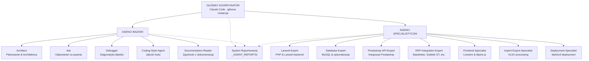
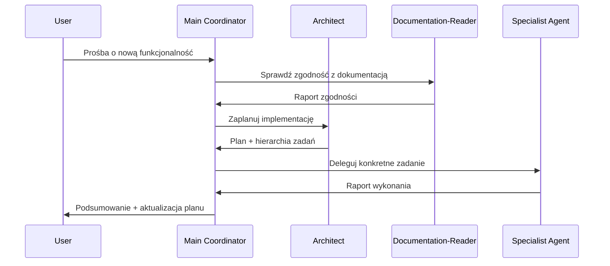
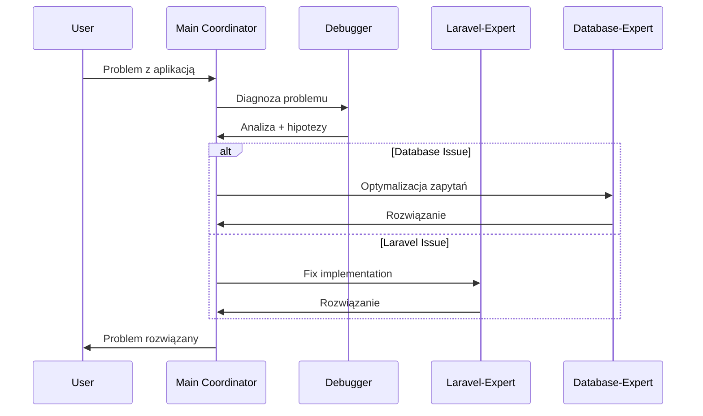

# 🤖 PRZEWODNIK AGENTÓW AI - PPM-CC-Laravel

**Wersja:** 1.0  
**Data:** 2024-09-05  
**Projekt:** PPM-CC-Laravel (Prestashop Product Manager)  
**Przeznaczenie:** Kompletny system Sub-Agentów Claude Code dla rozwoju aplikacji enterprise

---

## 📋 SPIS TREŚCI

1. [Wprowadzenie](#wprowadzenie)
2. [Architektura Zespołu Agentów](#architektura-zespołu-agentów)
3. [Agenci Bazowi](#agenci-bazowi)  
4. [Agenci Specjalistyczni](#agenci-specjalistyczni)
5. [Przepływ Pracy z Agentami](#przepływ-pracy-z-agentami)
6. [System Raportowania](#system-raportowania)
7. [Przykłady Użycia](#przykłady-użycia)
8. [Troubleshooting](#troubleshooting)

---

## 🎯 WPROWADZENIE

System Sub-Agentów Claude Code dla projektu PPM-CC-Laravel składa się z **12 specjalistycznych agentów** zaprojektowanych do obsługi wszystkich aspektów rozwoju aplikacji enterprise. Każdy agent ma swoją specjalizację i jest zoptymalizowany do konkretnych zadań w ramach projektu.

### Kluczowe Zasady:

✅ **Jedna funkcja - jeden agent** - każdy agent ma wyraźnie zdefiniowaną specjalizację  
✅ **Komunikacja przez raporty** - agenci komunikują się poprzez pliki `.md` w folderze `_AGENT_REPORTS/`  
✅ **Kontekst projektowy** - wszyscy agenci znają specyfikę PPM-CC-Laravel  
✅ **Ultrathink approach** - każdy agent ma guidelines do głębokiej analizy  
✅ **Enterprise quality** - wszystkie agenci przestrzegają najwyższych standardów  

---

## 🏗️ ARCHITEKTURA ZESPOŁU AGENTÓW



---


## 👥 AGENCI BAZOWI

### 🏛️ **ARCHITECT** 
```yaml
Agent: architect
Model: sonnet
Specjalizacja: Zarządzanie planem projektu i architektura
```

**Kiedy używać:**
- ✅ Planowanie nowych funkcjonalności przed implementacją
- ✅ Aktualizacja planu projektu po ukończonych milestone'ach  
- ✅ Zarządzanie hierarchią zadań w `Plan_Projektu/`
- ✅ Architektoniczne decyzje dla aplikacji enterprise
- ✅ Breaking down complex features na wykonalne zadania

**Przykład użycia:**
```
/task architect "Zaplanuj implementację systemu synchronizacji produktów 
z Baselinker API. Uwzględnij rate limiting, error handling, progress tracking 
i integrację z istniejącym systemem kolejek."
```

---

### ❓ **ASK**
```yaml
Agent: ask  
Model: sonnet
Specjalizacja: Odpowiedzi na pytania techniczne
```

**Kiedy używać:**
- ✅ Pytania o Laravel 12.x best practices
- ✅ Wyjaśnienia dotyczące Prestashop API compatibility
- ✅ Analiza istniejącego kodu bez wprowadzania zmian
- ✅ Rekomendacje technologiczne i architektoniczne
- ✅ Nauka o nowych technologiach/patterns

**Przykład użycia:**
```
/task ask "Jaka jest najlepsza strategia cache'owania dla aplikacji Laravel 
na shared hostingu MyDevil z dużą liczbą produktów? Porównaj opcje Redis 
vs database cache."
```

---

### 🐛 **DEBUGGER**
```yaml
Agent: debugger
Model: opus  
Specjalizacja: Diagnostyka i rozwiązywanie problemów
```

**Kiedy używać:**
- ✅ Troubleshooting błędów aplikacji
- ✅ Performance issues investigation  
- ✅ API integration problems (Prestashop/ERP)
- ✅ Database query optimization
- ✅ Systematic problem diagnosis

**Przykład użycia:**
```
/task debugger "Aplikacja spowalnia podczas importu dużych plików XLSX. 
Zdiagnozuj problem i zaproponuj rozwiązanie. Log pokazuje memory limit errors."
```

---

### 📝 **CODING-STYLE-AGENT**
```yaml
Agent: coding-style-agent
Model: sonnet
Specjalizacja: Jakość kodu i standardy
```

**Kiedy używać:**
- ✅ Code review nowych funkcjonalności
- ✅ Refactoring istniejącego kodu  
- ✅ Implementacja Context7 patterns
- ✅ PSR-12 compliance verification
- ✅ Enterprise code quality assurance

**Przykład użycia:**
```
/task coding-style-agent "Przejrzyj nowo utworzony ProductController 
i zweryfikuj zgodność z PSR-12, Laravel best practices i Context7 patterns."
```

---

### 📚 **DOCUMENTATION-READER**
```yaml
Agent: documentation-reader
Model: sonnet
Specjalizacja: Zgodność z dokumentacją projektu
```

**Kiedy używać:**
- ✅ Przed implementacją nowych funkcjonalności
- ✅ Weryfikacja compliance z `_init.md` requirements
- ✅ Sprawdzenie zgodności z Prestashop DB structure
- ✅ Validation przeciwko oficjalnej dokumentacji API
- ✅ Review requirements consistency

**Przykład użycia:**
```
/task documentation-reader "Zweryfikuj czy planowana implementacja 
systemu 8 grup cenowych jest zgodna z wymaganiami z _init.md 
i strukturą bazy Prestashop."
```

---

## 🛠️ AGENCI SPECJALISTYCZNI

### 🔶 **LARAVEL-EXPERT**
```yaml
Agent: laravel-expert
Model: sonnet
Specjalizacja: PHP 8.3 + Laravel 12.x backend
```

**Kiedy używać:**
- ✅ Implementacja core business logic
- ✅ Database migrations i model relationships
- ✅ API endpoints i controllers development
- ✅ Authentication & authorization (7 poziomów)
- ✅ Service layer architecture
- ✅ Queue jobs i background processing

**Najczęściej używany z:**
- `database-expert` (schema design)
- `coding-style-agent` (code review)

**Przykład użycia:**
```
/task laravel-expert "Zaimplementuj ProductService z metodami dla CRUD 
operacji, sync z external APIs i bulk operations. Uwzględnij error handling 
i audit trail dla wszystkich operacji."
```

---

### 🗄️ **DATABASE-EXPERT**
```yaml
Agent: database-expert
Model: sonnet  
Specjalizacja: MySQL i optymalizacja bazy danych
```

**Kiedy używać:**
- ✅ Projektowanie database schemas
- ✅ Complex migrations z proper rollback
- ✅ Query optimization i performance tuning
- ✅ Database constraints i data integrity  
- ✅ Indexing strategies dla large datasets

**Najczęściej używany z:**
- `laravel-expert` (model relationships)
- `prestashop-api-expert` (DB structure compatibility)

**Przykład użycia:**
```
/task database-expert "Zaprojektuj optymalną strukturę tabel dla systemu 
dopasowań pojazdów (Model/Oryginał/Zamiennik) z uwzględnieniem performance 
i możliwości filtrowania per sklep Prestashop."
```

---

### 🛒 **PRESTASHOP-API-EXPERT**  
```yaml
Agent: prestashop-api-expert
Model: sonnet
Specjalizacja: Integracja z Prestashop 8.x/9.x API
```

**Kiedy używać:**
- ✅ Implementacja Prestashop API connections
- ✅ Product synchronization workflows
- ✅ Multi-store data management
- ✅ Image upload i directory structure
- ✅ Category mapping między systemami
- ✅ Price groups jako specific_prices

**Najczęściej używany z:**
- `database-expert` (DB structure compatibility)
- `laravel-expert` (service integration)

**Przykład użycia:**
```
/task prestashop-api-expert "Zaimplementuj synchronizację produktu 
z dopasowaniami pojazdów na wieloma sklepami Prestashop. 
Uwzględnij filtrowanie 'zbanowanych' modeli per sklep."
```

---

### 🔗 **ERP-INTEGRATION-EXPERT**
```yaml
Agent: erp-integration-expert
Model: sonnet
Specjalizacja: Integracje ERP (Baselinker #1, Subiekt GT, Microsoft Dynamics)
```

**Kiedy używać:**
- ✅ Integration z systemami ERP
- ✅ Data synchronization strategies
- ✅ Order management i delivery system
- ✅ Multi-warehouse mapping
- ✅ API rate limiting i error recovery

**Najczęściej używany z:**
- `laravel-expert` (service architecture) 
- `database-expert` (mapping tables)

**Przykład użycia:**
```
/task erp-integration-expert "Zaimplementuj dwukierunkową synchronizację 
stanów magazynowych z Baselinker API. Priorytet dla mapowania 6 magazynów 
PPM na magazyny Baselinker."
```

---

### 🎨 **FRONTEND-SPECIALIST**
```yaml  
Agent: frontend-specialist
Model: sonnet
Specjalizacja: Livewire 3.x + Blade + Alpine.js
```

**Kiedy używać:**
- ✅ Livewire components development  
- ✅ Interactive UI z Alpine.js
- ✅ Complex forms z real-time validation
- ✅ Dashboard interfaces z role-based access
- ✅ Search interfaces z intelligent suggestions
- ✅ Responsive design i dark/light theme

**Najczęściej używany z:**
- `laravel-expert` (backend integration)
- `coding-style-agent` (frontend code quality)

**Przykład użycia:**
```
/task frontend-specialist "Stwórz Livewire component dla listy produktów 
z zaawansowanymi filtrami, bulk operations, search suggestions 
i real-time updates."
```

---

### 📊 **IMPORT-EXPORT-SPECIALIST**
```yaml
Agent: import-export-specialist  
Model: sonnet
Specjalizacja: XLSX processing i data workflows
```

**Kiedy używać:**
- ✅ XLSX import/export functionality
- ✅ Column mapping systems
- ✅ Background processing dla large files
- ✅ Data validation i error handling
- ✅ Progress tracking i notifications

**Najczęściej używany z:**
- `laravel-expert` (queue jobs)
- `database-expert` (batch operations)

**Przykład użycia:**
```
/task import-export-specialist "Zaimplementuj system importu XLSX 
z szablonem POJAZDY. Uwzględnij mapowanie kolumn, walidację biznesową 
i processing w tle dla plików do 10MB."
```

---

### 🚀 **DEPLOYMENT-SPECIALIST**
```yaml
Agent: deployment-specialist
Model: sonnet  
Specjalizacja: Deployment na MyDevil shared hosting
```

**Kiedy używać:**
- ✅ Production deployment workflows
- ✅ Shared hosting optimization
- ✅ Performance tuning dla limited resources  
- ✅ Backup i disaster recovery strategies
- ✅ Environment configuration
- ✅ CI/CD pipeline setup

**Najczęściej używany z:**
- `laravel-expert` (production optimization)
- `database-expert` (database deployment)

**Przykład użycia:**
```
/task deployment-specialist "Zoptymalizuj konfigurację Laravel 
dla MyDevil shared hosting. Skoncentruj się na memory usage, 
database connections i file permissions."
```

---

## 🔄 PRZEPŁYW PRACY Z AGENTAMI

### 1. **ROZPOCZĘCIE NOWEJ FUNKCJONALNOŚCI**



### 2. **DEBUGGING WORKFLOW**



### 3. **FEATURE DEVELOPMENT CYCLE**

```
📋 PLANNING PHASE
├── Architect: Decompose feature into tasks
├── Documentation-Reader: Validate requirements
└── Update Plan_Projektu/ with detailed tasks

🛠️ IMPLEMENTATION PHASE  
├── Specialist Agents: Implement specific parts
├── Coding-Style-Agent: Review code quality
└── Create implementation files

🧪 TESTING PHASE
├── Debugger: Diagnose any issues  
├── Laravel-Expert: Fix backend problems
└── Deployment-Specialist: Prepare for production

📦 DEPLOYMENT PHASE
├── Deployment-Specialist: Deploy to MyDevil
├── Health checks and monitoring
└── Update project plan with completion status
```

---

## 📊 SYSTEM RAPORTOWANIA

### Format Raportu Agenta

Każdy agent tworzy raport w formacie:

```markdown
# RAPORT PRACY AGENTA: [nazwa_agenta]
**Data**: [YYYY-MM-DD HH:MM]
**Agent**: [nazwa_agenta]  
**Zadanie**: [krótki opis zadania]

## ✅ WYKONANE PRACE
- Lista wykonanych zadań
- Ścieżki do utworzonych/zmodyfikowanych plików  
- Krótkie opisy zmian

## ⚠️ PROBLEMY/BLOKERY
- Lista napotkanych problemów
- Nierozwiązane kwestie wymagające uwagi

## 📋 NASTĘPNE KROKI
- Co należy zrobić dalej
- Zalecenia dla kolejnych agentów

## 📁 PLIKI
- [nazwa_pliku.ext] - [opis zmian]
- [folder/nazwa_pliku.ext] - [opis zmian]
```

### Lokalizacja Raportów

```
_AGENT_REPORTS/
├── architect_REPORT_2024-09-05_14-30.md
├── laravel-expert_REPORT_2024-09-05_15-45.md  
├── database-expert_REPORT_2024-09-05_16-20.md
└── prestashop-api-expert_REPORT_2024-09-05_17-10.md
```

---

## 💡 PRZYKŁADY UŻYCIA

### **Przykład 1: Implementacja Nowej Funkcjonalności**

**Zadanie:** "Dodaj system komentarzy do produktów z moderacją."

**Przepływ:**
1. **Architect** → planuje architekturę → optymalizacja planu
2. **Database-Expert** → projektuje schema → implementacja migrations
3. **Laravel-Expert** → analizuje requirements → implementacja models, controllers, services
4. **Frontend-Specialist** → pisze Livewire components → testy i poprawki
5. **Coding-Style-Agent** → final code review
6. **Deployment-Specialist** → deploy na production

### **Przykład 2: Integracja z Nowym ERP**

**Zadanie:** "Dodaj integrację z Microsoft Dynamics Business Central."

**Przepływ:**  
1. **Documentation-Reader** → sprawdza requirements i API docs
2. **Architect** → planuje integration architecture
3. **ERP-Integration-Expert** → implementuje API connector  
4. **Database-Expert** → dodaje mapping tables
5. **Laravel-Expert** → integruje z core application
6. **Debugger** → testuje i debuguje integration

### **Przykład 3: Performance Optimization**

**Zadanie:** "Aplikacja jest wolna przy dużej liczbie produktów."

**Przepływ:**
1. **Debugger** → diagnozuje bottlenecks
2. **Database-Expert** → optymalizuje queries i indexes  
3. **Laravel-Expert** → implementuje caching strategies
4. **Frontend-Specialist** → optymalizuje frontend performance
5. **Deployment-Specialist** → optymalizuje production environment

---

## 🔧 TROUBLESHOOTING

### Częste Problemy

**Problem:** Agent nie rozumie kontekstu projektu PPM-CC-Laravel
```
Rozwiązanie: Sprawdź czy agent ma dostęp do CLAUDE.md i _init.md. 
Przekaż kontekst explicite w zadaniu.
```

**Problem:** Agent tworzy kod niezgodny z enterprise standards
```
Rozwiązanie: Zawsze używaj coding-style-agent do review. 
Upewnij się że agent ma dostęp do Context7 guidelines.
```

**Problem:** Konflikty między różnymi agentami
```
Rozwiązanie: Main Coordinator musi czytać raporty wszystkich agentów 
przed delegowaniem kolejnych zadań.
```

**Problem:** Agent nie aktualizuje planu projektu
```
Rozwiązanie: Użyj Architect agenta do aktualizacji Plan_Projektu/ 
po każdym ukończonym milestone.
```

### Najlepsze Praktyki

✅ **Zawsze czytaj raporty** poprzednich agentów przed delegowaniem  
✅ **Używaj konkretnych zadań** - unikaj zbyt ogólnych poleceń  
✅ **Kombinuj agentów** - np. Laravel-Expert + Database-Expert  
✅ **Aktualizuj plan** po każdym znaczącym postępie  
✅ **Dokumentuj problemy** w raportach agentów  

---

## 📈 METRYKI I KPI

### Tracking Skuteczności Agentów

- **Code Quality Score** → przez Coding-Style-Agent
- **Bug Resolution Time** → przez Debugger  
- **Feature Completion Rate** → przez Architect
- **Documentation Compliance** → przez Documentation-Reader
- **Deployment Success Rate** → przez Deployment-Specialist

### Dashboard Agentów (Future Enhancement)

```
📊 AGENT DASHBOARD
├── 🏛️ Architect: 12 planów, 89% ukończonych zadań
├── 🔶 Laravel-Expert: 47 implementacji, 0 bugs
├── 🗄️ Database-Expert: 23 migracje, 100% rollback success  
├── 🛒 Prestashop-API-Expert: 156 produktów zsynchronizowanych
├── 🔗 ERP-Integration-Expert: 3 aktywne integracje
├── 🎨 Frontend-Specialist: 28 komponentów, 95% user satisfaction
├── 📊 Import-Export-Specialist: 45 importów, avg 2.3min processing
└── 🚀 Deployment-Specialist: 34 wdrożenia, 99.2% uptime
```

---

## 🎯 PODSUMOWANIE

System 12 Sub-Agentów Claude Code dla PPM-CC-Laravel zapewnia:

✅ **Kompletną ekspertyzę** w każdej dziedzinie projektu  
✅ **Consistency** w jakości kodu i standardach  
✅ **Scalability** dla złożonych enterprise workflows  
✅ **Traceability** przez system raportowania  
✅ **Efficiency** przez specialized task delegation  

### Kolejne Kroki

1. **Test agentów** na małych zadaniach
2. **Optymalizacja promptów** na podstawie wyników  
3. **Rozszerzenie systemu** o dodatkowych specjalistów jeśli potrzeba
4. **Implementacja automatyzacji** workflow między agentami
5. **Dashboard monitoring** dla track'owania performance

---

**🚀 System Sub-Agentów gotowy do użycia!**  
*Porażka nie wchodzi w grę. Sukces projektu PPM-CC-Laravel jest gwarantowany przez profesjonalny zespół AI Specialists.*