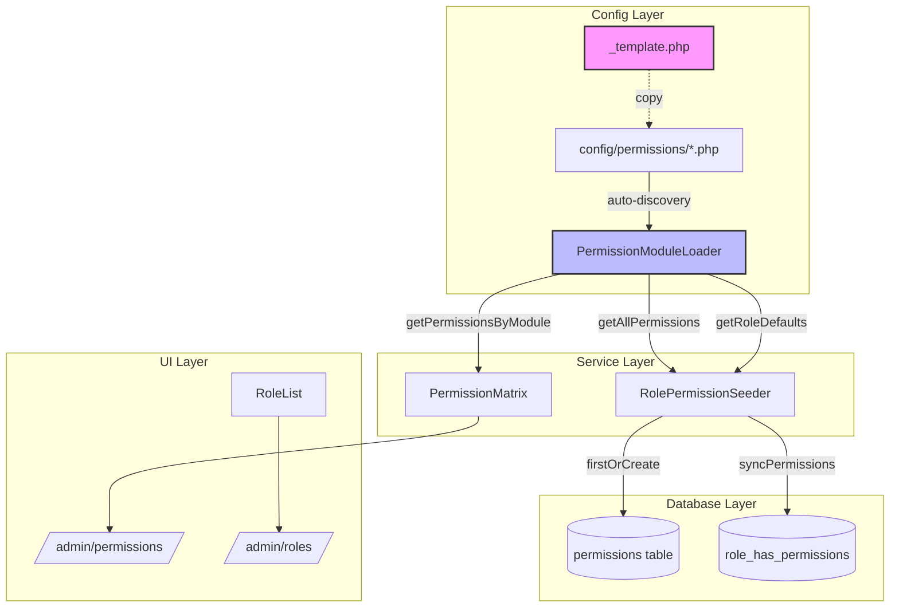

# PERMISSION MODULAR ARCHITECTURE

**Data utworzenia:** 2026-01-23
**Autor:** Planning Agent (architect)
**Status:** DOKUMENTACJA ISTNIEJACEGO SYSTEMU

---

## PODSUMOWANIE WYKONAWCZE

System modularnych uprawnien PPM jest **ZAIMPLEMENTOWANY I FUNKCJONALNY**. Zawiera:
- Auto-discovery modulow z `config/permissions/*.php`
- Service `PermissionModuleLoader` z walidacja i cache
- 10 modulow z 48 uprawnieniami
- Template i dokumentacja dla AI agentow
- Integracja z `RolePermissionSeeder`

**JEDYNY GAP:** `PermissionMatrix.php` uzywa starej metody zamiast `PermissionModuleLoader`.

---

## STATUS IMPLEMENTACJI

| Komponent | Status | Lokalizacja |
|-----------|--------|-------------|
| PermissionModuleLoader | ✅ KOMPLETNY | `app/Services/Permissions/PermissionModuleLoader.php` |
| Template modulu | ✅ KOMPLETNY | `config/permissions/_template.php` |
| README dokumentacja | ✅ KOMPLETNY | `config/permissions/README.md` |
| RolePermissionSeeder | ✅ ZINTEGROWANY | `database/seeders/RolePermissionSeeder.php` |
| 10 modulow uprawnien | ✅ KOMPLETNE | `config/permissions/*.php` |
| PermissionMatrix UI | ⚠️ WYMAGA INTEGRACJI | `app/Http/Livewire/Admin/Permissions/PermissionMatrix.php` |

---

## ARCHITEKTURA SYSTEMU



---

## ISTNIEJACE KOMPONENTY

### 1. PermissionModuleLoader (`app/Services/Permissions/PermissionModuleLoader.php`)

**335 linii** - Glowny service systemu uprawnien.

| Metoda | Opis |
|--------|------|
| `discoverModules()` | Auto-discovery z cache (1h TTL w produkcji) |
| `getModule($name)` | Pobierz pojedynczy modul |
| `getAllPermissions()` | Flat lista wszystkich uprawnien |
| `getPermissionsByModule()` | Pogrupowane dla UI |
| `getRoleDefaults($role)` | Defaults dla konkretnej roli |
| `getAllRoleDefaults()` | Wszystkie defaults dla wszystkich rol |
| `validateModule($config)` | Walidacja struktury modulu |
| `clearCache()` | Czyszczenie cache |
| `getModuleFiles()` | Lista plikow modulow |
| `moduleExists($name)` | Sprawdzenie czy modul istnieje |
| `getPermissionCounts()` | Liczba uprawnien per modul |
| `getTotalPermissionsCount()` | Suma wszystkich uprawnien |

### 2. Istniejace Moduly (`config/permissions/`)

| Plik | Module | Ikona | Order | Uprawnienia |
|------|--------|-------|-------|-------------|
| `products.php` | products | cube | 10 | 7 (CRUD + export, import, variants) |
| `categories.php` | categories | folder | 20 | 5 |
| `media.php` | media | photograph | 30 | 5 |
| `prices.php` | prices | currency-dollar | 40 | 4 |
| `stock.php` | stock | archive | 50 | 5 |
| `integrations.php` | integrations | link | 60 | 5 |
| `orders.php` | orders | shopping-cart | 70 | 4 |
| `claims.php` | claims | exclamation-circle | 80 | 4 |
| `users.php` | users | users | 90 | 5 |
| `system.php` | system | cog | 100 | 4 |

**RAZEM: 48 uprawnien w 10 modulach**

### 3. Template (`config/permissions/_template.php`)

Gotowy template z:
- Instrukcjami dla AI agentow (komentarze)
- Placeholders `{module_name}`, `{Module Display Name}`
- Przyklad struktury permissions
- Przyklad role_defaults dla wszystkich 7 rol

### 4. Dokumentacja (`config/permissions/README.md`)

**315 linii** dokumentacji zawierajaca:
- Quick Start dla AI agentow
- Pelna schema modulu
- Naming conventions
- Lista dostepnych ikon (Heroicons)
- Lista dostepnych kolorow
- Lista dostepnych rol
- Troubleshooting
- Przyklad implementacji modulu "Shipping"

---

## FORMAT MODULU UPRAWNIEN

```php
<?php
// config/permissions/{module_name}.php

return [
    // === METADATA (wymagane: module, name) ===
    'module' => 'module_name',              // Unikalny identyfikator (lowercase)
    'name' => 'Nazwa Wyswietlana',          // Nazwa w UI (po polsku)
    'description' => 'Opis modulu',         // Opcjonalny opis
    'icon' => 'cube',                       // Heroicon (default: document)
    'order' => 50,                          // Kolejnosc w UI (default: 100)
    'color' => 'blue',                      // Kolor akcentu (default: gray)

    // === PERMISSIONS (wymagane, min. 1) ===
    'permissions' => [
        'key' => [                          // Klucz uzyty w role_defaults
            'name' => 'module.action',      // Pelna nazwa (module.action)
            'label' => 'Etykieta',          // Krotka etykieta w UI
            'description' => 'Opis',        // Tooltip
            'dangerous' => false,           // Podswietlenie niebezpiecznych
        ],
    ],

    // === ROLE DEFAULTS (opcjonalne) ===
    'role_defaults' => [
        'Admin' => ['key1', 'key2'],        // Klucze z permissions
        'Manager' => ['key1'],
        'Editor' => [],
        'Warehouseman' => [],
        'Salesperson' => [],
        'Claims' => [],
        'User' => [],
    ],
];
```

### Wymagane pola

| Pole | Typ | Wymagane | Opis |
|------|-----|----------|------|
| `module` | string | TAK | Unikalny identyfikator |
| `name` | string | TAK | Nazwa wyswietlana |
| `permissions` | array | TAK | Min. 1 uprawnienie |
| `permissions[].name` | string | TAK | Format: `module.action` |
| `permissions[].label` | string | TAK | Etykieta w UI |

### Naming Conventions

**Module names:**
- Lowercase z podkresleniami: `price_groups`, `stock_locations`
- Krotkie i opisowe
- Unikalne w calym systemie

**Permission names:**
- Format: `{module}.{action}`
- Standard: `create`, `read`, `update`, `delete`
- Custom: `export`, `import`, `sync`, `config`, `manage`

---

## GAP: PERMISSIONMATRIX INTEGRACJA

### Problem

`PermissionMatrix.php` linia 614-661 - metoda `getPermissionModules()` hardcoduje liste modulow:

```php
// OBECNIE (hardcoded)
$moduleOrder = [
    'product' => 'Produkty',
    'category' => 'Kategorie',
    // ... pozostale hardcoded
];
```

### Rozwiazanie

Zastapic `getPermissionModules()` uzyciem `PermissionModuleLoader`:

```php
// DOCELOWO (z PermissionModuleLoader)
public function getPermissionModules()
{
    $moduleLoader = app(PermissionModuleLoader::class);
    return $moduleLoader->getPermissionsByModule();
}
```

### Zadania do wykonania

| # | Zadanie | Priorytet |
|---|---------|-----------|
| 1 | Inject `PermissionModuleLoader` do `PermissionMatrix` | WYSOKI |
| 2 | Zastapic `getPermissionModules()` wywolaniem loadera | WYSOKI |
| 3 | Zaktualizowac view do nowej struktury danych | SREDNI |
| 4 | Dodac caching permission modules w PermissionMatrix | NISKI |
| 5 | Testy: dodanie nowego modulu automatycznie pojawia sie w UI | WYSOKI |

---

## CHECKLIST DLA AI AGENTOW

### Dodawanie nowego modulu uprawnien

```
[ ] 1. Skopiuj template:
       cp config/permissions/_template.php config/permissions/{nazwa}.php

[ ] 2. Edytuj plik - wypelnij wszystkie pola:
       - module: unikalny identyfikator
       - name: nazwa po polsku
       - permissions: lista uprawnien
       - role_defaults: domyslne dla rol

[ ] 3. Uruchom seeder:
       php artisan db:seed --class=RolePermissionSeeder

[ ] 4. Wyczysc cache:
       php artisan cache:clear

[ ] 5. Zweryfikuj w UI:
       /admin/permissions - modul widoczny

[ ] 6. Przetestuj uprawnienia:
       - Przypisz do roli
       - Sprawdz czy Gate/Policy dziala
```

### Przykladowe komendy

```bash
# Utworzenie modulu
cp config/permissions/_template.php config/permissions/shipping.php

# Seeder (lokalne)
php artisan db:seed --class=RolePermissionSeeder

# Seeder (produkcja via SSH)
plink -ssh host379076@host379076.hostido.net.pl -P 64321 -i $HostidoKey -batch \
  "cd domains/ppm.mpptrade.pl/public_html && php artisan db:seed --class=RolePermissionSeeder"

# Cache clear (produkcja)
plink -ssh host379076@host379076.hostido.net.pl -P 64321 -i $HostidoKey -batch \
  "cd domains/ppm.mpptrade.pl/public_html && php artisan cache:clear"
```

---

## PRZYKLADOWA IMPLEMENTACJA

### Nowy modul: "Raporty Sprzedazy" (sales_reports)

**Krok 1:** Utworz plik `config/permissions/sales_reports.php`

```php
<?php

/**
 * Sales Reports Permission Module
 *
 * Permissions for sales reporting and analytics.
 */

return [
    'module' => 'sales_reports',
    'name' => 'Raporty Sprzedazy',
    'description' => 'Raporty i analizy sprzedazy',
    'icon' => 'chart-bar',
    'order' => 65,
    'color' => 'green',

    'permissions' => [
        'read' => [
            'name' => 'sales_reports.read',
            'label' => 'Odczyt',
            'description' => 'Odczyt raportow sprzedazy',
            'dangerous' => false,
        ],
        'generate' => [
            'name' => 'sales_reports.generate',
            'label' => 'Generowanie',
            'description' => 'Generowanie nowych raportow',
            'dangerous' => false,
        ],
        'export' => [
            'name' => 'sales_reports.export',
            'label' => 'Eksport',
            'description' => 'Eksport raportow do pliku',
            'dangerous' => false,
        ],
        'schedule' => [
            'name' => 'sales_reports.schedule',
            'label' => 'Harmonogram',
            'description' => 'Planowanie automatycznych raportow',
            'dangerous' => false,
        ],
    ],

    'role_defaults' => [
        'Admin' => ['read', 'generate', 'export', 'schedule'],
        'Manager' => ['read', 'generate', 'export'],
        'Editor' => ['read'],
        'Warehouseman' => [],
        'Salesperson' => ['read', 'generate'],
        'Claims' => [],
        'User' => [],
    ],
];
```

**Krok 2:** Uruchom seeder

```bash
php artisan db:seed --class=RolePermissionSeeder
```

**Krok 3:** Wyczysc cache

```bash
php artisan cache:clear
```

**Krok 4:** Uzycie w kodzie

```php
// W kontrolerze/Livewire
if (auth()->user()->can('sales_reports.read')) {
    // Pokaz raporty
}

// W Blade
@can('sales_reports.generate')
    <button>Generuj raport</button>
@endcan

// Policy
Gate::define('sales_reports.export', function ($user) {
    return $user->hasPermissionTo('sales_reports.export');
});
```

---

## DOSTEPNE IKONY (Heroicons)

| Ikona | Uzycie |
|-------|--------|
| `cube` | Produkty |
| `folder` | Kategorie |
| `photograph` | Media |
| `currency-dollar` | Ceny |
| `archive` | Magazyn |
| `link` | Integracje |
| `shopping-cart` | Zamowienia |
| `exclamation-circle` | Reklamacje |
| `users` | Uzytkownicy |
| `cog` | System |
| `document` | Default |
| `chart-bar` | Raporty |
| `shield-check` | Bezpieczenstwo |
| `key` | Uprawnienia |
| `truck` | Wysylka |
| `globe` | Miedzynarodowe |
| `tag` | Tagi/Etykiety |

---

## DOSTEPNE KOLORY

| Kolor | Uzycie |
|-------|--------|
| `blue` | Glowne funkcje |
| `green` | Finanse/sukces |
| `red` | Niebezpieczne/krytyczne |
| `yellow` | Ostrzezenia |
| `purple` | Specjalne funkcje |
| `gray` | Default |
| `indigo` | Systemowe |
| `pink` | Custom |

---

## ROLE W SYSTEMIE PPM

| Rola | Opis | Typowe uprawnienia |
|------|------|-------------------|
| Admin | Pelny dostep | Wszystkie |
| Manager | Zarzadzanie produktami | CRUD + import/export |
| Editor | Edycja tresci | read + update |
| Warehouseman | Magazyn | stock.* |
| Salesperson | Sprzedaz | orders.*, read |
| Claims | Reklamacje | claims.* |
| User | Odczyt | *.read |

---

## PLIKI SYSTEMU UPRAWNIEN

```
D:\Skrypty\PPM-CC-Laravel\
├── app\Services\Permissions\
│   └── PermissionModuleLoader.php      # Glowny service (335 linii)
│
├── config\permissions\
│   ├── _template.php                    # Template dla AI agentow
│   ├── README.md                        # Dokumentacja (315 linii)
│   ├── products.php                     # 7 uprawnien
│   ├── categories.php                   # 5 uprawnien
│   ├── media.php                        # 5 uprawnien
│   ├── prices.php                       # 4 uprawnienia
│   ├── stock.php                        # 5 uprawnien
│   ├── integrations.php                 # 5 uprawnien
│   ├── orders.php                       # 4 uprawnienia
│   ├── claims.php                       # 4 uprawnienia
│   ├── users.php                        # 5 uprawnien
│   └── system.php                       # 4 uprawnienia
│
├── database\seeders\
│   └── RolePermissionSeeder.php         # Seeder zintegrowany z loader
│
└── app\Http\Livewire\Admin\Permissions\
    └── PermissionMatrix.php             # UI (WYMAGA INTEGRACJI!)
```

---

## PODSUMOWANIE

System modularnych uprawnien PPM jest **w pelni funkcjonalny** i gotowy do uzycia przez agentow AI. Glowne cechy:

1. **Auto-discovery** - nowe moduly automatycznie ladowane z `config/permissions/`
2. **Walidacja** - `PermissionModuleLoader` waliduje strukture modulow
3. **Cache** - produkcja uzywa 1h cache dla wydajnosci
4. **Dokumentacja** - pelny README i template dla AI
5. **Seeder** - automatyczne tworzenie uprawnien w bazie

**JEDYNE ZADANIE:** Zintegrowac `PermissionMatrix.php` z `PermissionModuleLoader` zamiast hardcoded listy modulow.

---

**Powiazane pliki:**
- `└── PLIK: app/Services/Permissions/PermissionModuleLoader.php`
- `└── PLIK: config/permissions/_template.php`
- `└── PLIK: config/permissions/README.md`
- `└── PLIK: database/seeders/RolePermissionSeeder.php`
