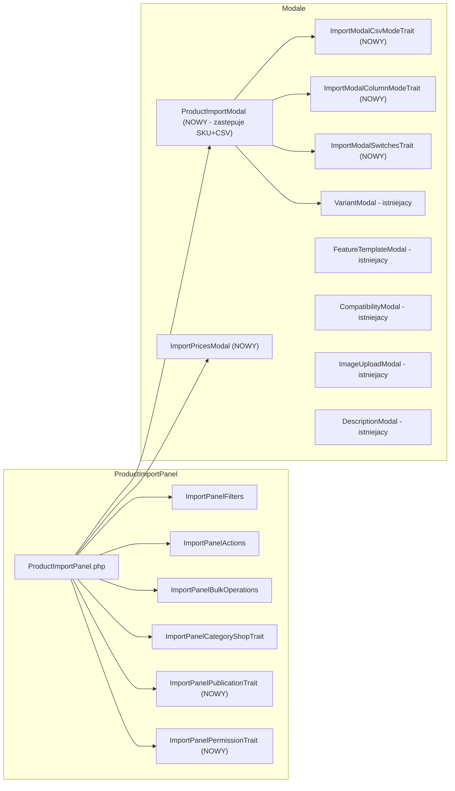
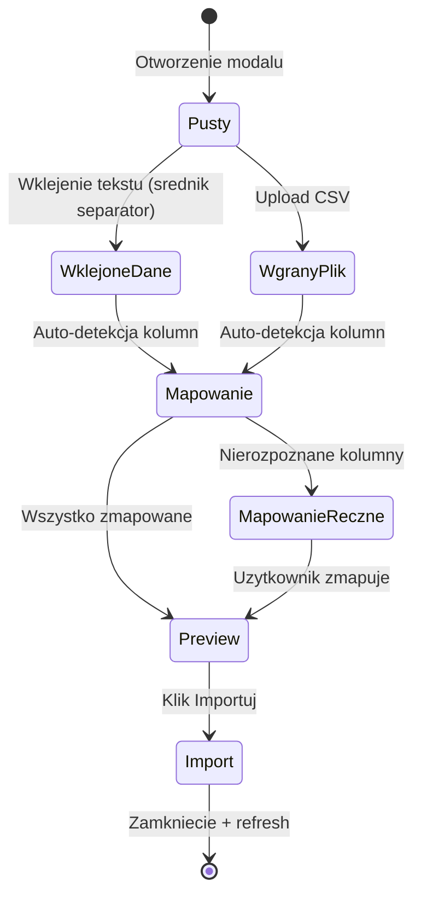
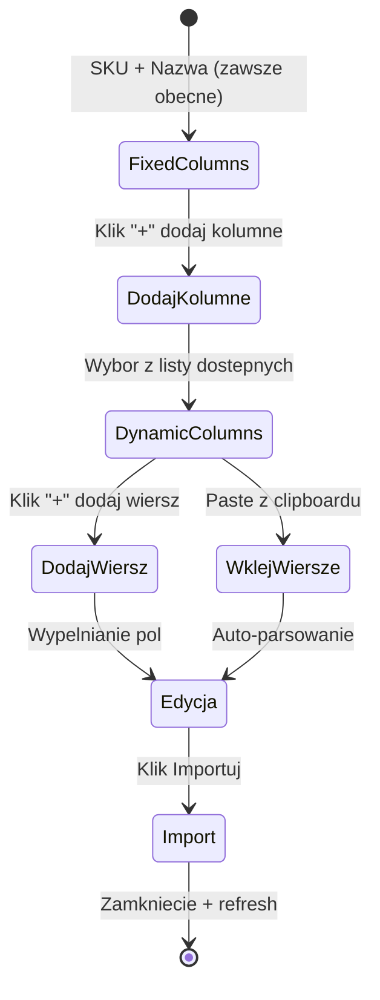
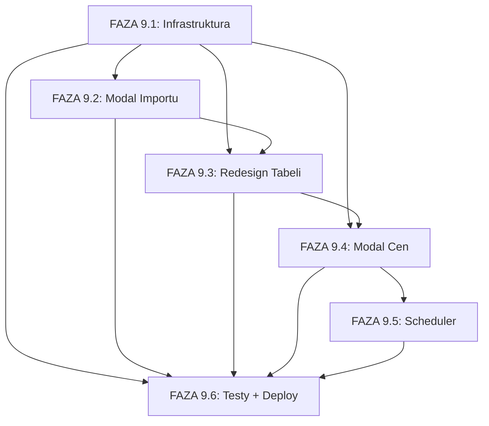

# ETAP_06 FAZA 9: REDESIGN PANELU IMPORTU PRODUKTOW

## PODSUMOWANIE

**Cel:** Gruntowny redesign panelu importu produktow - zunifikowany modal importu, nowy system publikacji z targetami, harmonogramowanie, granularne uprawnienia kolumnowe, modal cen.

**Status:** :x: NIE ROZPOCZETO
**Szacowany czas:** 60-80 godzin
**Priorytet:** WYSOKI
**Zaleznosci:** ETAP_06 FAZY 1-6.5 (ukonczone), ETAP_07 (PrestaShop API), ETAP_08 (ERP integrations)

---

## ARCHITEKTURA REDESIGNU

### Diagram przeplywy danych

```mermaid
flowchart TD
    subgraph "IMPORT (NOWY MODAL)"
        A1[Tryb CSV: paste/upload] --> B[ProductImportModal]
        A2[Tryb Kolumnowy: dynamiczne kolumny] --> B
        B --> |Przelaczniki| C{Sklep Internetowy?<br>Split Payment?<br>Wariantowy?}
        C --> |Wariantowy=TAK| D[VariantModal na wierzchu]
        C --> E[Tworzenie PendingProduct]
    end

    subgraph "TABELA (REDESIGN)"
        E --> F[Obraz | SKU | Nazwa | Typ | Cena | L3-L6 | Publikacja | Data pub. | Status | Publikuj | Akcje]
        F --> |Klik Cena| G[ImportPricesModal]
        F --> |Klik SKU/Nazwa| B
        F --> |Klik Publikuj 100%| H{Data publikacji?}
    end

    subgraph "PUBLIKACJA"
        H --> |Natychmiast| I[ProductPublicationService]
        H --> |Zaplanowana| J[scheduled_publish_at w DB]
        J --> |Scheduler co 1 min| I
        I --> K[Product w PPM]
        I --> L[Export do ERP Glowny]
        I --> M[SyncProductToPrestaShop per shop]
    end

    subgraph "UPRAWNIENIA P1-P11"
        N[import.images] -.-> F
        O[import.basic_data] -.-> F
        P[import.prices] -.-> F
        Q[import.categories] -.-> F
        R[import.publication_targets] -.-> F
        S[import.publish_button] -.-> F
    end
```

### Diagram komponentow Livewire



---

## 1. PELNA LISTA PLIKOW DO UTWORZENIA/MODYFIKACJI

### 1.1 NOWE PLIKI (17 plikow)

| # | Sciezka | Opis |
|---|---------|------|
| 1 | `database/migrations/2026_02_XX_add_import_redesign_fields_to_pending_products.php` | Migracja: nowe kolumny na pending_products |
| 2 | `config/permissions/import.php` | Modul uprawnien P1-P11 |
| 3 | `config/import.php` | Konfiguracja ERP Glowny, targety publikacji |
| 4 | `app/Http/Livewire/Products/Import/Modals/ProductImportModal.php` | Zunifikowany modal importu (max 300 linii) |
| 5 | `app/Http/Livewire/Products/Import/Modals/Traits/ImportModalCsvModeTrait.php` | Logika trybu CSV (paste + upload + mapping) |
| 6 | `app/Http/Livewire/Products/Import/Modals/Traits/ImportModalColumnModeTrait.php` | Logika trybu kolumnowego (dynamiczne kolumny + wiersze) |
| 7 | `app/Http/Livewire/Products/Import/Modals/Traits/ImportModalSwitchesTrait.php` | Przelaczniki: sklep, split payment, warianty |
| 8 | `app/Http/Livewire/Products/Import/Modals/ImportPricesModal.php` | Modal cen dla master produktu (wzor z VariantModalsTrait) |
| 9 | `app/Http/Livewire/Products/Import/Traits/ImportPanelPublicationTrait.php` | Logika publikacji z targetami i harmonogramem |
| 10 | `app/Http/Livewire/Products/Import/Traits/ImportPanelPermissionTrait.php` | Sprawdzanie uprawnien P1-P11 |
| 11 | `app/Console/Commands/PublishScheduledProducts.php` | Artisan command: auto-publikacja zaplanowanych |
| 12 | `app/Services/Import/PublicationTargetService.php` | Serwis: zarzadzanie targetami publikacji |
| 13 | `resources/views/livewire/products/import/modals/product-import-modal.blade.php` | Blade: zunifikowany modal |
| 14 | `resources/views/livewire/products/import/modals/partials/csv-mode.blade.php` | Blade: partial trybu CSV |
| 15 | `resources/views/livewire/products/import/modals/partials/column-mode.blade.php` | Blade: partial trybu kolumnowego |
| 16 | `resources/views/livewire/products/import/modals/import-prices-modal.blade.php` | Blade: modal cen |
| 17 | `resources/css/products/import-panel.css` | Dedykowany CSS dla panelu importu |

### 1.2 MODYFIKOWANE PLIKI (12 plikow)

| # | Sciezka | Zakres zmian |
|---|---------|--------------|
| 1 | `app/Models/PendingProduct.php` | Nowe pola, casty, recalculateCompletion(), REQUIRED_FIELDS |
| 2 | `app/Http/Livewire/Products/Import/ProductImportPanel.php` | Nowe use traits, nowe computed properties, modal handling |
| 3 | `app/Http/Livewire/Products/Import/Traits/ImportPanelActions.php` | publishSingle() z targetami, openImportModal() z edit mode |
| 4 | `app/Http/Livewire/Products/Import/Traits/ImportPanelBulkOperations.php` | bulkPublish() z targetami |
| 5 | `app/Services/Import/ProductPublicationService.php` | Publication targets, scheduling, new field mapping |
| 6 | `resources/views/livewire/products/import/product-import-panel.blade.php` | Nowe kolumny, Publikacja, Publikuj button |
| 7 | `resources/views/livewire/products/import/partials/product-row.blade.php` | Nowe kolumny per wiersz |
| 8 | `app/Console/Kernel.php` | Rejestracja PublishScheduledProducts w schedule |
| 9 | `resources/views/layouts/admin.blade.php` | Aktualizacja linku sidebar (opcjonalne) |
| 10 | `resources/css/app.css` | Import nowego pliku import-panel.css |
| 11 | `database/seeders/RolePermissionSeeder.php` | Auto-odczyt nowego modulu import.php |
| 12 | `Plan_Projektu/ETAP_06_Import_Export.md` | Aktualizacja planu o FAZE 9 |

---

## 2. PLAN MIGRACJI BAZY DANYCH

### 2.1 Nowe kolumny na `pending_products`

```php
// Migration: add_import_redesign_fields_to_pending_products
Schema::table('pending_products', function (Blueprint $table) {
    // === NOWE POLA PRODUKTOWE (z Column Mode) ===
    $table->string('cn_code', 50)->nullable()->after('ean')
        ->comment('Kod CN (Combined Nomenclature)');
    $table->string('material', 50)->nullable()->after('cn_code')
        ->comment('Material produktu');
    $table->string('defect_symbol', 128)->nullable()->after('material')
        ->comment('Symbol produktu z wada');
    $table->string('application', 255)->nullable()->after('defect_symbol')
        ->comment('Zastosowanie produktu');

    // === PRZELACZNIKI ===
    $table->boolean('is_online_shop')->default(false)->after('application')
        ->comment('Sklep Internetowy toggle');
    $table->boolean('split_payment')->default(false)->after('is_online_shop')
        ->comment('Mechanizm podzielonej platnosci');
    $table->boolean('is_variant_product')->default(false)->after('split_payment')
        ->comment('Czy produkt wariantowy');

    // === CENY ROZSZERZONE ===
    $table->json('price_data')->nullable()->after('purchase_price')
        ->comment('Ceny per grupa cenowa: {"groups":{"1":{"net":X,"gross":Y}}, "tax_rate":23}');

    // === PUBLIKACJA ===
    $table->timestamp('scheduled_publish_at')->nullable()->after('published_at')
        ->comment('Zaplanowana data publikacji (null=natychmiast)');
    $table->json('publication_targets')->nullable()->after('scheduled_publish_at')
        ->comment('Targety: {"erp_primary":true, "prestashop_shops":[1,3]}');
    $table->string('publish_status', 32)->default('draft')->after('publication_targets')
        ->comment('draft|scheduled|publishing|published|failed');

    // === INDEKSY ===
    $table->index('scheduled_publish_at');
    $table->index('publish_status');
    $table->index('is_variant_product');
});
```

### 2.2 Struktura price_data JSON

```json
{
    "groups": {
        "1": {"net": 100.00, "gross": 123.00, "group_name": "Detaliczna"},
        "2": {"net": 90.00, "gross": 110.70, "group_name": "Dealer Standard"},
        "3": {"net": 85.00, "gross": 104.55, "group_name": "Dealer Premium"}
    },
    "tax_rate": 23.00,
    "currency": "PLN",
    "locked": false,
    "updated_at": "2026-02-02T12:00:00Z"
}
```

### 2.3 Struktura publication_targets JSON

```json
{
    "erp_primary": true,
    "prestashop_shops": [1, 3, 5]
}
```

### 2.4 Wartosci publish_status

| Status | Opis |
|--------|------|
| `draft` | Roboczy - nie publikowany |
| `scheduled` | Zaplanowany na scheduled_publish_at |
| `publishing` | W trakcie publikacji |
| `published` | Opublikowany pomyslnie |
| `failed` | Publikacja nie powiodla sie |

---

## 3. ARCHITEKTURA KOMPONENTOW

### 3.1 ProductImportModal (NOWY - zastepuje SKUPasteModal + CSVImportModal)

```php
class ProductImportModal extends Component
{
    use ImportModalCsvModeTrait;      // CSV paste + file upload + mapping
    use ImportModalColumnModeTrait;   // Dynamic column editor
    use ImportModalSwitchesTrait;     // Switches: shop, payment, variants

    // === MODAL STATE ===
    public bool $showModal = false;
    public string $activeMode = 'column'; // 'csv' | 'column'
    public ?int $editingPendingProductId = null; // null = new, int = edit mode

    // === SHARED SWITCHES ===
    public bool $isOnlineShop = false;
    public bool $isSplitPayment = false;
    public bool $isVariantProduct = false;

    // === EVENTS ===
    #[On('openImportModal')]
    public function openModal(?int $pendingProductId = null): void;

    #[On('openImportModalForEdit')]
    public function openForEdit(int $pendingProductId): void;
}
```

### 3.2 ImportModalCsvModeTrait

```php
trait ImportModalCsvModeTrait
{
    // Text input for paste (semicolon separated)
    public string $csvTextInput = '';

    // File upload
    public $csvFile = null;

    // Column template (shown as reference)
    public array $csvTemplateHeaders = [
        'SKU', 'Nazwa', 'Typ produktu', 'Kod Dostawcy', 'Dostawca',
        'Producent', 'Importer', 'EAN', 'Kod CN', 'Material',
        'Symbol z wada', 'Zastosowanie'
    ];

    // Auto-mapped columns from paste
    public array $csvDetectedMapping = [];

    // Manual mapping overrides
    public array $csvManualMapping = [];

    // Parsed rows
    public array $csvParsedRows = [];

    public function parseCsvInput(): void;
    public function uploadCsvFile(): void;
    public function applyCsvAutoMapping(): void;
    public function setCsvManualMapping(int $colIndex, string $ppmField): void;
    public function importCsvRows(): void;
}
```

### 3.3 ImportModalColumnModeTrait

```php
trait ImportModalColumnModeTrait
{
    // Always present columns (not removable)
    public const FIXED_COLUMNS = ['sku', 'name'];

    // Available optional columns
    public const AVAILABLE_COLUMNS = [
        'product_type_id' => ['label' => 'Typ produktu', 'type' => 'dropdown', 'model' => 'ProductType'],
        'supplier_code'   => ['label' => 'Kod Dostawcy', 'type' => 'input'],
        'supplier_id'     => ['label' => 'Dostawca', 'type' => 'dropdown', 'model' => 'BusinessPartner:supplier'],
        'manufacturer_id' => ['label' => 'Producent', 'type' => 'dropdown', 'model' => 'BusinessPartner:manufacturer'],
        'importer_id'     => ['label' => 'Importer', 'type' => 'dropdown', 'model' => 'BusinessPartner:importer'],
        'ean'             => ['label' => 'EAN', 'type' => 'input', 'validation' => 'ean'],
        'cn_code'         => ['label' => 'Kod CN', 'type' => 'input'],
        'material'        => ['label' => 'Material', 'type' => 'input'],
        'defect_symbol'   => ['label' => 'Symbol z wada', 'type' => 'input'],
        'application'     => ['label' => 'Zastosowanie', 'type' => 'input'],
    ];

    // Currently active optional columns
    public array $activeColumns = [];

    // Row data: [['sku' => '...', 'name' => '...', 'manufacturer_id' => 5, ...]]
    public array $rows = [];

    public function addColumn(string $columnKey): void;
    public function removeColumn(string $columnKey): void;
    public function addEmptyRow(): void;
    public function removeRow(int $index): void;
    public function pasteFromClipboard(string $pastedText): void;
    public function updateRowField(int $rowIndex, string $field, mixed $value): void;
    public function importColumnRows(): void;
}
```

### 3.4 ImportPricesModal

```php
class ImportPricesModal extends Component
{
    public bool $showModal = false;
    public ?int $pendingProductId = null;
    public ?PendingProduct $pendingProduct = null;

    // Price data per group: [groupId => ['net' => X, 'gross' => Y]]
    public array $priceGroupData = [];

    // Tax rate for auto-calculation
    public float $taxRate = 23.00;

    // Lock/unlock state
    public bool $pricesLocked = true;

    #[On('openImportPricesModal')]
    public function openModal(int $pendingProductId): void;

    public function updateNetPrice(int $groupId, float $net): void;
    public function updateGrossPrice(int $groupId, float $gross): void;
    public function recalculateGross(int $groupId): void;
    public function recalculateNet(int $groupId): void;
    public function savePrices(): void;
    public function toggleLock(): void;
}
```

### 3.5 ImportPanelPublicationTrait

```php
trait ImportPanelPublicationTrait
{
    // Publication target: always ERP Primary + optional PrestaShop shops
    public function getPublicationTargetsForProduct(PendingProduct $product): array;
    public function setPublicationTargets(int $productId, array $targets): void;

    // Scheduling
    public function schedulePublication(int $productId, string $datetime): void;
    public function cancelScheduledPublication(int $productId): void;

    // Publish single with targets
    public function publishWithTargets(int $productId): void;

    // Get primary ERP name from config
    public function getPrimaryErpName(): string;
}
```

### 3.6 ImportPanelPermissionTrait

```php
trait ImportPanelPermissionTrait
{
    // P1-P11 permission checks
    public function canSeeImages(): bool;       // P1
    public function canSeeBasicData(): bool;     // P2
    public function canSeePrices(): bool;        // P3
    public function canSeeCategories(): bool;    // P4
    public function canSeePublication(): bool;   // P5
    public function canManageVariants(): bool;   // P6
    public function canManageCompatibility(): bool; // P7
    public function canManageDescriptions(): bool;  // P8
    public function canSeeScheduleDate(): bool;  // P9
    public function canPublish(): bool;          // P10
    public function canDuplicateDelete(): bool;  // P11

    // Get visible columns based on user permissions
    public function getVisibleColumns(): array;
}
```

---

## 4. ARCHITEKTURA MODALU (CSV + COLUMN MODE)

### 4.1 Tryb CSV



**Workflow:**
1. Uzytkownik wkleja tekst (kolumny oddzielone srednikiem) LUB uploaduje CSV
2. System wyswietla naglowki kolumn jako szablon (SKU;Nazwa;Typ;Kod Dostawcy;...)
3. Auto-mapowanie na podstawie nazw kolumn (reuse ColumnMappingService)
4. Dla nierozpoznanych kolumn: dropdown z dostepnymi polami PPM
5. Preview zmapowanych danych
6. Import - tworzenie PendingProduct rekordow

### 4.2 Tryb Kolumnowy



**Workflow:**
1. Modal startuje z 2 kolumnami: SKU + Nazwa
2. Uzytkownik klika "+" aby dodac kolumne z listy (Typ, EAN, Producent, etc.)
3. Dla dropdown-ow (Typ, Producent, Dostawca, Importer): ladowanie z DB
4. Uzytkownik dodaje wiersze: albo "+" (pusty wiersz) albo paste z clipboard
5. Paste z clipboard: auto-parsowanie wierszy (tab/semicolon separated), dystrybuowanie po aktywnych kolumnach
6. Kazdy wiersz = jeden PendingProduct do utworzenia

### 4.3 Przelaczniki (wspolne)

Umieszczone na dole modalu, przed przyciskami akcji:

| Przelacznik | Typ | Opis |
|-------------|-----|------|
| Sklep Internetowy | Toggle | Ustawia `is_online_shop=true` na WSZYSTKICH importowanych |
| Mechanizm podzielonej platnosci | Toggle | Ustawia `split_payment=true` na WSZYSTKICH |
| Produkt Wariantowy | Toggle | Ustawia `is_variant_product=true` + pojawia sie przycisk "Przejdz do wariantow" |

"Przejdz do wariantow" otwiera istniejacy `VariantModal` NA WIERZCHU tego modalu (x-teleport, z-index wyzszy).

### 4.4 Tryb edycji

Klikniecie na SKU/Nazwe w liscie importu otwiera modal w trybie edycji:
- `$editingPendingProductId` ustawiony na ID produktu
- Dane produktu zaladowane do `$rows[0]`
- Tryb automatycznie = 'column'
- Aktywne kolumny = te ktore maja wartosc w produkcie
- Przelaczniki ustawione z danych produktu

---

## 5. STRUKTURA MODULU UPRAWNIEN

### 5.1 config/permissions/import.php

```php
return [
    'module' => 'import',
    'name' => 'Panel Importu',
    'description' => 'Granularne uprawnienia do kolumn panelu importu',
    'icon' => 'arrow-down-tray',
    'order' => 15,
    'color' => 'green',

    'permissions' => [
        'images' => [                    // P1
            'name' => 'import.images',
            'label' => 'Obraz + Zdjecia',
            'description' => 'Kolumna Obraz i akcja Zdjecia',
            'dangerous' => false,
        ],
        'basic_data' => [                // P2
            'name' => 'import.basic_data',
            'label' => 'SKU + Nazwa + Typ',
            'description' => 'Kolumny SKU, Nazwa, Typ produktu i import modalem',
            'dangerous' => false,
        ],
        'prices' => [                    // P3
            'name' => 'import.prices',
            'label' => 'Cena',
            'description' => 'Kolumna Cena i modal cen',
            'dangerous' => false,
        ],
        'categories' => [               // P4
            'name' => 'import.categories',
            'label' => 'Kategorie',
            'description' => 'Kolumny kategorii L3-L6',
            'dangerous' => false,
        ],
        'publication_targets' => [       // P5
            'name' => 'import.publication_targets',
            'label' => 'Publikacja',
            'description' => 'Kolumna Publikacja (targety)',
            'dangerous' => false,
        ],
        'variants' => [                  // P6
            'name' => 'import.variants',
            'label' => 'Warianty',
            'description' => 'Akcja tworzenia wariantow',
            'dangerous' => false,
        ],
        'compatibility' => [             // P7
            'name' => 'import.compatibility',
            'label' => 'Dopasowania',
            'description' => 'Akcja zarzadzania dopasowaniami',
            'dangerous' => false,
        ],
        'descriptions' => [              // P8
            'name' => 'import.descriptions',
            'label' => 'Opisy',
            'description' => 'Akcja zarzadzania opisami',
            'dangerous' => false,
        ],
        'schedule' => [                  // P9
            'name' => 'import.schedule',
            'label' => 'Data i czas publikacji',
            'description' => 'Kolumna harmonogramu publikacji',
            'dangerous' => false,
        ],
        'publish' => [                   // P10
            'name' => 'import.publish',
            'label' => 'Przycisk Publikuj',
            'description' => 'Mozliwosc publikacji produktow',
            'dangerous' => true,
        ],
        'manage' => [                    // P11
            'name' => 'import.manage',
            'label' => 'Duplikuj + Usun',
            'description' => 'Duplikowanie i usuwanie produktow importu',
            'dangerous' => true,
        ],
    ],

    'role_defaults' => [
        'Admin' => ['images', 'basic_data', 'prices', 'categories', 'publication_targets',
                     'variants', 'compatibility', 'descriptions', 'schedule', 'publish', 'manage'],
        'Manager' => ['images', 'basic_data', 'prices', 'categories', 'publication_targets',
                      'variants', 'compatibility', 'descriptions', 'schedule', 'publish', 'manage'],
        'Editor' => ['images', 'basic_data', 'categories', 'descriptions'],
        'Warehouseman' => ['basic_data'],
        'Salesperson' => ['basic_data', 'prices'],
        'Claims' => [],
        'User' => [],
    ],
];
```

### 5.2 Mapowanie P1-P11 na kolumny tabeli

| Uprawnienie | Kod | Widoczne kolumny/akcje |
|-------------|-----|------------------------|
| P1 | `import.images` | Kolumna Obraz, przycisk Zdjecia w akcjach |
| P2 | `import.basic_data` | Kolumny SKU, Nazwa, Typ + przycisk "Importuj Produkty" |
| P3 | `import.prices` | Kolumna Cena, klikniecie otwiera modal cen |
| P4 | `import.categories` | Kolumny L3, L4, L5, L6 |
| P5 | `import.publication_targets` | Kolumna Publikacja |
| P6 | `import.variants` | Przycisk Warianty w akcjach |
| P7 | `import.compatibility` | Przycisk Dopasowania w akcjach |
| P8 | `import.descriptions` | Przycisk Opisy w akcjach |
| P9 | `import.schedule` | Kolumna Data i czas publikacji |
| P10 | `import.publish` | Przycisk Publikuj w wierszu |
| P11 | `import.manage` | Przyciski Duplikuj i Usun w akcjach |

---

## 6. ZMIANY W PRZEPLYWIE PUBLIKACJI

### 6.1 Obecny przepyw (do zachowania)

```
PendingProduct -> publishSingle() -> Product + ProductShopData + SyncProductToPrestaShop
```

### 6.2 Nowy przepyw

```
PendingProduct
  |
  |--> [Natychmiast] publishSingle() -+-> Product (mapowanie WSZYSTKICH nowych pol)
  |                                    |-> ProductPrice entries (z price_data)
  |--> [Zaplanowany] scheduled_publish_at -> Scheduler -> publishSingle()
  |
  +-> Publication Targets:
       |-> ERP Glowny (konfigurowalny: Subiekt GT / BaseLinker / Dynamics)
       |    -> dispatchErpSyncJob()
       |-> PrestaShop Shops (z publication_targets.prestashop_shops)
            -> SyncProductToPrestaShop (istniejacy job, per shop)
```

### 6.3 Nowe mapowania pol PendingProduct -> Product

| PendingProduct | Product | Uwagi |
|----------------|---------|-------|
| cn_code | cn_code | Bezposrednie mapowanie |
| material | material | Bezposrednie mapowanie |
| defect_symbol | defect_symbol | Bezposrednie mapowanie |
| application | application | Bezposrednie mapowanie |
| split_payment | split_payment | Boolean |
| is_online_shop | (ProductShopData) | Flaga per shop |
| is_variant_product | is_variant_master | Boolean |
| price_data | ProductPrice entries | JSON -> relacja |
| publication_targets | (shop_ids extraction) | Dla backward compat |

### 6.4 Dziedziczenie cen wariantow

Warianty przed publikacja dziedzicza ceny master:
1. Publikacja master product z price_data
2. Tworzenie ProductPrice entries dla mastera
3. Dla kazdego wariantu z variant_data:
   - Tworzenie ProductVariant
   - Kopiowanie ProductPrice z mastera (inherit)
   - Oznaczenie jako "inherited" do pozniejszej edycji

### 6.5 Zmiana przycisku Publikuj

| Stan | Tekst przycisku | Zachowanie |
|------|-----------------|------------|
| completion_percentage < 100 | "Niekompletny" (disabled) | Brak akcji |
| completion_percentage = 100, brak daty | "Publikuj" (aktywny) | Natychmiastowa publikacja |
| completion_percentage = 100, data przyszla | "Zaplanowano: 3d 5h" (countdown) | Odliczanie, auto-publish |
| publish_status = 'publishing' | "Publikowanie..." (spinner) | Brak akcji |
| publish_status = 'published' | "Opublikowano" (zielony) | Link do produktu |
| publish_status = 'failed' | "Blad" (czerwony) | Ponow probe |

---

## 7. DESIGN KOMENDY SCHEDULER

### 7.1 PublishScheduledProducts Command

```php
// app/Console/Commands/PublishScheduledProducts.php
class PublishScheduledProducts extends Command
{
    protected $signature = 'import:publish-scheduled {--dry-run}';
    protected $description = 'Auto-publish PendingProducts with scheduled_publish_at <= now()';

    public function handle(ProductPublicationService $service): int
    {
        $candidates = PendingProduct::unpublished()
            ->where('publish_status', 'scheduled')
            ->where('scheduled_publish_at', '<=', now())
            ->where('is_ready_for_publish', true)
            ->orderBy('scheduled_publish_at', 'asc')
            ->limit(50) // Batch limit per run
            ->get();

        if ($candidates->isEmpty()) {
            $this->info('No scheduled products to publish.');
            return self::SUCCESS;
        }

        $published = 0;
        $failed = 0;

        foreach ($candidates as $pending) {
            if ($this->option('dry-run')) {
                $this->line("[DRY] Would publish: {$pending->sku}");
                continue;
            }

            $pending->update(['publish_status' => 'publishing']);

            $result = $service->publishSingle($pending);

            if ($result['success']) {
                $pending->update(['publish_status' => 'published']);
                $published++;
            } else {
                $pending->update(['publish_status' => 'failed']);
                $failed++;
                Log::error('Scheduled publish failed', [
                    'pending_id' => $pending->id,
                    'errors' => $result['errors'],
                ]);
            }
        }

        $this->info("Published: {$published}, Failed: {$failed}");
        return $failed > 0 ? self::FAILURE : self::SUCCESS;
    }
}
```

### 7.2 Rejestracja w Kernel.php

```php
// app/Console/Kernel.php
protected function schedule(Schedule $schedule): void
{
    $schedule->command('import:publish-scheduled')
        ->everyMinute()
        ->withoutOverlapping()
        ->onOneServer();
}
```

---

## 8. ARCHITEKTURA FRONTEND (Alpine.js)

### 8.1 Countdown Timer (Alpine.js component)

```javascript
// W product-row.blade.php
x-data="{
    scheduledAt: $wire.entangle('scheduledPublishAt'),
    get timeLeft() {
        if (!this.scheduledAt) return null;
        const diff = new Date(this.scheduledAt) - new Date();
        if (diff <= 0) return 'Publikowanie...';
        const days = Math.floor(diff / 86400000);
        const hours = Math.floor((diff % 86400000) / 3600000);
        const mins = Math.floor((diff % 3600000) / 60000);
        if (days > 0) return `${days}d ${hours}h`;
        if (hours > 0) return `${hours}h ${mins}m`;
        return `${mins}m`;
    },
    init() {
        // Update every 60 seconds
        setInterval(() => { this.$el.dispatchEvent(new Event('tick')); }, 60000);
    }
}"
```

### 8.2 Column Mode - Dynamic Columns (Alpine.js)

```javascript
// W column-mode.blade.php
x-data="{
    showColumnPicker: false,
    pasteHandler(event) {
        const text = event.clipboardData.getData('text/plain');
        if (text.includes('\n') || text.includes('\t') || text.includes(';')) {
            event.preventDefault();
            $wire.pasteFromClipboard(text);
        }
    }
}"
```

### 8.3 Prices Modal - Net/Gross Auto-calculation

```javascript
// W import-prices-modal.blade.php
x-data="{
    taxRate: $wire.entangle('taxRate'),
    calculateGross(net) {
        return (parseFloat(net) * (1 + this.taxRate / 100)).toFixed(2);
    },
    calculateNet(gross) {
        return (parseFloat(gross) / (1 + this.taxRate / 100)).toFixed(2);
    }
}"
```

---

## 9. KRYTYCZNE RYZYKA I MITYGACJE

### R1: Zlozonosc zunifikowanego modalu (WYSOKIE)
**Ryzyko:** Modal z dwoma trybami, dynamicznymi kolumnami i przelacznikami moze byc zbyt duzy.
**Mitygacja:** Scisle rozdzielenie na 3 traits (CsvMode, ColumnMode, Switches). Kazdy trait < 200 linii. Blade partiale dla kazdego trybu.

### R2: Column Mode - paste z clipboard (SREDNIE)
**Ryzyko:** Rozne formaty clipboardu (tab vs semicolon, rozne ilosci kolumn).
**Mitygacja:** Reuse logiki z SkuParserService. Auto-detekcja separatora. Fallback na reczne wpisywanie.

### R3: Scheduler na hostingu wspoldielonym (SREDNIE)
**Ryzyko:** Hostido.net.pl moze nie miec cron job skonfigurowanego.
**Mitygacja:** Uzycie `withoutOverlapping()`, idempotentna logika. Fallback: reczna publikacja. Weryfikacja z hostingiem.

### R4: Backward compatibility z istniejacymi danymi (NISKIE)
**Ryzyko:** Migracja dodaje nullable kolumny - istniejace PendingProduct moga miec NULL w nowych polach.
**Mitygacja:** Wszystkie nowe kolumny sa nullable z default values. Completion % nie wymaga nowych pol.

### R5: Performance - wiele permission checkow na wiersz (NISKIE)
**Ryzyko:** 11 permission checkow x N wierszy = N*11 zapytan.
**Mitygacja:** Cache uprawnien usera raz na request (trait property). Blade @can jest cache-owane przez Spatie.

### R6: Price modal - synchronizacja z base_price (SREDNIE)
**Ryzyko:** Kolumna Cena w tabeli a price_data mogaby byc niespojne.
**Mitygacja:** base_price w tabeli = cena z grupy "Detaliczna" (domyslna). Auto-sync przy zapisie price_data.

---

## 10. FAZY IMPLEMENTACJI (wg zaleznosci)

### FAZA 9.1: INFRASTRUKTURA (Baza + Model + Config + Uprawnienia)
**Szacowany czas:** 8h
**Zaleznosci:** Brak (fundament)

- :x: 9.1.1 Migracja bazy danych (nowe kolumny)
- :x: 9.1.2 Aktualizacja PendingProduct model (fillable, casts, REQUIRED_FIELDS)
- :x: 9.1.3 Aktualizacja recalculateCompletion() - nowe pola w kalkulacji
- :x: 9.1.4 config/import.php - konfiguracja ERP i targetow
- :x: 9.1.5 config/permissions/import.php - modul P1-P11
- :x: 9.1.6 RolePermissionSeeder - run dla nowych uprawnien
- :x: 9.1.7 ImportPanelPermissionTrait - metody sprawdzania P1-P11

### FAZA 9.2: ZUNIFIKOWANY MODAL IMPORTU
**Szacowany czas:** 20h
**Zaleznosci:** FAZA 9.1

- :x: 9.2.1 ProductImportModal.php (komponent glowny, max 300 linii)
- :x: 9.2.2 ImportModalColumnModeTrait.php (dynamiczne kolumny + wiersze)
    - :x: 9.2.2.1 Stale kolumny: SKU + Nazwa
    - :x: 9.2.2.2 Dynamiczne kolumny: Typ, Kod Dostawcy, Dostawca, Producent, Importer, EAN, Kod CN, Material, Symbol z wada, Zastosowanie
    - :x: 9.2.2.3 Dodawanie wiersza: "+" button + paste z clipboard
    - :x: 9.2.2.4 Dropdown-y dla FK pol (ProductType, BusinessPartner)
    - :x: 9.2.2.5 Walidacja EAN inline
- :x: 9.2.3 ImportModalCsvModeTrait.php (paste + upload + mapping)
    - :x: 9.2.3.1 Pojedyncze pole tekstowe (separator: srednik)
    - :x: 9.2.3.2 Upload pliku CSV
    - :x: 9.2.3.3 Wyswietlanie szablonu naglowkow
    - :x: 9.2.3.4 Auto-mapowanie po paste
    - :x: 9.2.3.5 Reczne mapowanie nierozpoznanych kolumn
- :x: 9.2.4 ImportModalSwitchesTrait.php (przelaczniki)
    - :x: 9.2.4.1 Toggle: Sklep Internetowy
    - :x: 9.2.4.2 Toggle: Mechanizm podzielonej platnosci
    - :x: 9.2.4.3 Toggle: Produkt Wariantowy -> przycisk "Przejdz do wariantow"
    - :x: 9.2.4.4 Integracja z istniejacym VariantModal (na wierzchu)
- :x: 9.2.5 Blade views (modal + 2 partiale)
    - :x: 9.2.5.1 product-import-modal.blade.php (glowny layout z tabami)
    - :x: 9.2.5.2 partials/csv-mode.blade.php
    - :x: 9.2.5.3 partials/column-mode.blade.php
- :x: 9.2.6 Tryb edycji: klik na SKU/Nazwe -> otwarcie modalu z danymi produktu
- :x: 9.2.7 Integracja z ProductImportPanel (nowy przycisk "Importuj Produkty")

### FAZA 9.3: REDESIGN TABELI + KOLUMNA PUBLIKACJA
**Szacowany czas:** 15h
**Zaleznosci:** FAZA 9.1, FAZA 9.2

- :x: 9.3.1 ImportPanelPublicationTrait.php
    - :x: 9.3.1.1 getPublicationTargetsForProduct() - ERP + PrestaShop
    - :x: 9.3.1.2 setPublicationTargets() - zapis do JSON
    - :x: 9.3.1.3 getPrimaryErpName() - odczyt z config
- :x: 9.3.2 Aktualizacja product-import-panel.blade.php
    - :x: 9.3.2.1 Zamiana "Sklepy" na "Publikacja" kolumne
    - :x: 9.3.2.2 Dodanie "Data i czas publikacji" kolumny
    - :x: 9.3.2.3 Dodanie "Publikuj" button per wiersz
    - :x: 9.3.2.4 Usuniecie kolumny "Marka"
    - :x: 9.3.2.5 Permission-based visibility (@can directives)
- :x: 9.3.3 Aktualizacja product-row.blade.php
    - :x: 9.3.3.1 Kolumna Publikacja: badge "ERP Glowny" + opcjonalne sklepy PrestaShop
    - :x: 9.3.3.2 Kolumna Data: datetime-local input + countdown timer
    - :x: 9.3.3.3 Kolumna Publikuj: button z logikg stanu (disabled/aktywny/countdown/opublikowano)
    - :x: 9.3.3.4 Klik na Cena -> dispatch openImportPricesModal
- :x: 9.3.4 CSS: import-panel.css
    - :x: 9.3.4.1 Klasy dla nowych kolumn
    - :x: 9.3.4.2 Countdown timer styling
    - :x: 9.3.4.3 Publikuj button states
    - :x: 9.3.4.4 Dark theme compliance

### FAZA 9.4: MODAL CEN + ZMIANY PUBLIKACJI
**Szacowany czas:** 12h
**Zaleznosci:** FAZA 9.1, FAZA 9.3

- :x: 9.4.1 ImportPricesModal.php
    - :x: 9.4.1.1 Tabela grup cenowych (net/gross per grupa)
    - :x: 9.4.1.2 Lock/unlock mechanizm
    - :x: 9.4.1.3 Auto-kalkulacja brutto z netto (i odwrotnie)
    - :x: 9.4.1.4 Zapis do price_data JSON
    - :x: 9.4.1.5 Sync base_price z cena Detaliczna
- :x: 9.4.2 import-prices-modal.blade.php
    - :x: 9.4.2.1 Layout identyczny z variant-prices-modal
    - :x: 9.4.2.2 Dark theme
    - :x: 9.4.2.3 Alpine.js kalkulacja
- :x: 9.4.3 Aktualizacja ProductPublicationService
    - :x: 9.4.3.1 Mapowanie nowych pol (cn_code, material, etc.)
    - :x: 9.4.3.2 Tworzenie ProductPrice entries z price_data
    - :x: 9.4.3.3 Dziedziczenie cen wariantow
    - :x: 9.4.3.4 Obsluga publication_targets (ERP dispatch)
    - :x: 9.4.3.5 Obsluga publish_status transitions
- :x: 9.4.4 PublicationTargetService.php
    - :x: 9.4.4.1 resolveTargets() - ERP + PrestaShop z config
    - :x: 9.4.4.2 dispatchToErp() - job dla ERP sync
    - :x: 9.4.4.3 dispatchToPrestaShop() - istniejacy SyncProductToPrestaShop

### FAZA 9.5: SCHEDULER + COUNTDOWN TIMER
**Szacowany czas:** 8h
**Zaleznosci:** FAZA 9.4

- :x: 9.5.1 PublishScheduledProducts command
    - :x: 9.5.1.1 Logika: find scheduled_publish_at <= now()
    - :x: 9.5.1.2 Batch limit (50 per run)
    - :x: 9.5.1.3 Idempotentnosc (publish_status check)
    - :x: 9.5.1.4 --dry-run option
    - :x: 9.5.1.5 Logging (Log::info per publish)
- :x: 9.5.2 Rejestracja w Kernel.php
    - :x: 9.5.2.1 everyMinute(), withoutOverlapping(), onOneServer()
- :x: 9.5.3 Alpine.js countdown timer
    - :x: 9.5.3.1 Format: "3d 5h" (bez "0d")
    - :x: 9.5.3.2 Update co 60 sekund
    - :x: 9.5.3.3 Po osiagnieciu 0: auto-refresh wiersza
- :x: 9.5.4 Weryfikacja cron na Hostido
    - :x: 9.5.4.1 Sprawdzenie czy cron jest skonfigurowany
    - :x: 9.5.4.2 Fallback: reczna publikacja jesli brak cron

### FAZA 9.6: TESTOWANIE + DEPLOYMENT
**Szacowany czas:** 10h
**Zaleznosci:** FAZY 9.1-9.5

- :x: 9.6.1 Testy jednostkowe
    - :x: 9.6.1.1 Test PendingProduct nowych pol i completion
    - :x: 9.6.1.2 Test ImportPanelPermissionTrait
    - :x: 9.6.1.3 Test PublicationTargetService
    - :x: 9.6.1.4 Test PublishScheduledProducts command
- :x: 9.6.2 Testy integracyjne
    - :x: 9.6.2.1 Test ProductImportModal - Column Mode
    - :x: 9.6.2.2 Test ProductImportModal - CSV Mode
    - :x: 9.6.2.3 Test ImportPricesModal
    - :x: 9.6.2.4 Test pelny workflow: import -> cena -> publikacja
- :x: 9.6.3 Deployment
    - :x: 9.6.3.1 npm run build
    - :x: 9.6.3.2 Migracja bazy na produkcji
    - :x: 9.6.3.3 RolePermissionSeeder na produkcji
    - :x: 9.6.3.4 Upload plikow PHP + blade + CSS
    - :x: 9.6.3.5 Cache clear
    - :x: 9.6.3.6 Chrome DevTools MCP verification
- :x: 9.6.4 Aktualizacja dokumentacji
    - :x: 9.6.4.1 ETAP_06_Import_Export.md - FAZA 9
    - :x: 9.6.4.2 Struktura_Bazy_Danych.md
    - :x: 9.6.4.3 Struktura_Plikow_Projektu.md

---

## PODSUMOWANIE ESTYMACJI

| Faza | Opis | Godziny |
|------|------|---------|
| 9.1 | Infrastruktura (DB + Model + Config + Permissions) | 8h |
| 9.2 | Zunifikowany Modal Importu (oba tryby) | 20h |
| 9.3 | Redesign Tabeli + Publikacja | 15h |
| 9.4 | Modal Cen + Zmiany Publikacji | 12h |
| 9.5 | Scheduler + Countdown Timer | 8h |
| 9.6 | Testowanie + Deployment | 10h |
| **RAZEM** | | **73h** |

---

## ZALEZNOSCI MIEDZY FAZAMI



**Sciezka krytyczna:** 9.1 -> 9.2 -> 9.3 -> 9.4 -> 9.5 -> 9.6

---

## NOTATKI DLA IMPLEMENTUJACYCH AGENTOW

1. **Nie usuwaj** istniejacych SKUPasteModal i CSVImportModal od razu - najpierw zbuduj nowy modal, potem oznacz stare jako deprecated
2. **Reuse** ColumnMappingService z FAZY 4 dla auto-mapowania w trybie CSV
3. **Reuse** SkuParserService dla parsowania paste z clipboard w trybie kolumnowym
4. **Wzoruj** ImportPricesModal na istniejacym `resources/views/livewire/products/management/partials/variant-prices-modal.blade.php`
5. **Nie zmieniaj** istniejacego przepywu SyncProductToPrestaShop - dodaj ERP dispatch jako dodatkowy krok
6. **Pamietaj** o `->layout('layouts.admin')` i dark theme dla WSZYSTKICH nowych widokow
7. **CSS w pliku** `resources/css/products/import-panel.css` - NIGDY inline styles
8. **Livewire 3.x**: `$this->dispatch()` nie `$this->emit()`, wire:model.live, #[On('event')]
9. **Max 300 linii** per plik - jezeli trait rosnie, podziel na mniejsze
10. **MANDATORY**: Context7 MCP przed implementacja kazdego komponentu Livewire
