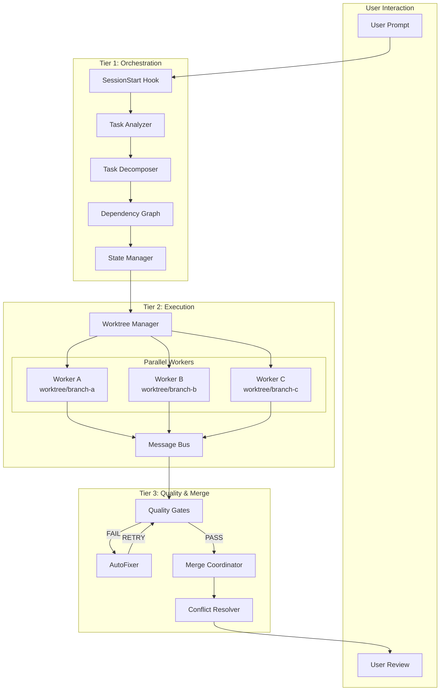
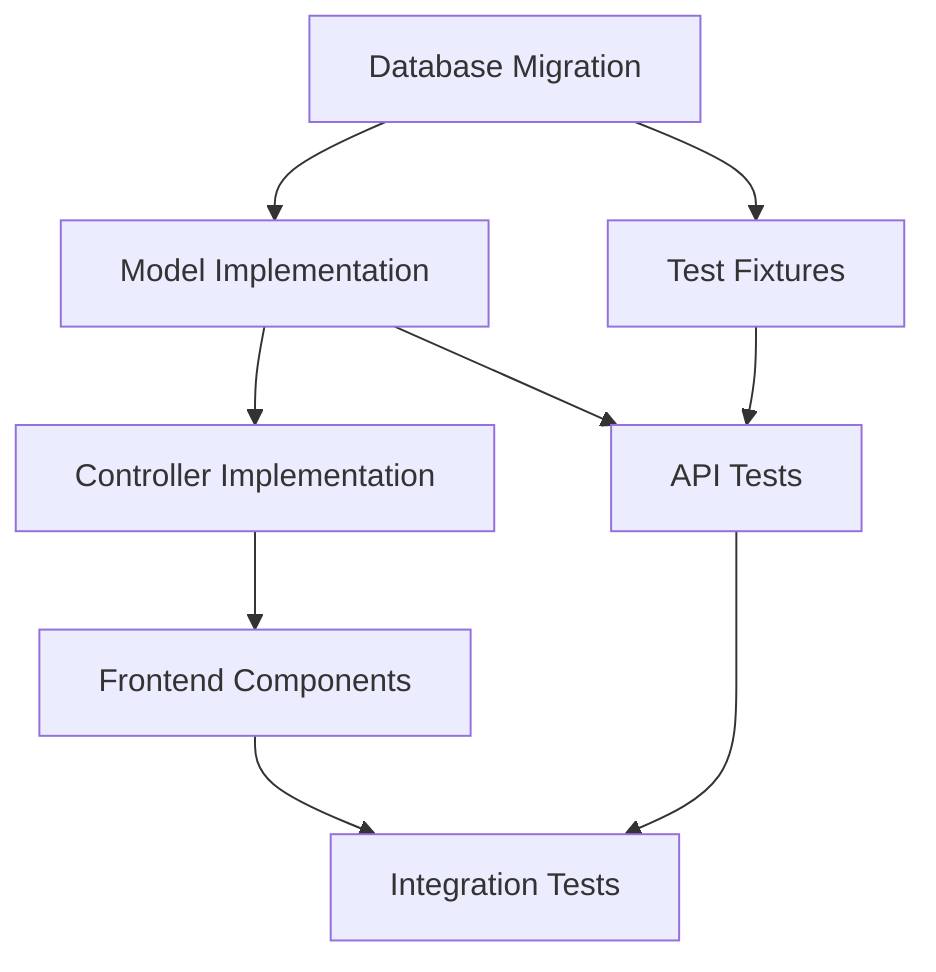
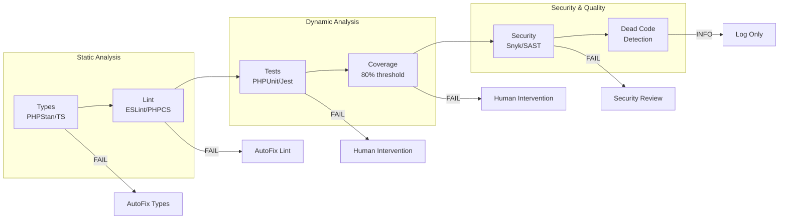
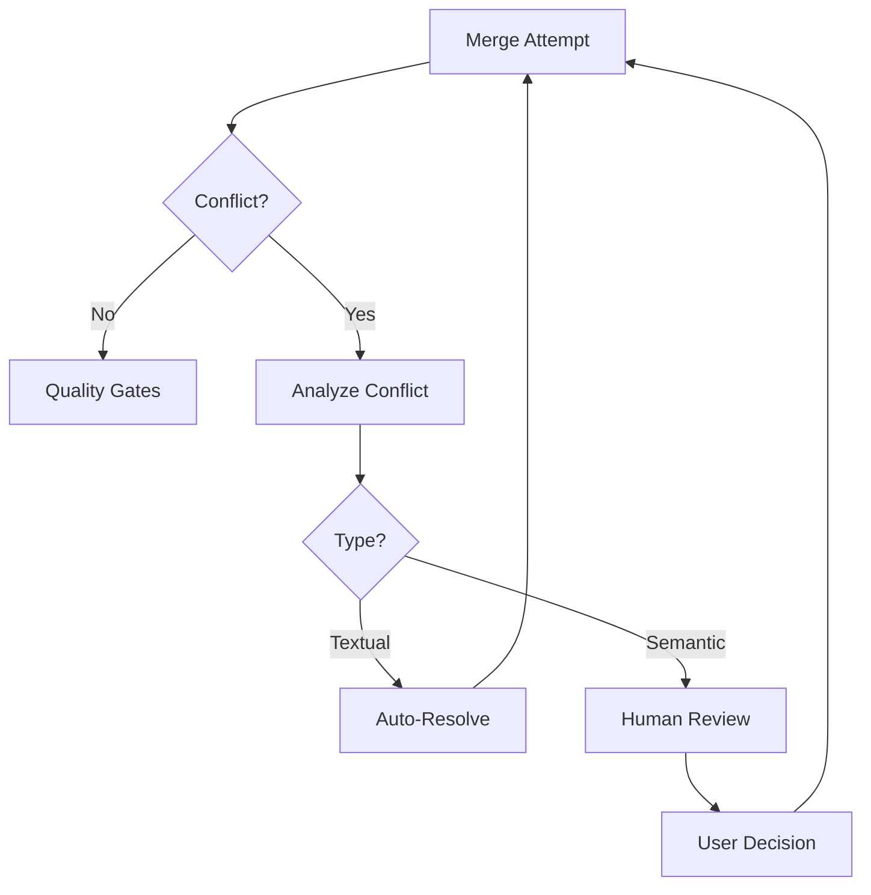

# Parallel Agent Orchestration System - Architecture Design

**Status:** PROJEKT ARCHITEKTONICZNY
**Data:** 2026-01-26
**Autor:** Architect Agent

---

## 1. Executive Summary

### Cel Systemu
System "Parallel Agent Orchestration" (PAO) umozliwia rownolegle wykonywanie zadan przez wielu agentow Claude Code w izolowanych srodowiskach git worktrees, z automatyczna weryfikacja jakosci i naprawa problemow.

### Kluczowe Korzysci
- **Przyspieszenie pracy** - rownolegle wykonywanie niezaleznych zadan
- **Izolacja zmian** - kazdy agent pracuje w osobnym worktree
- **Automatyczna weryfikacja** - quality gates przed merge
- **Auto-naprawa** - automatyczne naprawianie typowych problemow
- **Skalowalosc** - latwe dodawanie nowych agentow specjalistycznych

### Scope
- Global plugin dla Claude Code (instalacja w `~/.claude/plugins/`)
- Obsluga dowolnych projektow Git
- Integracja z istniejacym ekosystemem skills i agents

---

## 2. Architecture Overview

### Three-Tier Architecture

```
+-----------------------------------------------------------------------------------+
|                              TIER 1: ORCHESTRATION LAYER                          |
|                                                                                   |
|  +----------------+    +------------------+    +-------------------+              |
|  | SessionStart   | -> | Task Analyzer    | -> | Dependency Graph  |              |
|  | Hook           |    | (Intent Parser)  |    | Builder           |              |
|  +----------------+    +------------------+    +-------------------+              |
|         |                      |                       |                          |
|         v                      v                       v                          |
|  +----------------+    +------------------+    +-------------------+              |
|  | PreToolUse     |    | Task Decomposer  |    | State Manager     |              |
|  | Interceptor    |    | (Atomic Tasks)   |    | (Progress Track)  |              |
|  +----------------+    +------------------+    +-------------------+              |
|                                |                                                  |
+--------------------------------|--------------------------------------------------+
                                 v
+-----------------------------------------------------------------------------------+
|                              TIER 2: EXECUTION LAYER                              |
|                                                                                   |
|  +------------------+  +------------------+  +------------------+                 |
|  | Worktree Manager |  | Message Bus      |  | Shared Skills    |                 |
|  | (Git Operations) |  | (Agent Comm)     |  | (Cross-cutting)  |                 |
|  +------------------+  +------------------+  +------------------+                 |
|         |                      |                       |                          |
|         v                      v                       v                          |
|  +--------------------------------------------------------------------------------+
|  |                        WORKER AGENTS (PARALLEL)                                |
|  |  +-------------+  +-------------+  +-------------+  +-------------+            |
|  |  | CodeAgent   |  | TestAgent   |  | DocsAgent   |  | RefactorAgent|            |
|  |  | worktree/a  |  | worktree/b  |  | worktree/c  |  | worktree/d  |            |
|  |  +-------------+  +-------------+  +-------------+  +-------------+            |
|  +--------------------------------------------------------------------------------+
|                                                                                   |
+-----------------------------------------------------------------------------------+
                                 |
                                 v
+-----------------------------------------------------------------------------------+
|                          TIER 3: QUALITY & MERGE LAYER                            |
|                                                                                   |
|  +--------------------------------------------------------------------------------+
|  |                         QUALITY GATE PIPELINE                                  |
|  |  +--------+  +------+  +-------+  +----------+  +----------+  +-----------+   |
|  |  | Types  |->| Lint |->| Tests |->| Coverage |->| Security |->| Dead Code |   |
|  |  +--------+  +------+  +-------+  +----------+  +----------+  +-----------+   |
|  +--------------------------------------------------------------------------------+
|         |                                                                         |
|         v                                                                         |
|  +------------------+    +-------------------+    +-------------------+           |
|  | AutoFixer        | -> | Merge Coordinator | -> | Conflict Resolver |           |
|  | (Auto-repair)    |    | (Branch Merge)    |    | (Human Escalation)|           |
|  +------------------+    +-------------------+    +-------------------+           |
|                                                                                   |
+-----------------------------------------------------------------------------------+
```

### Mermaid Diagram - High Level Flow



---

## 3. Component Breakdown

### 3.1 Tier 1: Orchestration Layer

#### 3.1.1 Hook System

| Hook | Trigger | Responsibility |
|------|---------|----------------|
| `session-start.md` | Poczatek sesji | Inicjalizacja state managera, cleanup stale worktrees |
| `pre-tool-use.md` | Przed Task/Agent call | Intercept prompt, detect multi-agent need |
| `post-tool-use.md` | Po zakonczeniu | Cleanup, raportowanie |

**session-start.md:**
```markdown
# SessionStart Hook - Parallel Orchestrator

## Trigger
- Claude Code session initialization

## Actions
1. Initialize state manager (create .parallel-work/ if not exists)
2. Cleanup stale worktrees from previous sessions
3. Load configuration from plugin config
4. Register orchestrator availability
```

#### 3.1.2 Task Analyzer

**Cel:** Analiza promptu uzytkownika i okreslenie czy wymaga parallel execution.

**Kryteria Parallel Execution:**
- Wiele niezaleznych plikow do modyfikacji
- Rozne domeny (frontend + backend + tests)
- Explicit request (`/parallel`, `/orchestrate`)
- Zlozonosc > threshold (heurystyka)

**Pseudocode:**
```python
def analyze_task(prompt):
    # Extract intent
    intent = extract_intent(prompt)

    # Identify affected files/domains
    affected = identify_affected_resources(prompt)

    # Check parallelization criteria
    if len(affected.domains) > 1 or explicit_parallel_request(prompt):
        return ParallelTask(intent, affected)
    else:
        return SequentialTask(intent, affected)
```

#### 3.1.3 Dependency Graph Builder

**Cel:** Budowa DAG (Directed Acyclic Graph) zadan z uwzglednieniem zaleznosci.



#### 3.1.4 State Manager

**Lokalizacja:** `.parallel-work/state.json`

**Struktura:**
```json
{
  "session_id": "uuid-v4",
  "started_at": "2026-01-26T10:00:00Z",
  "status": "running",
  "tasks": [
    {
      "id": "task-001",
      "agent": "code-agent",
      "worktree": ".parallel-work/worktree-001",
      "branch": "parallel/task-001/code-agent",
      "status": "in_progress",
      "started_at": "2026-01-26T10:01:00Z",
      "quality_gates": {
        "types": null,
        "lint": null,
        "tests": null
      }
    }
  ],
  "dependencies": {
    "task-002": ["task-001"],
    "task-003": ["task-001", "task-002"]
  }
}
```

---

### 3.2 Tier 2: Execution Layer

#### 3.2.1 Worktree Manager

**Odpowiedzialnosci:**
- Tworzenie izolowanych worktrees
- Zarzadzanie branchami
- Cleanup po zakonczeniu

**Git Operations:**
```bash
# Create worktree
git worktree add .parallel-work/worktree-{id} -b parallel/{task-id}/{agent-name}

# List active worktrees
git worktree list

# Remove worktree
git worktree remove .parallel-work/worktree-{id}

# Cleanup branch
git branch -D parallel/{task-id}/{agent-name}
```

**Izolacja:**
- Kazdy agent ma wlasny katalog roboczy
- Zmiany nie wplywaja na inne agenty
- Full git history dostepna
- Mozliwosc manual inspection

#### 3.2.2 Worker Agents

| Agent | Specjalizacja | Typowe Zadania |
|-------|---------------|----------------|
| **CodeAgent** | Implementacja kodu | Features, bug fixes, refactoring |
| **TestAgent** | Testowanie | Unit tests, integration tests, e2e |
| **DocsAgent** | Dokumentacja | README, API docs, comments |
| **RefactorAgent** | Refaktoryzacja | Code cleanup, file splitting |
| **SecurityAgent** | Bezpieczenstwo | Security audit, vulnerability fixes |

**Agent Template (AGENT.md):**
```markdown
# CodeAgent

## Role
Implement code changes in isolated worktree.

## Capabilities
- Read/Write files in worktree
- Run build commands
- Execute local tests
- Report progress to orchestrator

## Communication
- Receive tasks via State Manager
- Report completion via Message Bus
- Request help via escalation

## Constraints
- ONLY modify files in assigned worktree
- MUST run quality checks before reporting completion
- CANNOT merge to main branch directly
```

#### 3.2.3 Message Bus

**Event Types:**
```typescript
interface AgentEvent {
  type: 'TASK_STARTED' | 'TASK_COMPLETED' | 'TASK_FAILED' | 'HELP_NEEDED';
  agent_id: string;
  task_id: string;
  timestamp: string;
  payload: Record<string, unknown>;
}

interface OrchestratorEvent {
  type: 'TASK_ASSIGNED' | 'TASK_CANCELLED' | 'MERGE_REQUESTED';
  target_agent: string;
  task_id: string;
  payload: Record<string, unknown>;
}
```

**Implementation:**
- File-based: `.parallel-work/events/{timestamp}-{type}.json`
- Polling-based consumption (every 2s)
- Event ordering by timestamp

---

### 3.3 Tier 3: Quality & Merge Layer

#### 3.3.1 Quality Gates Pipeline



#### 3.3.2 Quality Gate Specifications

| Gate | Tool | Threshold | AutoFix? | Blocking? |
|------|------|-----------|----------|-----------|
| Types | PHPStan L8 / tsc | 0 errors | Partial | YES |
| Lint | ESLint / PHP-CS-Fixer | 0 errors, <10 warnings | YES | YES |
| Tests | PHPUnit / Jest | 100% pass | NO | YES |
| Coverage | PHPUnit / Jest | 80% lines | NO | YES |
| Security | Snyk / SonarQube | 0 critical, 0 high | NO | YES |
| Dead Code | PHPStan / ESLint | Report only | NO | NO |

#### 3.3.3 AutoFixer

**Scope:**
- **Lint Fixes:** `eslint --fix`, `php-cs-fixer fix`
- **Type Fixes:** Suggest fixes (nie auto-apply)
- **Import Fixes:** Auto-organize imports

**Retry Logic:**
```python
MAX_ATTEMPTS = 3

def run_quality_with_autofix(worktree):
    for attempt in range(MAX_ATTEMPTS):
        result = run_quality_gates(worktree)

        if result.all_passed:
            return SUCCESS

        if result.has_auto_fixable:
            apply_auto_fixes(result.fixable_issues)
            continue

        if result.has_unfixable:
            return escalate_to_human(result.unfixable_issues)

    return FAILED_AFTER_RETRIES
```

#### 3.3.4 Merge Coordinator

**Strategy:**
1. Create staging branch: `parallel/{session-id}/staging`
2. Merge each worktree branch to staging (--no-ff)
3. Run quality gates on merged code
4. If pass: Merge staging to target branch
5. If fail: Analyze conflicts, attempt resolution

**Conflict Resolution:**


---

## 4. Shared Skills

### 4.1 Validation Skill

**Cel:** Walidacja inputow i outputow agentow.

```markdown
# Validation Skill

## Capabilities
- Schema validation (JSON Schema, TypeScript types)
- Business rule validation
- Cross-reference validation (file exists, function exists)

## Usage
Called by agents before committing changes to verify correctness.
```

### 4.2 Research Skill

**Cel:** Lookup dokumentacji i best practices.

```markdown
# Research Skill

## Integrations
- Context7 MCP (Laravel, Livewire, PrestaShop docs)
- WebFetch (external documentation)
- Codebase search (Grep, Glob)

## Usage
Called by agents when implementing new patterns or debugging issues.
```

### 4.3 Testing Skill

**Cel:** Generowanie i uruchamianie testow.

```markdown
# Testing Skill

## Capabilities
- Generate unit tests from implementation
- Run test suites
- Coverage analysis
- Test data generation

## Usage
Called by TestAgent and as verification step.
```

### 4.4 Planning Skill

**Cel:** Aktualizacja planow projektu.

```markdown
# Planning Skill

## Capabilities
- Update Plan_Projektu/ files
- Track progress (emoji status)
- Generate reports

## Usage
Called by Orchestrator after task completion.
```

---

## 5. File Structure

```
~/.claude/plugins/parallel-orchestrator/
|
+-- plugin.json                         # Plugin manifest
+-- README.md                           # Documentation
|
+-- hooks/
|   +-- session-start.md               # Session initialization
|   +-- pre-tool-use.md                # Prompt interception
|   +-- post-tool-use.md               # Cleanup
|
+-- agents/
|   +-- orchestrator/
|   |   +-- AGENT.md                   # Main orchestrator
|   |   +-- task-analyzer.ts           # Intent parsing
|   |   +-- dependency-graph.ts        # DAG builder
|   |   +-- state-manager.ts           # State persistence
|   |
|   +-- workers/
|   |   +-- code-agent/
|   |   |   +-- AGENT.md
|   |   +-- test-agent/
|   |   |   +-- AGENT.md
|   |   +-- docs-agent/
|   |   |   +-- AGENT.md
|   |   +-- refactor-agent/
|   |       +-- AGENT.md
|   |
|   +-- verifier/
|       +-- AGENT.md                   # Quality gate runner
|       +-- fixer/
|           +-- AGENT.md               # AutoFixer
|
+-- skills/
|   +-- validation/
|   |   +-- SKILL.md
|   +-- research/
|   |   +-- SKILL.md
|   +-- testing/
|   |   +-- SKILL.md
|   +-- planning/
|       +-- SKILL.md
|
+-- quality-gates/
|   +-- types.ts                       # PHPStan/TypeScript checker
|   +-- lint.ts                        # ESLint/PHP-CS-Fixer
|   +-- tests.ts                       # Test runner
|   +-- coverage.ts                    # Coverage analyzer
|   +-- security.ts                    # Security scanner
|   +-- dead-code.ts                   # Dead code detector
|
+-- lib/
|   +-- worktree-manager.ts            # Git worktree operations
|   +-- merge-coordinator.ts           # Merge logic
|   +-- message-bus.ts                 # Agent communication
|   +-- logger.ts                      # Logging utilities
|
+-- config/
    +-- default.json                   # Default configuration
    +-- quality-thresholds.json        # Quality gate thresholds
    +-- agent-limits.json              # Resource limits
```

---

## 6. Configuration

### 6.1 Plugin Manifest (plugin.json)

```json
{
  "name": "parallel-orchestrator",
  "version": "1.0.0",
  "description": "Parallel Agent Orchestration System for Claude Code",
  "author": "MPP TRADE",
  "license": "MIT",

  "entry": "hooks/session-start.md",

  "permissions": [
    "Bash(*)",
    "Read(*)",
    "Write(*)",
    "mcp__context7__*",
    "Task",
    "TodoWrite"
  ],

  "hooks": {
    "SessionStart": "hooks/session-start.md",
    "PreToolUse": "hooks/pre-tool-use.md",
    "PostToolUse": "hooks/post-tool-use.md"
  },

  "agents": [
    "agents/orchestrator/AGENT.md",
    "agents/workers/code-agent/AGENT.md",
    "agents/workers/test-agent/AGENT.md",
    "agents/workers/docs-agent/AGENT.md",
    "agents/workers/refactor-agent/AGENT.md",
    "agents/verifier/AGENT.md",
    "agents/verifier/fixer/AGENT.md"
  ],

  "skills": [
    "skills/validation/SKILL.md",
    "skills/research/SKILL.md",
    "skills/testing/SKILL.md",
    "skills/planning/SKILL.md"
  ],

  "config": {
    "max_parallel_agents": 4,
    "worktree_base": ".parallel-work",
    "quality_gate_timeout": 300,
    "auto_fix_attempts": 3,
    "cleanup_on_success": true,
    "cleanup_on_failure": false
  }
}
```

### 6.2 Quality Thresholds (quality-thresholds.json)

```json
{
  "types": {
    "enabled": true,
    "blocking": true,
    "tool": "auto",
    "max_errors": 0
  },
  "lint": {
    "enabled": true,
    "blocking": true,
    "tool": "auto",
    "max_errors": 0,
    "max_warnings": 10,
    "auto_fix": true
  },
  "tests": {
    "enabled": true,
    "blocking": true,
    "timeout": 300,
    "require_pass": true
  },
  "coverage": {
    "enabled": true,
    "blocking": true,
    "min_lines": 80,
    "min_functions": 70,
    "min_branches": 60
  },
  "security": {
    "enabled": true,
    "blocking": true,
    "max_critical": 0,
    "max_high": 0,
    "max_medium": 5
  },
  "dead_code": {
    "enabled": true,
    "blocking": false,
    "report_only": true
  }
}
```

---

## 7. Key Architectural Decisions

### 7.1 Decision: Parallel Execution Model

**Opcje:**
| Opcja | Opis | Pros | Cons |
|-------|------|------|------|
| A | Claude Code native Task tool | Prostosc | Sequential by design |
| B | External Node.js orchestrator | True parallelism | External dependency |
| C | Bash background jobs | Native, simple | Limited control |

**Decyzja:** **Opcja B - External Node.js orchestrator**

**Uzasadnienie:**
- True parallel execution (Promise.all)
- Better error handling
- Structured communication
- Easy scaling

### 7.2 Decision: State Persistence

**Opcje:**
| Opcja | Opis | Pros | Cons |
|-------|------|------|------|
| A | JSON files | Simple, portable | No transactions |
| B | SQLite | Queries, transactions | Extra dependency |
| C | In-memory | Fast | Lost on crash |

**Decyzja:** **Opcja A - JSON files z atomic writes**

**Uzasadnienie:**
- Zero dependencies
- Human-readable (debug)
- Git-friendly
- Atomic write via temp file + rename

### 7.3 Decision: Conflict Resolution

**Opcje:**
| Opcja | Opis | Pros | Cons |
|-------|------|------|------|
| A | Auto-merge only | Fast | May miss semantic conflicts |
| B | Semantic analysis | Better quality | Complex, slow |
| C | Always human review | Safest | Slow, blocks automation |

**Decyzja:** **Opcja B - Semantic analysis z fallback do human**

**Uzasadnienie:**
- Wykrywa konflikty na poziomie funkcji
- AutoFixer dla prostych przypadkow
- Human escalation dla zlozonych

### 7.4 Decision: Quality Gate Order

**Decyzja:** Static -> Dynamic -> Security

**Uzasadnienie:**
- Fail-fast: szybkie checky najpierw
- Type errors blokuja lint
- Lint errors moga blokowac testy
- Security na koniec (wolne)

### 7.5 Decision: Worktree Location

**Opcje:**
| Opcja | Opis | Pros | Cons |
|-------|------|------|------|
| A | W projekcie (.parallel-work/) | Blisko kodu | Zasmiecanie repo |
| B | Globalnie (~/.parallel-work/) | Czyste repo | Daleko od kodu |
| C | Temp dir (/tmp/) | Auto-cleanup | Lost on reboot |

**Decyzja:** **Opcja A - W projekcie z .gitignore**

**Uzasadnienie:**
- Latwiejszy dostep
- Relative paths
- Manual inspection
- Dodanie do .gitignore

---

## 8. Questions for Stakeholder

### 8.1 Scope & Triggering

1. **Trigger mechanism:** Czy system ma sie aktywowac automatycznie dla kazdego prompta, czy uzytkownik ma jawnie wolac `/parallel` lub `/orchestrate`?

2. **Detection criteria:** Jakie kryteria okreslaja czy zadanie wymaga wielu agentow?
   - Liczba plikow > X?
   - Wielosc domen (frontend + backend)?
   - Explicite slowa kluczowe?
   - Zlozonosc estimowana przez LLM?

3. **Opt-out:** Czy uzytkownik moze wymusic sequential execution nawet dla duzych zadan?

### 8.2 Technical Environment

4. **Node.js availability:** Czy mamy dostep do Node.js w globalnym srodowisku Claude Code? Jesli nie, jaki runtime jest dostepny?

5. **External daemon:** Czy akceptujesz zewnetrzny orchestrator (background process) czy preferujesz pure Claude Code solution?

6. **Execution timeout:** Jaki jest maksymalny akceptowalny czas wykonania parallel task? (5 min? 30 min? unlimited?)

### 8.3 Git & Repository

7. **Non-Git projects:** Jak obsluzyc projekty bez Git? Skip parallel mode? Error?

8. **Monorepo support:** Czy system ma wspierac monorepo (wiele projektow w jednym repo)?

9. **Branch protection:** Jak obsluzyc sytuacje gdy target branch ma protection rules?

### 8.4 Quality Gates

10. **Mandatory gates:** Ktore quality gates sa MANDATORY vs OPTIONAL?
    - [ ] Types (PHPStan/TypeScript)
    - [ ] Lint (ESLint/PHP-CS-Fixer)
    - [ ] Tests (PHPUnit/Jest)
    - [ ] Coverage
    - [ ] Security
    - [ ] Dead Code

11. **Thresholds:** Jakie progi akceptowalne?
    - Coverage minimum: 80%? 70%? 60%?
    - Max lint warnings: 0? 10? 50?
    - Security: block on critical only? high? medium?

12. **External services:** Czy chcesz integracje z zewnetrznymi serwisami?
    - [ ] SonarQube
    - [ ] Snyk
    - [ ] Codecov
    - [ ] GitHub Actions

### 8.5 AutoFixer Behavior

13. **Aggressiveness:** Jak agresywnie AutoFixer ma dzialac?
    - Safe-only (formatting, imports)
    - Medium (+ simple fixes)
    - Aggressive (wszystko co da sie naprawic automatycznie)

14. **Test modification:** Czy AutoFixer moze modyfikowac testy jesli sa broken?

15. **Retry limit:** Ile prob naprawy przed eskalacja do czlowieka? (3? 5? unlimited?)

### 8.6 Merge & Conflicts

16. **Merge strategy:** Preferowana strategia merge?
    - [ ] Merge commit (--no-ff)
    - [ ] Rebase
    - [ ] Squash

17. **Semantic conflicts:** Jak obsluzyc sytuacje gdy 2 agenty modyfikuja te sama funkcje?
    - Auto-merge wiekszej zmiany
    - Human review always
    - AI-assisted merge

18. **Human review:** Czy wymagany human review przed final merge? Zawsze? Tylko dla konfliktow?

### 8.7 Reporting & Integration

19. **Report detail:** Jak szczegolowe raporty?
    - Summary only (pass/fail)
    - Detailed (per-agent, per-gate)
    - Full logs

20. **Report location:** Gdzie zapisywac raporty?
    - [ ] _AGENT_REPORTS/ (existing)
    - [ ] .parallel-work/reports/
    - [ ] Console output only

21. **External notifications:** Czy integracja z external tools?
    - [ ] Slack
    - [ ] Email
    - [ ] GitHub PR comments

### 8.8 Plugin Distribution

22. **Installation scope:** Czy plugin ma byc instalowany:
    - [ ] Globalnie (~/.claude/plugins/)
    - [ ] Per-project (.claude/plugins/)
    - [ ] Both (configurable)

23. **Updates:** Jak dystrybuowac aktualizacje?
    - [ ] Manual copy
    - [ ] Git submodule
    - [ ] Package manager (npm?)
    - [ ] Auto-update mechanism

24. **Versioning:** Czy plugin ma miec semantic versioning? Changelog?

---

## 9. Implementation Phases (Proposal)

### Phase 1: Core Infrastructure
- [ ] Plugin scaffold
- [ ] Hook system
- [ ] Worktree manager
- [ ] State manager
- [ ] Basic orchestrator

### Phase 2: Worker Agents
- [ ] CodeAgent implementation
- [ ] TestAgent implementation
- [ ] Message bus
- [ ] Agent coordination

### Phase 3: Quality Gates
- [ ] Types checker integration
- [ ] Lint checker integration
- [ ] Test runner integration
- [ ] Coverage analyzer

### Phase 4: AutoFixer & Merge
- [ ] AutoFixer for lint
- [ ] Merge coordinator
- [ ] Conflict detection
- [ ] Human escalation flow

### Phase 5: Advanced Features
- [ ] Security scanner
- [ ] Dead code detector
- [ ] Shared skills
- [ ] Reporting system

### Phase 6: Polish & Distribution
- [ ] Documentation
- [ ] Configuration UI
- [ ] Plugin packaging
- [ ] Distribution mechanism

---

## 10. Risks & Mitigations

| Risk | Impact | Probability | Mitigation |
|------|--------|-------------|------------|
| Git conflicts during merge | High | Medium | Semantic analysis, human review |
| Quality gate false positives | Medium | Medium | Configurable thresholds |
| Agent deadlock | High | Low | Timeout + cleanup |
| Resource exhaustion | Medium | Low | Max parallel limit |
| Lost work on crash | High | Low | State persistence, worktree recovery |

---

## 11. Success Metrics

- **Speed:** 2-4x faster for parallelizable tasks
- **Quality:** 0 regressions from parallel execution
- **Reliability:** 99% successful completions
- **User satisfaction:** Intuitive UX, clear reporting

---

## 12. Next Steps

1. **Review** tego dokumentu z uzytkownikiem
2. **Odpowiedz** na pytania z sekcji 8
3. **Priorytetyzacja** features
4. **Estymacja** effort dla kazdej fazy
5. **Start implementacji** Phase 1

---

**Document Version:** 1.0.0
**Last Updated:** 2026-01-26
**Status:** AWAITING STAKEHOLDER INPUT
