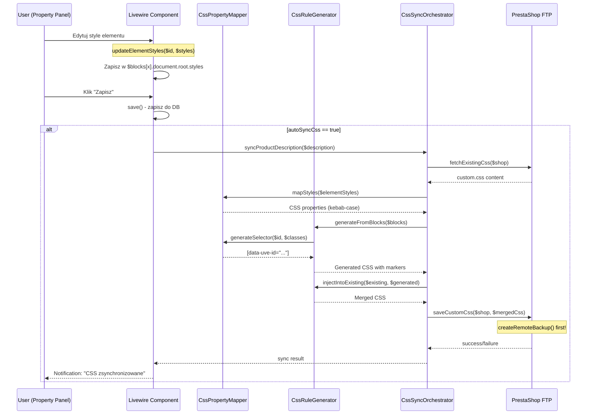

# RAPORT ARCHITEKTURY: CSS Synchronizacja (FAZA 5) dla UVE

**Data**: 2026-01-07
**Agent**: architect
**Zadanie**: Zaplanowanie architektury CSS Synchronizacji dla Unified Visual Editor

---

## 1. PODSUMOWANIE ANALIZY

### 1.1 Stan Aktualny - ISTNIEJE JUZ 80% KODU!

Podczas analizy odkrylem, ze **trzy kluczowe serwisy juz istnieja i sa zaimplementowane**:

| Serwis | Lokalizacja | Linie | Status |
|--------|-------------|-------|--------|
| `CssPropertyMapper` | `app/Services/VisualEditor/CssPropertyMapper.php` | 512 | ZAIMPLEMENTOWANY |
| `CssRuleGenerator` | `app/Services/VisualEditor/CssRuleGenerator.php` | 456 | ZAIMPLEMENTOWANY |
| `CssSyncOrchestrator` | `app/Services/VisualEditor/CssSyncOrchestrator.php` | 505 | ZAIMPLEMENTOWANY |
| `UVE_CssSync` (trait) | `app/Http/Livewire/.../Traits/UVE_CssSync.php` | 283 | ZAIMPLEMENTOWANY |
| `PrestaShopCssFetcher` | `app/Services/VisualEditor/PrestaShopCssFetcher.php` | 1356 | ZAIMPLEMENTOWANY |

**WNIOSEK**: FAZA 5 jest w 80% gotowa - brakuje tylko:
1. Integracji z metodą `save()` w UnifiedVisualEditor
2. UI feedback w toolbarze UVE
3. Obsługi responsive styles i hover states

---

## 2. ODPOWIEDZI NA PYTANIA ARCHITEKTONICZNE

### 2.1 Gdzie w PrestaShop przechowywany jest CSS dla opisów produktów?

**ODPOWIEDZ**: CSS przechowywany jest w plikach `custom.css` motywu PrestaShop.

**Mechanizm**:
```
PrestaShop Theme:
/themes/{theme_name}/assets/css/custom.css  <-- TUTAJ trafia CSS z UVE
```

**Implementacja w PPM** (istniejaca!):
1. `PrestaShopShop.ftp_config` - konfiguracja FTP z polami:
   - `host`, `port`, `user`, `password` (zaszyfrowane)
   - `css_path` - sciezka do custom.css
2. `PrestaShopShop.css_files[]` - tablica zeskanowanych plikow CSS z polami:
   - `url`, `filename`, `category`, `enabled`, `cached_content`, `last_fetched_at`
3. `PrestaShopCssFetcher` - operacje FTP: `ftpRead()`, `ftpWrite()`, `createRemoteBackup()`

### 2.2 Jak identyfikowac selektory CSS dla elementow?

**ODPOWIEDZ**: Uzywamy `data-uve-id` jako glownego selektora.

**Strategia selektorow** (juz zaimplementowana w CssPropertyMapper):

```php
// app/Services/VisualEditor/CssPropertyMapper.php:433-447
public function generateSelector(string $id, array $classes = []): string
{
    // Prefer ID-based selector for uniqueness
    if (!empty($id)) {
        return "[data-uve-id=\"{$id}\"]";
    }
    // Fallback to class-based selector
    if (!empty($classes)) {
        return '.' . implode('.', array_map('trim', $classes));
    }
    return '';
}
```

**Scope selector** (juz zaimplementowany w CssRuleGenerator):
```php
// app/Services/VisualEditor/CssRuleGenerator.php:142-154
private function getScopeSelector(?int $shopId, ?int $productId): string
{
    $parts = [];
    if ($productId) {
        $parts[] = "[data-product-id=\"{$productId}\"]";
    }
    $parts[] = '.uve-content';
    return implode(' ', $parts) . ' ';
}
```

**Przyklad wygenerowanego selektora**:
```css
[data-product-id="123"] .uve-content [data-uve-id="blk_001_heading_1"] {
    font-size: 24px;
    color: #e0ac7e;
}
```

### 2.3 Jak unikac konfliktow z istniejacym CSS PrestaShop?

**ODPOWIEDZ**: System uzywa sekcji oznaczonych komentarzami (juz zaimplementowane).

```php
// app/Services/VisualEditor/CssRuleGenerator.php:27-28
private const SECTION_START = '/* ========== UVE GENERATED CSS START ========== */';
private const SECTION_END = '/* ========== UVE GENERATED CSS END ========== */';
```

**Mechanizm merge** (juz zaimplementowany):
```php
// app/Services/VisualEditor/CssRuleGenerator.php:246-262
public function injectIntoExisting(string $existingCss, string $generatedCss): string
{
    $startPos = strpos($existingCss, self::SECTION_START);
    $endPos = strpos($existingCss, self::SECTION_END);

    if ($startPos !== false && $endPos !== false) {
        // Replace existing section
        $before = substr($existingCss, 0, $startPos);
        $after = substr($existingCss, $endPos + strlen(self::SECTION_END));
        return rtrim($before) . "\n\n" . $generatedCss . "\n" . ltrim($after);
    }
    // Append to end
    return rtrim($existingCss) . "\n\n" . $generatedCss;
}
```

**Backup przed zapisem** (juz zaimplementowany):
```php
// app/Services/VisualEditor/PrestaShopCssFetcher.php:1139-1186
private function createRemoteBackup(array $config): ?string
{
    $backupPath = $cssPath . '.backup.' . date('Y-m-d_His');
    // ... FTP backup logic
}
```

### 2.4 Jak obsluzywac responsive styles (breakpoints)?

**ODPOWIEDZ**: Juz istnieje infrastruktura, brakuje integracji z CSS sync.

**Istniejaca infrastruktura**:
1. `UVE_ResponsiveStyles` trait - przechowuje style per breakpoint
2. `CssRuleGenerator::generateResponsiveRules()` - generuje media queries

```php
// app/Services/VisualEditor/CssRuleGenerator.php:315-361
public function generateResponsiveRules(array $rules, array $breakpoints): string
{
    $mediaQueries = [
        'tablet' => '@media (max-width: 1024px)',
        'mobile' => '@media (max-width: 768px)',
    ];
    // ... generates rules with media queries
}
```

**BRAKUJE**: Integracja `UVE_ResponsiveStyles` z `CssSyncOrchestrator`.

### 2.5 Jak obsluzywac hover states (:hover pseudo-selectors)?

**ODPOWIEDZ**: Juz istnieje kontrolka hover-states, brakuje integracji z CSS sync.

**Istniejaca infrastruktura**:
1. `uve-property-panel-v2.blade.php` - toggle Normal/Hover
2. `controls/hover-states.blade.php` - UI dla edycji hover
3. `controls/transition.blade.php` - animacje przejsc

**Struktura danych** (z UVE_PropertyPanel):
```php
$element = [
    'styles' => [
        'color' => '#333',
        'fontSize' => '16px'
    ],
    'hoverStyles' => [  // <-- HOVER STYLES
        'color' => '#e0ac7e',
        'transform' => 'scale(1.05)'
    ],
    'transition' => [
        'duration' => '0.3s',
        'timing' => 'ease-in-out',
        'properties' => ['color', 'transform']
    ]
];
```

**BRAKUJE**: Modyfikacja `CssRuleGenerator::generateBlockRules()` o obsluge hover.

---

## 3. ARCHITEKTURA CSS SYNC - DIAGRAM

```
+------------------+     +---------------------+     +------------------+
|   UVE Editor     |     |   CSS Generation    |     |   PrestaShop     |
|                  |     |                     |     |                  |
| +--------------+ |     | +-----------------+ |     | +-------------+  |
| | Property     | |     | | CssProperty     | |     | | FTP Server  |  |
| | Panel        |------>| | Mapper          | |     | |             |  |
| | (styles)     | |     | | (camel->kebab)  | |     | | custom.css  |  |
| +--------------+ |     | +-----------------+ |     | +-------------+  |
|                  |     |          |          |     |        ^         |
| +--------------+ |     |          v          |     |        |         |
| | UVE_CssSync  | |     | +-----------------+ |     |        |         |
| | Trait        |------>| | CssRule         | |     |        |         |
| | (syncCss)    | |     | | Generator       | |     |        |         |
| +--------------+ |     | | (selectors)     | |     |        |         |
|        |         |     | +-----------------+ |     |        |         |
|        v         |     |          |          |     |        |         |
| +--------------+ |     |          v          |     |        |         |
| | save()       | |     | +-----------------+ |     |        |         |
| | method       |------>| | CssSync         |----->|        |         |
| +--------------+ |     | | Orchestrator    | |     |        |         |
+------------------+     | | (fetch->merge-> | |     +--------+---------+
                         | |  upload)        | |
                         | +-----------------+ |
                         +---------------------+
```

---

## 4. PRZEPYW DANYCH CSS (Edit -> Save -> Sync)



---

## 5. PROPOZYCJA NAZEWNICTWA SELEKTOROW CSS

### 5.1 Hierarchia selektorow

| Poziom | Selektor | Przyklad | Specyficznosc |
|--------|----------|----------|---------------|
| Product Scope | `[data-product-id="123"]` | Izolacja produktu | Niska |
| UVE Container | `.uve-content` | Container UVE | Srednia |
| Block ID | `[data-uve-id="blk_001"]` | Blok | Wysoka |
| Element ID | `[data-uve-id="blk_001_heading_1"]` | Element | Najwyzsza |
| PrestaShop Class | `.pd-intro`, `.pd-cover` | Klasy PS | Srednia |

### 5.2 Pelny selektor (produkcja)

```css
/* Element-specific styles */
[data-product-id="123"] .uve-content [data-uve-id="blk_001_heading_1"] {
    font-size: 24px;
    color: #e0ac7e;
}

/* Hover state */
[data-product-id="123"] .uve-content [data-uve-id="blk_001_heading_1"]:hover {
    color: #ffffff;
    transform: scale(1.05);
}

/* Tablet breakpoint */
@media (max-width: 1024px) {
    [data-product-id="123"] .uve-content [data-uve-id="blk_001_heading_1"] {
        font-size: 20px;
    }
}

/* Mobile breakpoint */
@media (max-width: 768px) {
    [data-product-id="123"] .uve-content [data-uve-id="blk_001_heading_1"] {
        font-size: 18px;
    }
}
```

### 5.3 CSS Classes (pd-*) - bez scope

```css
/* PrestaShop default classes - bez scope productId */
.uve-content .pd-intro {
    padding: 40px;
    background: linear-gradient(135deg, #1a1a2e 0%, #16213e 100%);
}

.uve-content .pd-merits__item {
    display: flex;
    align-items: center;
    gap: 16px;
}
```

---

## 6. BRAKUJACE ELEMENTY DO IMPLEMENTACJI

### 6.1 Lista brakujacych elementow

| ID | Element | Priorytet | Estymacja |
|----|---------|-----------|-----------|
| B1 | Integracja `save()` z `afterSaveCssSync()` | WYSOKI | 0.5 dnia |
| B2 | UI: przycisk [Sync CSS] w toolbarze | WYSOKI | 0.5 dnia |
| B3 | UI: progress bar podczas sync | SREDNI | 0.5 dnia |
| B4 | Hover styles w `CssRuleGenerator` | SREDNI | 1 dzien |
| B5 | Responsive styles integracja | SREDNI | 1 dzien |
| B6 | UI: CSS Preview modal | NISKI | 0.5 dnia |

### 6.2 Pliki do modyfikacji

```
MODYFIKACJE (istniejace pliki):
1. app/Http/Livewire/Products/VisualDescription/UnifiedVisualEditor.php
   - Dodanie wywolania afterSaveCssSync() w save()
   - Uzycie traitu UVE_CssSync

2. app/Services/VisualEditor/CssRuleGenerator.php
   - Dodanie generateHoverRules()
   - Integracja z UVE_ResponsiveStyles

3. resources/views/livewire/products/visual-description/unified-visual-editor.blade.php
   - Przycisk [Sync CSS] w toolbarze
   - Progress bar dla sync
   - CSS Preview modal
```

### 6.3 Szczegoly implementacji B4 (Hover styles)

```php
// CssRuleGenerator.php - DODAC:
public function generateBlockRules(array $block, ?int $shopId = null, ?int $productId = null): array
{
    $rules = [];
    // ... existing code ...

    // NOWE: Collect hover rules
    $this->collectHoverRules($document['root'], $rules, $scopePrefix);

    return $rules;
}

private function collectHoverRules(array $element, array &$rules, string $scopePrefix): void
{
    $elementId = $element['id'] ?? '';
    $hoverStyles = $element['hoverStyles'] ?? [];

    if (!empty($elementId) && !empty($hoverStyles)) {
        $selector = $scopePrefix . '[data-uve-id="' . $elementId . '"]:hover';
        $cssProps = $this->propertyMapper->mapStyles($hoverStyles);
        if (!empty($cssProps)) {
            $rules[$selector] = $cssProps;
        }

        // Add transition if defined
        $transition = $element['transition'] ?? [];
        if (!empty($transition)) {
            $baseSelector = $scopePrefix . '[data-uve-id="' . $elementId . '"]';
            $rules[$baseSelector]['transition'] = $this->formatTransition($transition);
        }
    }

    // Process children
    if (!empty($element['children'])) {
        foreach ($element['children'] as $child) {
            $this->collectHoverRules($child, $rules, $scopePrefix);
        }
    }
}

private function formatTransition(array $transition): string
{
    $properties = $transition['properties'] ?? ['all'];
    $duration = $transition['duration'] ?? '0.3s';
    $timing = $transition['timing'] ?? 'ease';
    $delay = $transition['delay'] ?? '0s';

    return implode(', ', array_map(
        fn($prop) => "{$prop} {$duration} {$timing} {$delay}",
        $properties
    ));
}
```

---

## 7. TIMELINE IMPLEMENTACJI

| Dzien | Zadanie | Deliverable |
|-------|---------|-------------|
| 1 | B1 + B2: Integracja save() + UI button | Sync dziala przy zapisie |
| 2 | B4: Hover styles | :hover selektory w CSS |
| 3 | B5: Responsive styles | @media queries w CSS |
| 4 | B3 + B6: Progress bar + Preview modal | Kompletne UI |

**TOTAL**: 4 dni (zgodnie z estymacja w planie projektu)

---

## 8. PYTANIA DO UZYTKOWNIKA

1. **Czy CSS sync ma byc domyslnie wlaczony?**
   - Obecnie: `$autoSyncCss = true`
   - Alternatywa: Per-shop setting

2. **Czy tworzyc backup CSS przed kazda synchronizacja?**
   - Obecnie: TAK, `createRemoteBackup()` jest wywolywane
   - Limit backupow? (np. max 10, rotacja)

3. **Czy generowac minified CSS czy pretty-printed?**
   - Obecnie: Pretty-printed (dla debugowania)
   - Produkcja: Moze minified dla wydajnosci?

4. **Czy obslugiwac CSS Variables (--var-name)?**
   - Obecnie: NIE zaimplementowane
   - Potrzebne?: `:root { --brand-color: #e0ac7e; }`

---

## 9. PODSUMOWANIE

### Co juz mamy (80%):
- CssPropertyMapper - konwersja camelCase na kebab-case
- CssRuleGenerator - generowanie selektorow i CSS rules
- CssSyncOrchestrator - caly workflow fetch->modify->upload
- PrestaShopCssFetcher - operacje FTP read/write
- UVE_CssSync trait - metody Livewire

### Co brakuje (20%):
- Integracja z save() - 0.5 dnia
- UI w toolbarze - 0.5 dnia
- Hover styles - 1 dzien
- Responsive styles - 1 dzien
- Preview modal - 0.5 dnia

### Rekomendacja:
**FAZA 5 jest prawie gotowa.** Potrzebne sa glownie modyfikacje istniejacych plikow, a nie tworzenie nowych serwisow. Estymacja 4 dni jest realistyczna.

---

**Autor**: architect agent
**Wersja**: 1.0
**Data utworzenia**: 2026-01-07
