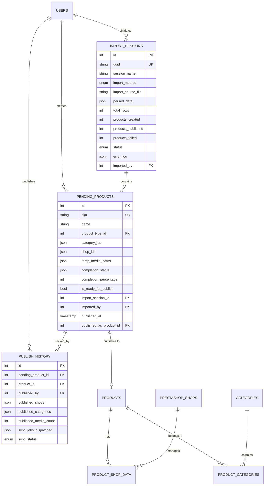
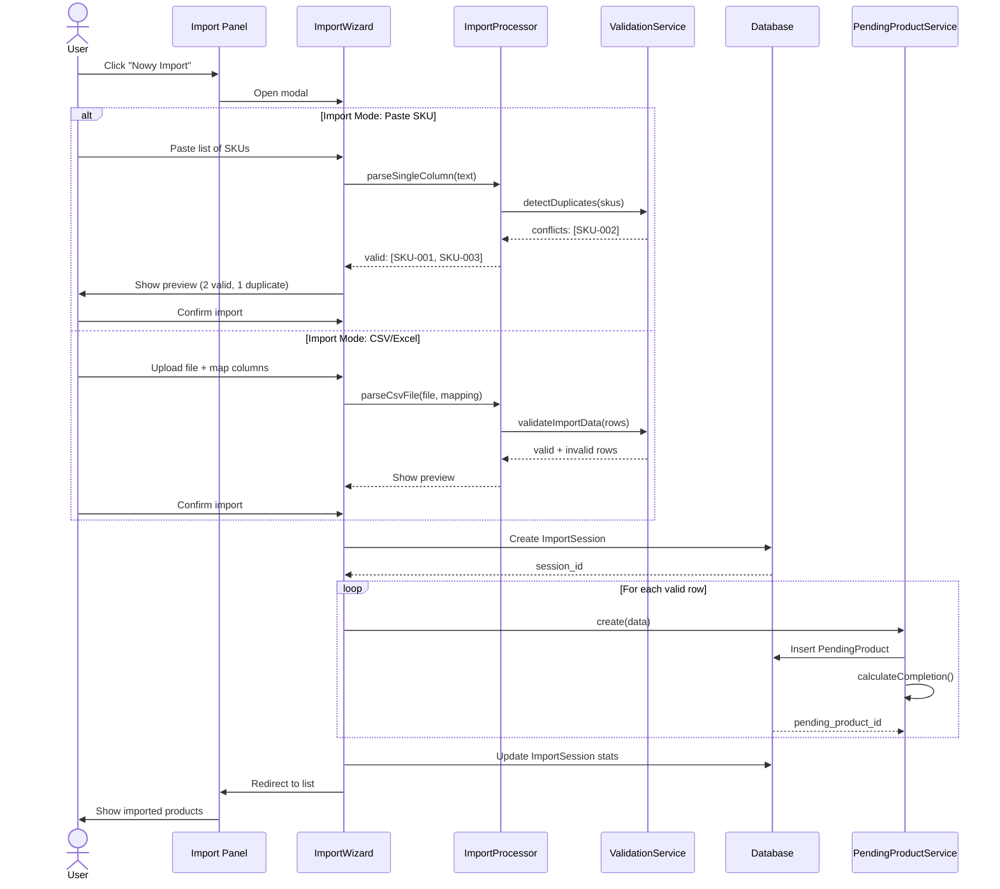
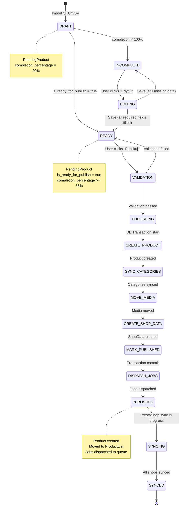
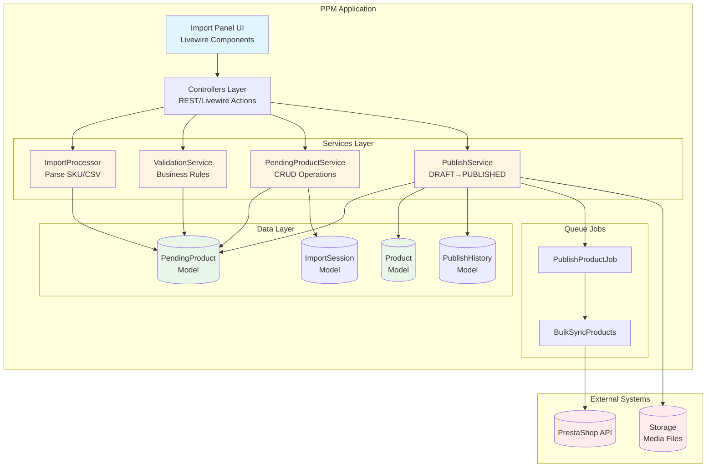
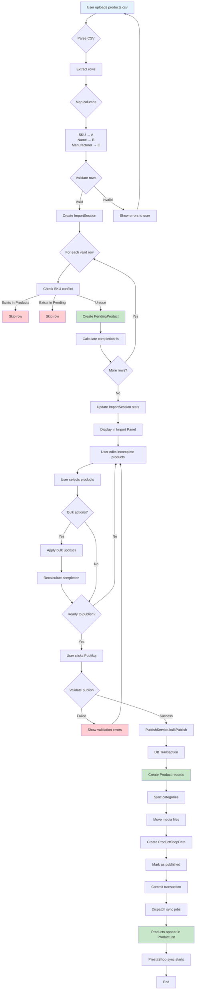
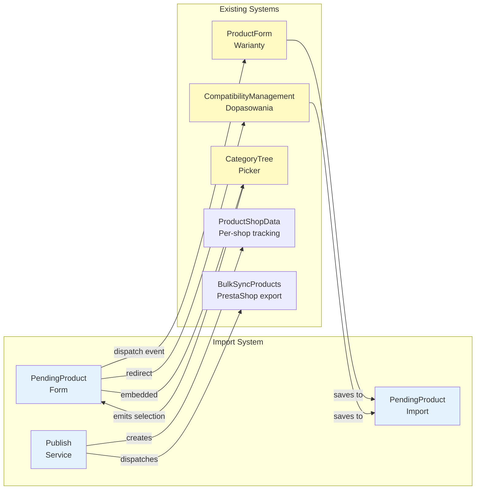
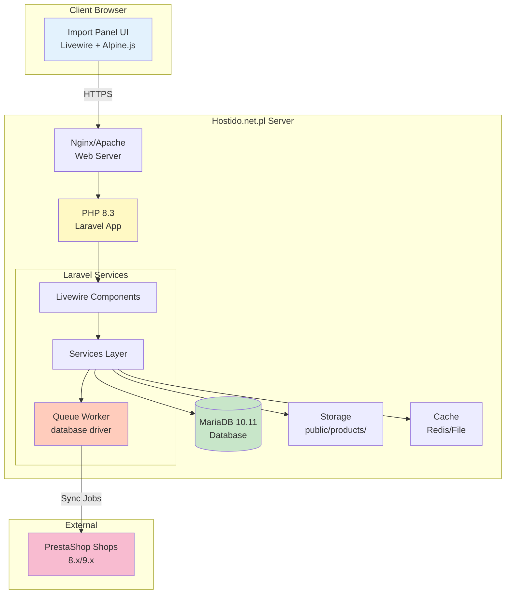
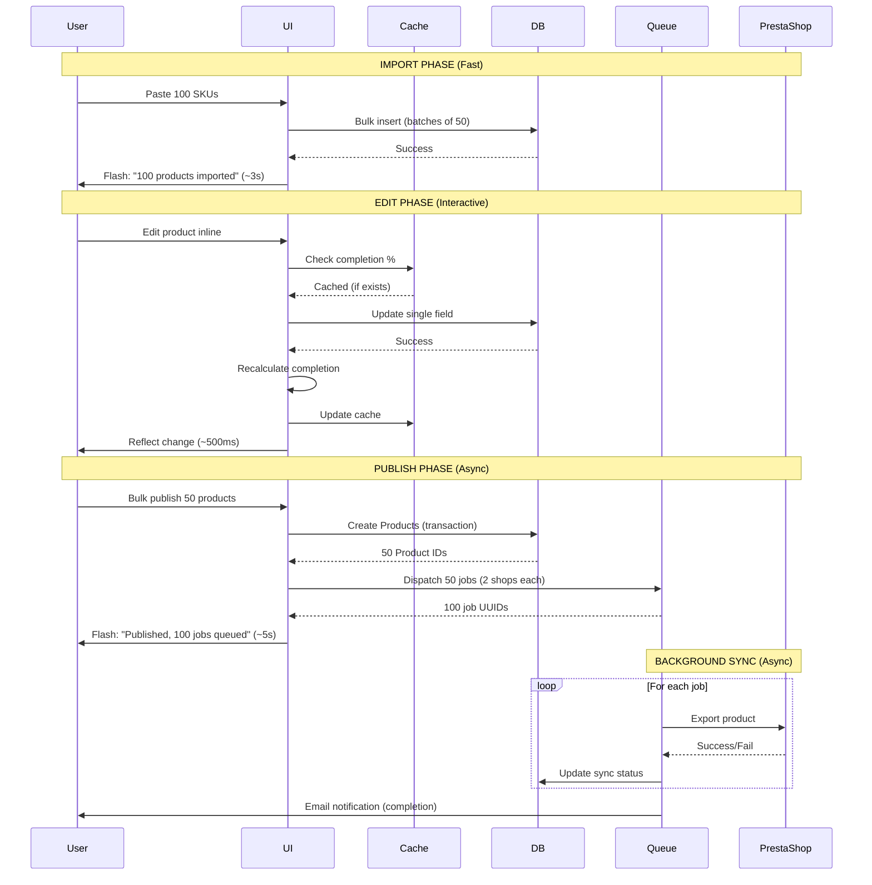

# DIAGRAMY ARCHITEKTURY: System IMPORT DO PPM

**Agent:** architect
**Data:** 2025-12-08
**Powiązany raport:** architect_PPM_IMPORT_SYSTEM_ARCHITECTURE.md

---

## 📊 DIAGRAM 1: Entity Relationship Diagram



---

## 🔄 DIAGRAM 2: Import Workflow (Sequence Diagram)



---

## 📤 DIAGRAM 3: Publish Workflow (State Machine)



---

## 🏗️ DIAGRAM 4: Component Architecture (C4 Model - Container)



---

## 🔀 DIAGRAM 5: Data Flow - CSV Import Example



---

## 🎨 DIAGRAM 6: UI Component Tree

```mermaid
graph TD
    ROOT[/admin/import/products]

    ROOT --> LIST[PendingProductsList Component]
    ROOT --> WIZARD[ImportWizard Modal]
    ROOT --> FORM[PendingProductForm Modal]
    ROOT --> BULK[BulkActions Dropdown]

    LIST --> TABLE[Table with inline editing]
    LIST --> ACTIONS[Row actions menu]

    WIZARD --> MODE[Select import mode]
    MODE --> PASTE_SKU[Paste SKU textarea]
    MODE --> PASTE_TWO[Paste SKU+Name textarea]
    MODE --> UPLOAD[CSV/Excel upload]

    UPLOAD --> MAP[Column mapping]
    MAP --> PREVIEW[Preview 10 rows]
    PREVIEW --> CONFIRM[Confirm import button]

    FORM --> TABS[Tab navigation]
    TABS --> TAB_BASIC[Podstawowe]
    TABS --> TAB_CAT[Kategorie<br/>CategoryTree picker]
    TABS --> TAB_VAR[Warianty<br/>→ ProductForm integration]
    TABS --> TAB_FEAT[Cechy/Dopasowania<br/>→ CompatibilityManagement]
    TABS --> TAB_MEDIA[Zdjęcia<br/>Drag&drop upload]
    TABS --> TAB_SHOPS[Sklepy<br/>Tile selector]

    BULK --> BULK_CAT[Przypisz kategorie]
    BULK --> BULK_PREFIX[Dodaj prefix/suffix]
    BULK --> BULK_TYPE[Ustaw typ produktu]
    BULK --> BULK_SHOPS[Wybierz sklepy]
    BULK --> BULK_PUB[Publikuj zaznaczone]

    style ROOT fill:#e1f5ff
    style LIST fill:#fff9c4
    style WIZARD fill:#f3e5f5
    style FORM fill:#e8f5e9
    style BULK fill:#ffccbc
```

---

## 🔄 DIAGRAM 7: Integration Points



---

## 📋 DIAGRAM 8: Permission Matrix

```mermaid
graph TB
    subgraph "User Roles & Permissions"
        ADMIN[Admin<br/>Full Access]
        MANAGER[Manager<br/>Import + Publish]
        EDITOR[Editor<br/>Import only]
        WAREHOUSE[Magazynier<br/>No access]
    end

    subgraph "Import Actions"
        IMP[Import SKU/CSV]
        EDIT[Edit pending products]
        BULK[Bulk actions]
        PUB[Publish to ProductList]
        HIST[View history]
    end

    ADMIN --> IMP
    ADMIN --> EDIT
    ADMIN --> BULK
    ADMIN --> PUB
    ADMIN --> HIST

    MANAGER --> IMP
    MANAGER --> EDIT
    MANAGER --> BULK
    MANAGER --> PUB
    MANAGER -.->|read only| HIST

    EDITOR --> IMP
    EDITOR --> EDIT
    EDITOR -.->|limited| BULK
    EDITOR -.x.->|denied| PUB
    EDITOR -.x.->|denied| HIST

    WAREHOUSE -.x.->|denied| IMP
    WAREHOUSE -.x.->|denied| EDIT

    style ADMIN fill:#4caf50
    style MANAGER fill:#8bc34a
    style EDITOR fill:#ffc107
    style WAREHOUSE fill:#f44336
    style PUB fill:#2196f3
```

---

## 🚀 DIAGRAM 9: Deployment Architecture



---

## 📈 DIAGRAM 10: Performance Flow



---

**KONIEC DIAGRAMÓW**
