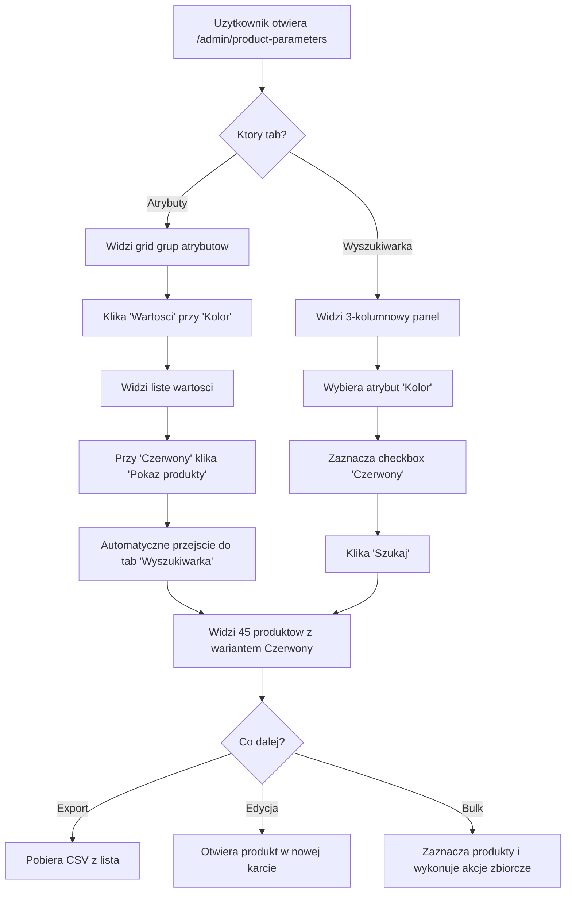
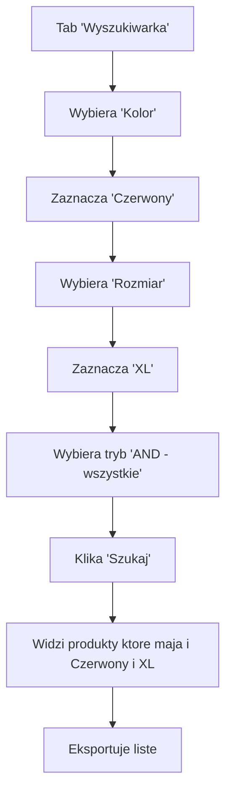

# RAPORT ARCHITEKTA: Przebudowa Panelu Zarzadzania Wariantami

**Data:** 2025-12-11
**Agent:** architect
**Zadanie:** Projekt nowej architektury panelu zarzadzania wariantami produktow
**Plik:** `_AGENT_REPORTS/architect_VARIANT_MANAGEMENT_PANEL_REDESIGN.md`

---

## SPIS TRESCI

1. [Analiza Obecnego Stanu](#1-analiza-obecnego-stanu)
2. [Zidentyfikowane Problemy UX](#2-zidentyfikowane-problemy-ux)
3. [Propozycja Nowej Architektury](#3-propozycja-nowej-architektury)
4. [Kluczowa Funkcjonalnosc: Wyszukiwanie Produktow po Wariantach](#4-kluczowa-funkcjonalnosc-wyszukiwanie-produktow-po-wariantach)
5. [Komponenty Livewire do Implementacji](#5-komponenty-livewire-do-implementacji)
6. [Diagram Flow Uzytkownika](#6-diagram-flow-uzytkownika)
7. [Nowe Queries i Scopes](#7-nowe-queries-i-scopes)
8. [Plan Implementacji](#8-plan-implementacji)
9. [Szacowany Effort](#9-szacowany-effort)

---

## 1. ANALIZA OBECNEGO STANU

### 1.1 Struktura Plikow

| Plik | Linie | Odpowiedzialnosc |
|------|-------|------------------|
| `ProductParametersManager.php` | 65 | Glowny tabs controller (Atrybuty, Marki, Magazyny, Typy) |
| `AttributeSystemManager.php` | 328 | CRUD dla AttributeType (grup atrybutow) |
| `AttributeValueManager.php` | 276 | CRUD dla AttributeValue (wartosci atrybutow) |
| `attribute-system-manager.blade.php` | 448 | UI - grid kart AttributeType |
| `attribute-value-manager.blade.php` | 222 | UI - modal z lista wartosci |

### 1.2 Obecny Flow

```
/admin/product-parameters
    |
    +-- Tabs: [Atrybuty] [Marki] [Magazyny] [Typy]
    |
    +-- Tab "Atrybuty":
        |
        +-- Grid kart AttributeType (Kolor, Rozmiar, Material...)
        |   +-- Kazda karta pokazuje:
        |       - Nazwa + kod
        |       - Status active/inactive
        |       - Sync status PS (badge per shop)
        |       - Liczba wartosci
        |       - Liczba produktow (!)
        |       - Przyciski: Edytuj, Wartosci, Usun
        |
        +-- Klik "Wartosci" -> Modal AttributeValueManager
            +-- Lista wartosci (Bialy, Czerwony, Niebieski...)
            +-- Kazda wartosc pokazuje:
                - Label + kod
                - Color hex (jesli typ color)
                - Liczba produktow (!)
                - Sync status per shop
                - Akcje: Edit, Sync, Delete
```

### 1.3 Model Danych

```
AttributeType (1) ----< (N) AttributeValue (1) ----< (N) VariantAttribute (N) >---- (1) ProductVariant (N) >---- (1) Product
     |                           |                              |                           |
   Kolor                       Czerwony                    Wariant X ma                 Produkt Y
   Rozmiar                     Niebieski                   kolor=Czerwony
   Material                    XL, L, M
```

**Kluczowe relacje:**
- `AttributeValue::variantAttributes()` -> HasMany VariantAttribute
- `VariantAttribute::variant()` -> BelongsTo ProductVariant
- `ProductVariant::product()` -> BelongsTo Product

---

## 2. ZIDENTYFIKOWANE PROBLEMY UX

### PROBLEM 1: Brak mozliwosci wyszukiwania produktow po wariantach

**Opis:** Uzytkownik chce znalezc wszystkie produkty ktore maja wariant "Czerwony" lub wariant "Rozmiar XL" - **obecnie NIE MA takiej funkcji!**

**Current State:**
- Modal "Produkty uzywajace wartosci" pokazuje tylko liste
- Brak filtrowania, sortowania, paginacji
- Brak akcji na produktach (link do edycji)

**User Need:**
> "Potrzebuje wczytac produkty z okreslonymi wariantami"

### PROBLEM 2: Nieintuicyjny 2-poziomowy layout

**Opis:** Obecny flow wymaga:
1. Znalezc AttributeType na gridzie
2. Kliknac "Wartosci" -> otwiera modal
3. Znalezc wartosc na liscie
4. Kliknac "Produkty" -> otwiera kolejny modal

**4 kroki** zeby zobaczyc produkty z danym wariantem!

### PROBLEM 3: Slaba czytelnosc kart AttributeType

**Opis:**
- Wszystkie karty wygladaja tak samo
- Brak wizualnego rozroznienia "uzywane" vs "nieuzywane" wartosci
- Badge sync PS male i trudne do odczytania
- Liczba produktow czesto pokazuje 0 (bug naprawiony, ale UX slabe)

### PROBLEM 4: Modal-in-Modal Anti-pattern

**Opis:** Obecne rozwiazanie:
- Modal wartosci
  - Modal produktow (nested!)
  - Modal sync (nested!)

**Problem:** Z-index conflicts, Escape key confusion, mobile UX broken

### PROBLEM 5: Brak bulk operations na produktach

**Opis:** Po znalezieniu produktow z danym wariantem, uzytkownik nie moze:
- Eksportowac listy
- Zmienic kategorii
- Zmienic ceny
- Wykonac innych akcji zbiorczych

---

## 3. PROPOZYCJA NOWEJ ARCHITEKTURY

### 3.1 Nowy Layout: Master-Detail-Results (3-Panel)

```
+===================================================================================+
|  ZARZADZANIE WARIANTAMI                                           [+ Dodaj Grupe] |
+===================================================================================+
| [Szukaj atrybuty...]                                                              |
+-------------------+-------------------------------------------+-------------------+
| GRUPY ATRYBUTOW   | WARTOSCI: Kolor (12)                      | PRODUKTY (45)     |
| (4)               |                                           |                   |
+-------------------+-------------------------------------------+-------------------+
| [*] Kolor      12 | [Szukaj...] [Filtr: v] [+ Dodaj]         | [Szukaj...] [v]   |
|     @B2B @KAYO    |                                           |                   |
|                   | [ ] #fff Bialy     0 prod  [Edytuj]       | [Zaznacz wsz.]    |
| [ ] Rozmiar    6  | [*] #f00 Czerwony 45 prod [Edytuj]       |                   |
|     @B2B          |     ^-- ZAZNACZONY                        | [] MRF13-68-003   |
|                   | [ ] #00f Niebieski 12 prod [Edytuj]       |    Nakladki MRF   |
| [ ] Material   3  | [ ] #0f0 Zielony   8 prod  [Edytuj]       |    3 warianty     |
|     @B2B @YCF     |                                           |                   |
|                   | BULK: [Usun nieuzywane] [Sync All]        | [] KAYO-K1-2024   |
+-------------------+-------------------------------------------+    Pit bike KAYO  |
                    |                                           |    2 warianty     |
                    |                                           |                   |
                    |                                           | [] YCF-SM125...   |
                    |                                           |                   |
                    |                                           +-------------------+
                    |                                           | AKCJE ZBIORCZE:   |
                    |                                           | [Edytuj] [Export] |
                    |                                           | [Zmien kategorie] |
                    +-------------------------------------------+-------------------+
```

### 3.2 Koncepcja 3-Panel Layout

| Panel | Szerokosc | Zawartosc |
|-------|-----------|-----------|
| LEFT | 200px (fixed) | Lista AttributeType (grupy) |
| CENTER | flex-1 | Lista AttributeValue (wartosci wybranej grupy) |
| RIGHT | 350px (conditional) | Produkty uzywajace wybranej wartosci |

**Kluczowe cechy:**
- **Single Page** - zero modali dla podstawowego flow
- **Selection State** - zaznaczona grupa + zaznaczona wartosc = produkty
- **Reactive** - klik na wartosc natychmiast pokazuje produkty
- **Bulk Operations** - na produktach w prawym panelu

### 3.3 Alternative: Expanded Row Pattern

Jesli 3-panel zbyt skomplikowany, alternatywa:

```
+===========================================================================+
| GRUPY ATRYBUTOW                                         [+ Dodaj Grupe]   |
+===========================================================================+
| [Szukaj...]                                                               |
+---------------------------------------------------------------------------+
| v Kolor (12 wartosci, 45 produktow)                    @B2B @KAYO [Edytuj]|
|   +-----------------------------------------------------------------+     |
|   | [Szukaj wartosci...] [Filtr: v]            [+ Dodaj Wartosc]    |     |
|   |-----------------------------------------------------------------|     |
|   | #fff Bialy      | 0 prod   | @-- @-- @-- | [Edytuj] [Sync]      |     |
|   | #f00 Czerwony   | 45 prod  | @B2B @KAYO  | [Edytuj] [Sync] [>>] |     |
|   |                   ^-- klik [>>] rozwija produkty:               |     |
|   |   +-- PRODUKTY Z WARIANTEM "Czerwony" (45) ------------------+  |     |
|   |   | [x] MRF13-68-003 | Nakladki szprychy MRF | 3 war. [Edit] |  |     |
|   |   | [ ] KAYO-K1-2024 | Pit bike KAYO K1      | 2 war. [Edit] |  |     |
|   |   | [ ] YCF-SM125    | YCF SM125             | 1 war. [Edit] |  |     |
|   |   +-- [Zaznacz] [Export CSV] [Zmien kategorie] Str. 1/5 -----+  |     |
|   | #00f Niebieski  | 12 prod  | @B2B        | [Edytuj] [Sync]      |     |
|   +-----------------------------------------------------------------+     |
|                                                                           |
| > Rozmiar (6 wartosci, 0 produktow)                    @B2B        [Edytuj]|
| > Material (3 wartosci, 0 produktow)                   @B2B @YCF   [Edytuj]|
+---------------------------------------------------------------------------+
```

**Zalety Expanded Row:**
- Bardziej naturalny dla istniejacego UI
- Latwy do implementacji (accordion pattern)
- Mniej zmian w istniejacym kodzie

---

## 4. KLUCZOWA FUNKCJONALNOSC: WYSZUKIWANIE PRODUKTOW PO WARIANTACH

### 4.1 User Stories

| ID | As a... | I want to... | So that... |
|----|---------|--------------|------------|
| US1 | Admin | Wyszukac produkty ktore maja wariant "Czerwony" | Moge sprawdzic dostepnosc |
| US2 | Admin | Wyszukac produkty z kombinacja wariantow (Czerwony + XL) | Moge zrobic promocje |
| US3 | Admin | Eksportowac liste produktow z danym wariantem | Moge wyslac do dostawcy |
| US4 | Admin | Zbiorczo edytowac produkty z danym wariantem | Moge zmienic kategorie |

### 4.2 Proponowane Rozwiazanie: ProductsByVariantBrowser

**Nowy komponent Livewire:** `ProductsByVariantBrowser`

```php
class ProductsByVariantBrowser extends Component
{
    // Selection state
    public ?int $selectedTypeId = null;
    public array $selectedValueIds = []; // Multi-select!

    // Filter mode
    public string $filterMode = 'any'; // 'any' (OR) | 'all' (AND)

    // Results
    public int $perPage = 15;
    public string $sortField = 'sku';
    public string $sortDirection = 'asc';

    // Bulk operations
    public array $selectedProductIds = [];

    #[Computed]
    public function products(): LengthAwarePaginator
    {
        if (empty($this->selectedValueIds)) {
            return new LengthAwarePaginator([], 0, $this->perPage);
        }

        return $this->productService->findByVariantValues(
            valueIds: $this->selectedValueIds,
            mode: $this->filterMode,
            sortField: $this->sortField,
            sortDirection: $this->sortDirection,
            perPage: $this->perPage
        );
    }

    public function exportToCsv(): StreamedResponse
    {
        // Export selected or all filtered products
    }

    public function bulkEditCategory(int $categoryId): void
    {
        // Change category for selected products
    }
}
```

### 4.3 UI Mockup: Wyszukiwarka Produktow po Wariantach

```
+===================================================================================+
| WYSZUKIWARKA PRODUKTOW PO WARIANTACH                                              |
+===================================================================================+
|                                                                                   |
| KROK 1: Wybierz atrybuty                                                          |
| +-------------------------+  +-------------------------+  +---------------------+ |
| | KOLOR              [v]  |  | ROZMIAR            [v]  |  | MATERIAL       [v]  | |
| |-------------------------|  |-------------------------|  |---------------------| |
| | [ ] Bialy               |  | [ ] S                   |  | [ ] Plastik         | |
| | [x] Czerwony            |  | [x] M                   |  | [ ] Metal           | |
| | [x] Niebieski           |  | [x] L                   |  | [ ] Guma            | |
| | [ ] Zielony             |  | [ ] XL                  |  |                     | |
| +-------------------------+  +-------------------------+  +---------------------+ |
|                                                                                   |
| [o] Produkty z JAKIMKOLWIEK z wybranych (OR)                                     |
| [ ] Produkty z WSZYSTKIMI wybranymi (AND)                                        |
|                                                                                   |
| [Szukaj produktow]                                                                |
+===================================================================================+
| WYNIKI: 78 produktow pasuje do kryteriow                                          |
+===================================================================================+
| [x] Zaznacz wszystkie     | Sortuj: [SKU v] [Rosnaco v]                          |
|---------------------------------------------------------------------------+------|
| [x] | SKU           | Nazwa                    | Warianty pasujace | Akcje       |
|---------------------------------------------------------------------------+------|
| [x] | MRF13-68-003  | Nakladki szprychy MRF    | Czerwony (3)      | [Edytuj]    |
|     |               |                          | M (2), L (1)      |             |
|---------------------------------------------------------------------------+------|
| [ ] | KAYO-K1-2024  | Pit bike KAYO K1         | Czerwony (2)      | [Edytuj]    |
|     |               |                          | Niebieski (1)     |             |
|---------------------------------------------------------------------------+------|
| [x] | YCF-SM125-RD  | YCF Supermoto 125        | Czerwony (1)      | [Edytuj]    |
|     |               |                          | L (1)             |             |
+---------------------------------------------------------------------------+------+
| << Poprz | Strona 1 z 6 | Nast >>                                                 |
+===================================================================================+
| AKCJE ZBIORCZE (3 zaznaczone):                                                    |
| [Export CSV] [Export Excel] [Zmien kategorie] [Synchronizuj do PS]                |
+===================================================================================+
```

### 4.4 Backend Query: Multi-Value Filter

```php
// app/Services/Product/ProductVariantSearchService.php

class ProductVariantSearchService
{
    /**
     * Find products that have variants with specified attribute values
     *
     * @param array $valueIds AttributeValue IDs to filter by
     * @param string $mode 'any' (OR) or 'all' (AND)
     * @param string $sortField Sort field
     * @param string $sortDirection Sort direction
     * @param int $perPage Items per page
     * @return LengthAwarePaginator
     */
    public function findByVariantValues(
        array $valueIds,
        string $mode = 'any',
        string $sortField = 'sku',
        string $sortDirection = 'asc',
        int $perPage = 15
    ): LengthAwarePaginator {
        if (empty($valueIds)) {
            return new LengthAwarePaginator([], 0, $perPage);
        }

        $query = Product::query()
            ->select('products.*')
            ->distinct();

        if ($mode === 'any') {
            // OR mode: product has variant with ANY of the values
            $query->whereHas('variants.attributes', function ($q) use ($valueIds) {
                $q->whereIn('value_id', $valueIds);
            });
        } else {
            // AND mode: product has variants with ALL of the values
            foreach ($valueIds as $valueId) {
                $query->whereHas('variants.attributes', function ($q) use ($valueId) {
                    $q->where('value_id', $valueId);
                });
            }
        }

        // Eager load matching variants
        $query->with(['variants' => function ($q) use ($valueIds) {
            $q->whereHas('attributes', function ($a) use ($valueIds) {
                $a->whereIn('value_id', $valueIds);
            })->with('attributes.attributeValue');
        }]);

        return $query
            ->orderBy($sortField, $sortDirection)
            ->paginate($perPage);
    }

    /**
     * Get matching variant count per product
     */
    public function getMatchingVariantCounts(array $productIds, array $valueIds): Collection
    {
        return DB::table('products')
            ->select([
                'products.id',
                DB::raw('COUNT(DISTINCT product_variants.id) as matching_variants'),
            ])
            ->join('product_variants', 'products.id', '=', 'product_variants.product_id')
            ->join('variant_attributes', 'product_variants.id', '=', 'variant_attributes.variant_id')
            ->whereIn('products.id', $productIds)
            ->whereIn('variant_attributes.value_id', $valueIds)
            ->groupBy('products.id')
            ->get()
            ->keyBy('id');
    }
}
```

---

## 5. KOMPONENTY LIVEWIRE DO IMPLEMENTACJI

### 5.1 Nowe Komponenty

| Komponent | Odpowiedzialnosc | Priorytet |
|-----------|------------------|-----------|
| `ProductsByVariantBrowser` | Wyszukiwarka produktow po wariantach | **P1 - KRYTYCZNY** |
| `VariantFilterPanel` | Multi-select panel atrybutow | P1 |
| `ProductResultsTable` | Tabela wynikow z paginacja | P1 |
| `BulkActionsToolbar` | Pasek akcji zbiorczych | P2 |

### 5.2 Komponenty do Refaktoryzacji

| Komponent | Zmiana | Priorytet |
|-----------|--------|-----------|
| `AttributeSystemManager` | Dodac link do wyszukiwarki | P2 |
| `AttributeValueManager` | Inline products preview (bez modala) | P2 |
| `ProductParametersManager` | Dodac tab "Wyszukiwarka" | P1 |

### 5.3 Architektura Komponentow

```
ProductParametersManager (tabs)
    |
    +-- Tab "Atrybuty":
    |   +-- AttributeSystemManager (bez zmian)
    |       +-- AttributeValueManager (refactor: inline products)
    |
    +-- Tab "Wyszukiwarka" (NOWY!):
        +-- ProductsByVariantBrowser
            +-- VariantFilterPanel (child)
            +-- ProductResultsTable (child)
            +-- BulkActionsToolbar (child)
```

### 5.4 Events i Komunikacja

```php
// Dispatch z AttributeValueManager do ProductsByVariantBrowser
$this->dispatch('search-by-value', valueId: $valueId);

// Listener w ProductsByVariantBrowser
#[On('search-by-value')]
public function searchByValue(int $valueId): void
{
    $this->selectedValueIds = [$valueId];
    $this->switchToSearchTab();
}
```

---

## 6. DIAGRAM FLOW UZYTKOWNIKA

### 6.1 Flow: Znalezc produkty z wariantem "Czerwony"



### 6.2 Flow: Znalezc produkty z kombinacja wariantow (AND)



### 6.3 User Journey Map

```
+----------------+----------------+----------------+----------------+----------------+
| ETAP           | DISCOVER       | SELECT         | FILTER         | ACTION         |
+----------------+----------------+----------------+----------------+----------------+
| USER ACTION    | Otwiera panel  | Wybiera grupę  | Zaznacza       | Exportuje/     |
|                | wariantów      | "Kolor"        | "Czerwony"     | edytuje bulk   |
+----------------+----------------+----------------+----------------+----------------+
| SYSTEM         | Ładuje grupy   | Ładuje         | Filtruje       | Wykonuje akcję |
| RESPONSE       | atrybutów      | wartości       | produkty       | na produktach  |
+----------------+----------------+----------------+----------------+----------------+
| TOUCHPOINT     | Tab            | Karta grupy    | Checkbox       | Przyciski      |
|                | "Atrybuty"     | lub dropdown   | wartości       | "Export/Edit"  |
+----------------+----------------+----------------+----------------+----------------+
| EMOTION        | Neutralna      | Ciekawość      | Fokus          | Satysfakcja    |
+----------------+----------------+----------------+----------------+----------------+
| PAIN POINT     | Gdzie szukać?  | Dużo kart      | Brak multi-    | Brak bulk!     |
| (OBECNY)       |                |                | select         |                |
+----------------+----------------+----------------+----------------+----------------+
| SOLUTION       | Tab            | 3-panel        | Multi-select   | BulkActions    |
| (NOWY)         | "Wyszukiwarka" | layout         | checkboxy      | Toolbar        |
+----------------+----------------+----------------+----------------+----------------+
```

---

## 7. NOWE QUERIES I SCOPES

### 7.1 Nowy Service: ProductVariantSearchService

```php
// app/Services/Product/ProductVariantSearchService.php

<?php

namespace App\Services\Product;

use App\Models\Product;
use Illuminate\Contracts\Pagination\LengthAwarePaginator;
use Illuminate\Support\Collection;
use Illuminate\Support\Facades\DB;

class ProductVariantSearchService
{
    /**
     * Find products by variant attribute values
     */
    public function findByVariantValues(
        array $valueIds,
        string $mode = 'any',
        string $sortField = 'sku',
        string $sortDirection = 'asc',
        int $perPage = 15
    ): LengthAwarePaginator {
        // Implementation w sekcji 4.4
    }

    /**
     * Get grouped counts per attribute type
     */
    public function getFilterCounts(array $activeValueIds = []): Collection
    {
        // Returns counts for filter UI
    }

    /**
     * Export products to CSV
     */
    public function exportToCsv(array $productIds, array $columns): string
    {
        // Returns CSV content
    }
}
```

### 7.2 Nowe Scopes w Product Model

```php
// app/Models/Product.php - dodac scopes

/**
 * Scope: Products with variants having specific attribute value
 */
public function scopeWithVariantValue($query, int $valueId)
{
    return $query->whereHas('variants.attributes', function ($q) use ($valueId) {
        $q->where('value_id', $valueId);
    });
}

/**
 * Scope: Products with variants having ANY of specified values (OR)
 */
public function scopeWithAnyVariantValues($query, array $valueIds)
{
    return $query->whereHas('variants.attributes', function ($q) use ($valueIds) {
        $q->whereIn('value_id', $valueIds);
    });
}

/**
 * Scope: Products with variants having ALL of specified values (AND)
 */
public function scopeWithAllVariantValues($query, array $valueIds)
{
    foreach ($valueIds as $valueId) {
        $query->whereHas('variants.attributes', function ($q) use ($valueId) {
            $q->where('value_id', $valueId);
        });
    }
    return $query;
}
```

### 7.3 Eager Loading Pattern

```php
// Optymalne eager loading dla wynikow wyszukiwania
Product::query()
    ->with([
        'variants' => fn($q) => $q
            ->whereHas('attributes', fn($a) => $a->whereIn('value_id', $valueIds))
            ->with([
                'attributes' => fn($a) => $a->whereIn('value_id', $valueIds),
                'attributes.attributeValue:id,label,color_hex',
                'attributes.attributeType:id,name,code',
            ]),
        'primaryImage:id,product_id,path',
        'category:id,name',
    ])
    ->withCount([
        'variants as matching_variants_count' => fn($q) => $q
            ->whereHas('attributes', fn($a) => $a->whereIn('value_id', $valueIds))
    ]);
```

---

## 8. PLAN IMPLEMENTACJI

### 8.1 FAZA 1: Backend Services (1 dzien)

| ID | Zadanie | Effort |
|----|---------|--------|
| 1.1 | Utworz `ProductVariantSearchService` | 2h |
| 1.2 | Dodaj scopes do `Product` model | 1h |
| 1.3 | Utworz testy jednostkowe | 2h |
| 1.4 | Optymalizacja queries (indexy) | 1h |

**Deliverable:** Service gotowy do uzycia przez Livewire

### 8.2 FAZA 2: Livewire Components (2 dni)

| ID | Zadanie | Effort |
|----|---------|--------|
| 2.1 | Utworz `ProductsByVariantBrowser` | 4h |
| 2.2 | Utworz `VariantFilterPanel` | 3h |
| 2.3 | Utworz `ProductResultsTable` | 3h |
| 2.4 | Utworz `BulkActionsToolbar` | 2h |
| 2.5 | Integracja z `ProductParametersManager` | 1h |

**Deliverable:** Komponenty dzialajace w izolacji

### 8.3 FAZA 3: UI/UX Implementation (1.5 dnia)

| ID | Zadanie | Effort |
|----|---------|--------|
| 3.1 | Blade templates dla nowych komponentow | 4h |
| 3.2 | CSS w `components.css` (bez inline!) | 2h |
| 3.3 | Responsive design (mobile-first) | 2h |
| 3.4 | Loading states i animacje | 1h |
| 3.5 | Dark mode consistency | 1h |

**Deliverable:** Pelny UI gotowy do testow

### 8.4 FAZA 4: Integration & Testing (1 dzien)

| ID | Zadanie | Effort |
|----|---------|--------|
| 4.1 | Event communication miedzy komponentami | 2h |
| 4.2 | Export CSV/Excel funkcjonalnosc | 2h |
| 4.3 | E2E testing z Chrome DevTools MCP | 2h |
| 4.4 | Bug fixes i polish | 2h |

**Deliverable:** Feature gotowy do deploy

### 8.5 FAZA 5: Deployment & Documentation (0.5 dnia)

| ID | Zadanie | Effort |
|----|---------|--------|
| 5.1 | Deploy do produkcji | 1h |
| 5.2 | Chrome DevTools verification | 1h |
| 5.3 | Aktualizacja CLAUDE.md | 0.5h |
| 5.4 | Aktualizacja planu projektu | 0.5h |

**Deliverable:** Feature live na produkcji

---

## 9. SZACOWANY EFFORT

| Faza | Czas | Persona |
|------|------|---------|
| FAZA 1: Backend | 6h | laravel-expert |
| FAZA 2: Livewire | 13h | livewire-specialist |
| FAZA 3: UI/UX | 10h | frontend-specialist |
| FAZA 4: Integration | 8h | livewire-specialist |
| FAZA 5: Deployment | 3h | deployment-specialist |
| **TOTAL** | **40h** | **~5 dni roboczych** |

---

## 10. PLIKI DO UTWORZENIA

### 10.1 Backend

| Plik | Linie | Opis |
|------|-------|------|
| `app/Services/Product/ProductVariantSearchService.php` | ~150 | Glowny service wyszukiwania |

### 10.2 Livewire Components

| Plik | Linie | Opis |
|------|-------|------|
| `app/Http/Livewire/Admin/Variants/ProductsByVariantBrowser.php` | ~200 | Glowny komponent |
| `app/Http/Livewire/Admin/Variants/VariantFilterPanel.php` | ~100 | Panel filtrow |
| `app/Http/Livewire/Admin/Variants/ProductResultsTable.php` | ~150 | Tabela wynikow |
| `app/Http/Livewire/Admin/Variants/BulkActionsToolbar.php` | ~80 | Pasek akcji |

### 10.3 Blade Views

| Plik | Linie | Opis |
|------|-------|------|
| `resources/views/livewire/admin/variants/products-by-variant-browser.blade.php` | ~300 | Main view |
| `resources/views/livewire/admin/variants/partials/variant-filter-panel.blade.php` | ~120 | Filter UI |
| `resources/views/livewire/admin/variants/partials/product-results-table.blade.php` | ~150 | Table UI |
| `resources/views/livewire/admin/variants/partials/bulk-actions-toolbar.blade.php` | ~60 | Actions UI |

### 10.4 CSS (dodac do istniejacych)

```css
/* resources/css/admin/components.css - sekcja Variant Browser */

/* 3-panel layout */
.variant-browser-grid {
    display: grid;
    grid-template-columns: 200px 1fr 350px;
    gap: 1rem;
    min-height: 600px;
}

@media (max-width: 1024px) {
    .variant-browser-grid {
        grid-template-columns: 1fr;
    }
}

/* Filter panel checkboxes */
.variant-filter-group {
    max-height: 200px;
    overflow-y: auto;
}

.variant-filter-item {
    display: flex;
    align-items: center;
    gap: 0.5rem;
    padding: 0.25rem 0;
}

/* Product results row */
.product-result-row {
    display: grid;
    grid-template-columns: auto 1fr auto auto;
    gap: 1rem;
    padding: 0.75rem 1rem;
    border-bottom: 1px solid var(--border-color);
}

.product-result-row:hover {
    background: var(--bg-card-hover);
}

/* Matching variants badges */
.matching-variant-badge {
    display: inline-flex;
    align-items: center;
    gap: 0.25rem;
    padding: 0.125rem 0.5rem;
    border-radius: 9999px;
    font-size: 0.75rem;
    background: rgba(var(--mpp-primary-rgb), 0.15);
    color: var(--mpp-primary);
}
```

---

## 11. METRYKI SUKCESU

| Metryka | Obecny Stan | Cel | Jak Mierzyc |
|---------|-------------|-----|-------------|
| Czas znalezienia produktow po wariancie | ~30s (4 kroki) | <5s (2 kroki) | User testing |
| Liczba klikow do listy produktow | 4 | 2 | Analytics |
| Eksport produktow z wariantem | Niemozliwe | <3s | Feature usage |
| Bulk operations | Niemozliwe | Dostepne | Feature usage |

---

## 12. RYZYKA I MITYGACJE

| Ryzyko | Prawdopodobienstwo | Impact | Mitygacja |
|--------|-------------------|--------|-----------|
| Query performance przy duzej ilosci produktow | Srednie | Wysoki | Dodac indexy, cache, paginacja |
| Zlozone UI na mobile | Wysokie | Sredni | Responsive design od poczatku |
| Konflikty z istniejacym kodem | Niskie | Sredni | Nowe komponenty, minimalne zmiany w starych |

---

## 13. NASTEPNE KROKI

1. **Orchestrator:** Utworzyc task dla `laravel-expert` na FAZA 1
2. **laravel-expert:** Implementacja `ProductVariantSearchService`
3. **livewire-specialist:** FAZA 2 po zakonczeniu FAZA 1
4. **frontend-specialist:** FAZA 3 rownolegle z FAZA 2
5. **deployment-specialist:** FAZA 5 po zakonczeniu testow

---

**Autor:** architect
**Data:** 2025-12-11
**Status:** RAPORT UKONCZONY - gotowy do implementacji
**Lokalizacja:** `_AGENT_REPORTS/architect_VARIANT_MANAGEMENT_PANEL_REDESIGN.md`
