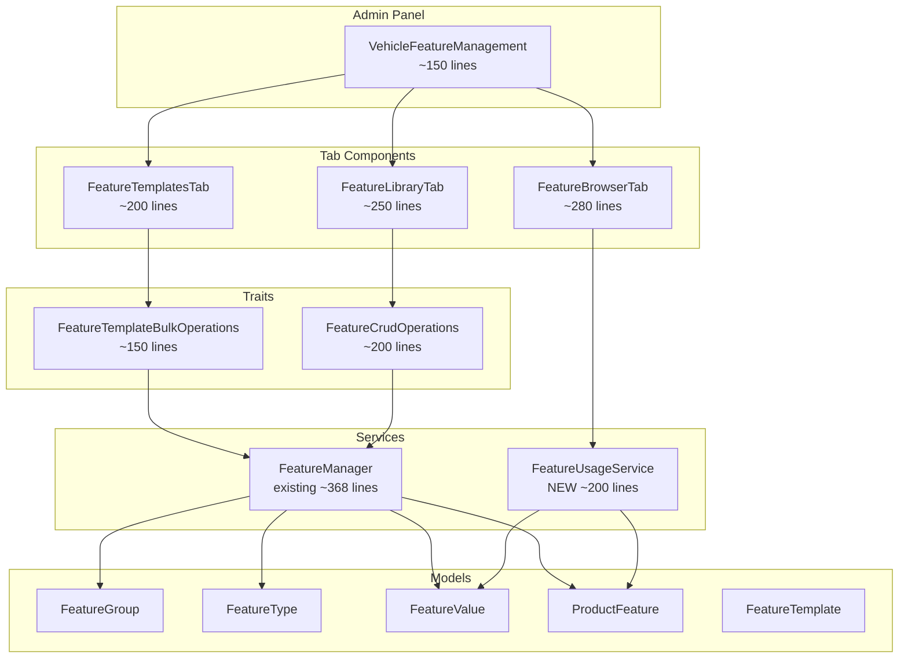

# RAPORT ARCHITEKTONICZNY: Redesign Panelu Cech Pojazdow

**Data**: 2025-12-17
**Agent**: architect
**Zadanie**: Calkowity redesign panelu zarzadzania cechami pojazdow na wzor panelu wariantow

---

## 1. ANALIZA OBECNEGO STANU

### 1.1 Istniejace Modele (DOBRE - do zachowania)

| Model | Linie | Opis |
|-------|-------|------|
| `FeatureGroup` | ~275 | Grupy cech (Silnik, Wymiary, Hamulce) |
| `FeatureType` | ~360 | Definicje cech (Moc, Pojemnosc) |
| `FeatureValue` | ~108 | Predefiniowane wartosci (dla value_type=select) |
| `ProductFeature` | ~147 | Pivot product-feature (z custom_value) |
| `FeatureTemplate` | ~118 | Szablony zestawow cech |

**Relacje:**
```
FeatureGroup 1:N FeatureType 1:N FeatureValue
                              1:N ProductFeature N:1 Product
FeatureTemplate (standalone JSON features array)
```

### 1.2 Obecny Komponent (WYMAGA REFAKTORINGU)

**Plik:** `app/Http/Livewire/Admin/Features/VehicleFeatureManagement.php`
**Linie:** ~1100 (PRZEKROCZONE! Limit CLAUDE.md = 300)

**Problemy:**
1. **Monolityczny** - CRUD grup, cech, szablonow, bulk assign w jednym pliku
2. **Brak separacji** - caly UI w jednym blade (754 linii)
3. **Brak 3-kolumnowego layoutu** - obecny widok to karty + accordion
4. **Brak przegladarki produktow** - nie mozna zobaczyc produktow z dana cecha

### 1.3 Wzorcowy Komponent (DO NASLADOWANIA)

**Plik:** `app/Http/Livewire/Admin/Variants/AttributeValueManager.php`
**Linie:** ~275 (ZGODNE z limitem)

**Dobre praktyki:**
- Trait `AttributeValueBulkOperations` dla bulk operacji (~227 linii)
- `#[Computed]` properties z memoizacja
- Single-responsibility: zarzadzanie wartosciami jednego typu
- Lazy-loaded services (nie DI w constructor)
- Partiale: `value-edit-form.blade.php`, `products-modal.blade.php`, `sync-modal.blade.php`

---

## 2. PROPONOWANA ARCHITEKTURA

### 2.1 Struktura Komponentow (3 zakladki = 3 komponenty)

```
app/Http/Livewire/Admin/Features/
|-- VehicleFeatureManagement.php      # GLOWNY (routing, tab switching) ~150 linii
|-- Tabs/
|   |-- FeatureLibraryTab.php         # Zakladka 1: Biblioteka Cech ~250 linii
|   |-- FeatureTemplatesTab.php       # Zakladka 2: Szablony Cech ~200 linii
|   |-- FeatureBrowserTab.php         # Zakladka 3: Przegladarka Cech ~280 linii
|-- Traits/
|   |-- FeatureCrudOperations.php     # CRUD dla grup i cech ~200 linii
|   |-- FeatureTemplateBulkOperations.php  # Bulk assign ~150 linii
```

### 2.2 Layout Przegladarki Cech (wzor z AttributeValueManager)

```
+---------------------------------------+
| PRZEGLADARKA CECH                     |
| Wybierz grupe i cechy aby zobczyc prod|
+---------------------------------------+
| GRUPY CECH    | WARTOSCI CECHY | PRODUKTY |
| +----------+  | +------------+ | +------+ |
| |[x]Silnik |  | |[x]125cc   1| | |SKU001| |
| |[ ]Wymiary|  | |[x]250cc   3| | |SKU002| |
| |[ ]Hamulce|  | |[ ]500cc   0| | |SKU003| |
| +----------+  | +------------+ | +------+ |
|    3 grupy    | Moc: 3 wart.   | 4 prod.  |
+---------------------------------------+
```

**Kolumny:**
1. **Lewa (GRUPY)**: FeatureGroup z badges (liczba cech)
2. **Srodkowa (WARTOSCI)**: Wartosci wybranej cechy + badge "X prod."
3. **Prawa (PRODUKTY)**: Lista produktow z zaznaczona wartoscia

### 2.3 Nowy Serwis: FeatureUsageService

**Wzorzec:** `AttributeUsageService.php` (~242 linie)

```php
// app/Services/Product/FeatureUsageService.php (~200 linii)
class FeatureUsageService
{
    // Statystyki uzycia dla wszystkich wartosci w grupie (1 query)
    public function getUsageStatsForGroup(int $groupId): Collection;

    // Produkty uzywajace danej wartosci cechy
    public function getProductsUsingFeatureValue(int $featureValueId): Collection;

    // Produkty z custom_value dla typu cechy
    public function getProductsWithCustomValue(int $featureTypeId): Collection;

    // Czy mozna usunac cecha (brak produktow)
    public function canDeleteFeatureType(int $featureTypeId): bool;

    // Nieuzywane wartosci w grupie
    public function getUnusedValuesForGroup(int $groupId): Collection;
}
```

---

## 3. DIAGRAM KOMPONENTOW



---

## 4. PLAN IMPLEMENTACJI

### FAZA 1: Serwisy i Infrastruktura (1 dzien)

| # | Zadanie | Plik | Linie |
|---|---------|------|-------|
| 1.1 | Stworzyc FeatureUsageService | `app/Services/Product/FeatureUsageService.php` | ~200 |
| 1.2 | Dodac metody do FeatureManager | `app/Services/Product/FeatureManager.php` | +50 |
| 1.3 | Testy jednostkowe | `tests/Unit/Services/FeatureUsageServiceTest.php` | ~150 |

### FAZA 2: Traity (1 dzien)

| # | Zadanie | Plik | Linie |
|---|---------|------|-------|
| 2.1 | Wyodrebnic FeatureCrudOperations | `app/Http/Livewire/Admin/Features/Traits/FeatureCrudOperations.php` | ~200 |
| 2.2 | Wyodrebnic FeatureTemplateBulkOperations | `app/Http/Livewire/Admin/Features/Traits/FeatureTemplateBulkOperations.php` | ~150 |

### FAZA 3: Komponenty Livewire (2-3 dni)

| # | Zadanie | Plik | Linie |
|---|---------|------|-------|
| 3.1 | FeatureLibraryTab | `app/Http/Livewire/Admin/Features/Tabs/FeatureLibraryTab.php` | ~250 |
| 3.2 | FeatureTemplatesTab | `app/Http/Livewire/Admin/Features/Tabs/FeatureTemplatesTab.php` | ~200 |
| 3.3 | FeatureBrowserTab (3-kolumnowy) | `app/Http/Livewire/Admin/Features/Tabs/FeatureBrowserTab.php` | ~280 |
| 3.4 | Refaktor VehicleFeatureManagement | `app/Http/Livewire/Admin/Features/VehicleFeatureManagement.php` | ~150 |

### FAZA 4: Blade Templates (2 dni)

| # | Zadanie | Plik | Linie |
|---|---------|------|-------|
| 4.1 | Glowny widok z tabami | `resources/views/livewire/admin/features/vehicle-feature-management.blade.php` | ~100 |
| 4.2 | Biblioteka cech | `resources/views/livewire/admin/features/tabs/feature-library-tab.blade.php` | ~200 |
| 4.3 | Szablony cech | `resources/views/livewire/admin/features/tabs/feature-templates-tab.blade.php` | ~150 |
| 4.4 | Przegladarka cech (3-kolumnowy) | `resources/views/livewire/admin/features/tabs/feature-browser-tab.blade.php` | ~250 |
| 4.5 | Partiale (modals, forms) | `resources/views/livewire/admin/features/partials/*.blade.php` | ~300 total |

### FAZA 5: CSS i Testy (1 dzien)

| # | Zadanie | Plik |
|---|---------|------|
| 5.1 | Style dla 3-kolumnowego layoutu | `resources/css/admin/feature-browser.css` |
| 5.2 | Testy komponentow | `tests/Feature/Livewire/Admin/Features/*.php` |
| 5.3 | Weryfikacja Chrome DevTools | Screenshot verification |

---

## 5. SPECYFIKACJA UI/UX

### 5.1 Zakladka "Biblioteka Cech"

**Cel:** Definiowanie grup i ich cech (FeatureGroup + FeatureType)

**Layout:**
```
+------------------------------------------+
| [+ Dodaj Grupe]  [+ Dodaj Ceche]         |
+------------------------------------------+
| [Szukaj cechy...]                        |
+------------------------------------------+
| GRUPY (accordion)                        |
| v Silnik (12 cech)         [Edit][Del]   |
|   - Moc (number, W)        [Edit][Del]   |
|   - Pojemnosc (number, cc) [Edit][Del]   |
|   - Typ (select)           [Edit][Del]   |
| > Wymiary (8 cech)                       |
| > Hamulce (4 cechy)                      |
+------------------------------------------+
```

### 5.2 Zakladka "Szablony Cech"

**Cel:** Gotowe zestawy cech do szybkiego przypisania

**Layout:**
```
+------------------------------------------+
| [+ Nowy Szablon]   [Zastosuj do produktow]|
+------------------------------------------+
| SZABLONY                                  |
| +----------------+ +----------------+     |
| | Pojazd Elektr. | | Pojazd Spalin. |     |
| | 15 cech        | | 18 cech        |     |
| | [Edytuj][Usun] | | [Edytuj][Usun] |     |
| +----------------+ +----------------+     |
+------------------------------------------+
```

### 5.3 Zakladka "Przegladarka Cech" (NOWA!)

**Cel:** 3-kolumnowy browser identyczny jak panel wariantow

**Layout:**
```
+------------------------------------------+
| Przegladarka Cech                        |
| Wybierz grupe i cechy aby zobaczyc prod. |
+------------------------------------------+
| GRUPY        | WARTOSCI CECHY | PRODUKTY |
| +---------+  | +-----------+  | +------+ |
| |[x]Silnik|  | Moc silnika    | 4 prod.  |
| |   12    |  | +-----------+  |          |
| |[ ]Wymiary| | |[x]125W  2 |  | SKU001   |
| |   8     |  | |[ ]250W  1 |  | SKU002   |
| |[ ]Hamul.|  | |[x]500W  1 |  | SKU003   |
| |   4     |  | +-----------+  | SKU004   |
| +---------+  | [Zaznacz wsz.] |          |
+------------------------------------------+
```

**Interakcja:**
1. Klik na grupe -> laduje cechy tej grupy (srodkowa kolumna)
2. Klik na ceche -> laduje wartosci tej cechy
3. Checkbox na wartosci -> laduje produkty (prawa kolumna)
4. Klik na produkt -> redirect do edycji produktu

---

## 6. WYMAGANIA TECHNICZNE

### 6.1 Livewire 3.x Compliance

```php
// WYMAGANE wzorce:
#[Computed] public function groups(): Collection { ... }
#[On('feature-updated')] public function refreshData(): void { ... }
$this->dispatch('feature-saved', featureId: $id);

// ZAKAZANE:
$this->emit('event'); // Livewire 2.x!
public function __construct(Service $service) // DI conflict!
```

### 6.2 Performance Patterns

```php
// Single query for usage stats (jak AttributeUsageService)
public function getUsageStatsForGroup(int $groupId): Collection
{
    return DB::table('feature_types')
        ->select([
            'feature_types.id',
            DB::raw('COUNT(DISTINCT product_features.id) as usage_count'),
        ])
        ->leftJoin('product_features', 'feature_types.id', '=', 'product_features.feature_type_id')
        ->where('feature_types.feature_group_id', $groupId)
        ->groupBy('feature_types.id')
        ->get()
        ->keyBy('id');
}
```

### 6.3 CSS Requirements (CLAUDE.md)

```css
/* resources/css/admin/feature-browser.css */
.feature-browser {
    display: grid;
    grid-template-columns: 200px 1fr 1fr;
    gap: 1rem;
    min-height: 400px;
}

.feature-browser__column {
    border: 1px solid var(--border-color);
    border-radius: 0.5rem;
    overflow-y: auto;
    max-height: 500px;
}

/* ZAKAZANE: style="..." w blade! */
```

---

## 7. LISTA PLIKOW DO STWORZENIA/MODYFIKACJI

### Nowe pliki (CREATE):

| Sciezka | Typ | Linie |
|---------|-----|-------|
| `app/Services/Product/FeatureUsageService.php` | Service | ~200 |
| `app/Http/Livewire/Admin/Features/Tabs/FeatureLibraryTab.php` | Livewire | ~250 |
| `app/Http/Livewire/Admin/Features/Tabs/FeatureTemplatesTab.php` | Livewire | ~200 |
| `app/Http/Livewire/Admin/Features/Tabs/FeatureBrowserTab.php` | Livewire | ~280 |
| `app/Http/Livewire/Admin/Features/Traits/FeatureCrudOperations.php` | Trait | ~200 |
| `app/Http/Livewire/Admin/Features/Traits/FeatureTemplateBulkOperations.php` | Trait | ~150 |
| `resources/views/livewire/admin/features/tabs/feature-library-tab.blade.php` | Blade | ~200 |
| `resources/views/livewire/admin/features/tabs/feature-templates-tab.blade.php` | Blade | ~150 |
| `resources/views/livewire/admin/features/tabs/feature-browser-tab.blade.php` | Blade | ~250 |
| `resources/views/livewire/admin/features/partials/feature-type-modal.blade.php` | Blade | ~100 |
| `resources/views/livewire/admin/features/partials/feature-group-modal.blade.php` | Blade | ~80 |
| `resources/views/livewire/admin/features/partials/products-list.blade.php` | Blade | ~80 |
| `resources/css/admin/feature-browser.css` | CSS | ~150 |
| `tests/Unit/Services/FeatureUsageServiceTest.php` | Test | ~150 |

### Pliki do modyfikacji (UPDATE):

| Sciezka | Zmiana |
|---------|--------|
| `app/Http/Livewire/Admin/Features/VehicleFeatureManagement.php` | Refaktor: 1100 -> 150 linii |
| `resources/views/livewire/admin/features/vehicle-feature-management.blade.php` | Refaktor: 754 -> 100 linii |
| `app/Services/Product/FeatureManager.php` | Dodac metody (+50 linii) |
| `resources/css/app.css` | Import feature-browser.css |

---

## 8. SZACOWANY CZAS IMPLEMENTACJI

| Faza | Czas | Priorytet |
|------|------|-----------|
| FAZA 1: Serwisy | 1 dzien | WYSOKI |
| FAZA 2: Traity | 1 dzien | WYSOKI |
| FAZA 3: Komponenty Livewire | 2-3 dni | WYSOKI |
| FAZA 4: Blade Templates | 2 dni | SREDNI |
| FAZA 5: CSS i Testy | 1 dzien | SREDNI |

**RAZEM:** 7-8 dni roboczych

---

## 9. DEPENDENCIES I BLOKERY

### Wymagane przed implementacja:

1. Istniejace modele Feature* (OK - juz istnieja)
2. FeatureManager service (OK - juz istnieje)
3. Wzorzec AttributeValueManager (OK - do naladowania)

### Potencjalne blokery:

1. **Brak produktow z cechami** - trzeba zaseedowac testowe dane
2. **Brak feature_value dla wszystkich cech** - custom_value moze komplikowac 3-kolumnowy layout

### Mitygacja blokerow:

- Dla custom_value: dodatkowa kolumna "Wartosci niestandardowe" w przegladarce
- Seeder: `database/seeders/FeatureTestDataSeeder.php`

---

## 10. PODSUMOWANIE

**Obecny stan:**
- Monolityczny komponent 1100 linii (BLAD!)
- Brak 3-kolumnowego browsera
- Brak widoku produktow z cechami

**Proponowane zmiany:**
- Rozbicie na 4 komponenty + 2 traity (<300 linii kazdy)
- Nowy serwis FeatureUsageService
- 3-kolumnowy browser identyczny jak panel wariantow
- Pelna zgodnosc z CLAUDE.md i Livewire 3.x

**Korzysci:**
- Czytelnosc kodu
- Latwiejsze testowanie
- Reuzywalne traity
- Spojny UX z panelem wariantow

---

**Autor:** architect agent
**Wersja:** 1.0
**Status:** GOTOWE DO IMPLEMENTACJI
