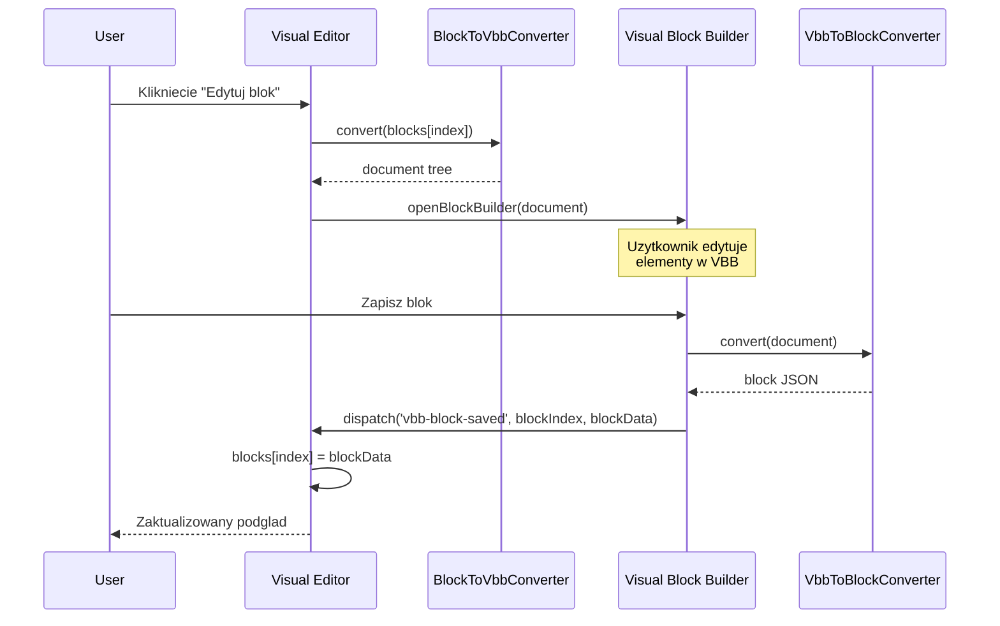
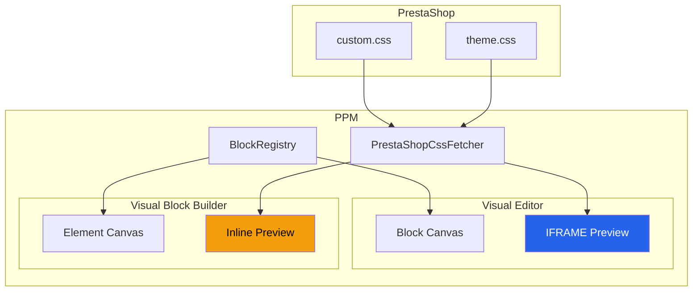

# RAPORT ARCHITEKTA: Visual Editor + Visual Block Builder Integration Plan

**Data**: 2025-12-19
**Agent**: architect
**Zadanie**: Analiza i plan naprawy Visual Editor (VE)

---

## 1. ANALIZA AKTUALNEJ ARCHITEKTURY

### 1.1 Visual Description Editor (VE)
**Lokalizacja:** `app/Http/Livewire/Products/VisualDescription/VisualDescriptionEditor.php`

**Przeznaczenie:** Edytor wysokopoziomowy do zarzadzania blokami opisow produktow.

**Struktura:**
```
VisualDescriptionEditor (Livewire Component)
├── Traits/
│   ├── EditorBlocks.php      - Zarzadzanie kolekcja blokow
│   ├── EditorPreview.php     - Generowanie podgladu HTML/CSS
│   ├── EditorActions.php     - Akcje: undo/redo, save
│   └── EditorImport.php      - Import z HTML/PrestaShop
├── Views/
│   ├── visual-description-editor.blade.php  - Glowny layout
│   └── partials/
│       ├── block-palette.blade.php  - Paleta blokow
│       ├── block-canvas.blade.php   - Canvas z blokami
│       ├── preview-pane.blade.php   - Iframe podglad
│       └── property-panel.blade.php - Panel wlasciwosci
└── Services/
    ├── BlockRegistry.php         - Rejestr typow blokow
    └── PrestaShopCssFetcher.php  - Pobieranie CSS z PS
```

**Kluczowe cechy:**
- Operuje na **blokach** (JSON struktura: type, id, data)
- Renderuje podglad przez `BlockRegistry::get($type)->render($content, $settings)`
- CSS ladowany do iframe przez `PrestaShopCssFetcher->getCssForPreview()`
- Prosty drag&drop (tylko z palety na canvas, bez pozycjonowania)

### 1.2 Visual Block Builder (VBB)
**Lokalizacja:** `app/Http/Livewire/Products/VisualDescription/BlockBuilder/BlockBuilderCanvas.php`

**Przeznaczenie:** Edytor niskopoziomowy do tworzenia pojedynczych blokow z elementow.

**Struktura:**
```
BlockBuilderCanvas (Livewire Component)
├── Views/
│   ├── canvas.blade.php                    - Glowny layout VBB
│   └── partials/
│       ├── element-renderer.blade.php      - Rekurencyjny renderer
│       ├── layer-panel.blade.php           - Panel warstw
│       └── property-panel.blade.php        - Panel wlasciwosci (~500 linii!)
├── Document Structure:
│   └── document['root'] = {
│       id, type, content, styles, classes, children: [...]
│   }
└── Features:
    ├── Drag & drop elementow w kontenerach
    ├── Panel warstw z hierarchia
    ├── WYSIWYG edytor tekstu
    ├── Import/Export HTML
    └── Szablony PrestaShop (pd-intro, pd-merits, etc.)
```

**Kluczowe cechy:**
- Operuje na **drzewie elementow** (zagniezdzone children)
- Kazdy element ma: id, type, content, styles, classes, visible, locked
- Panel warstw pokazuje hierarchie z drag&drop
- Wlasciwosci sa podzielone na zakladki (Layout, Typografia, Kolory, etc.)
- CSS z PrestaShop ladowany inline w `<style>{!! $this->previewCss !!}</style>`

---

## 2. ZIDENTYFIKOWANE PROBLEMY

### PROBLEM 1: CSS z PrestaShop nie jest aplikowany poprawnie

**Root Cause:**
CSS z PrestaShop jest ladowany do iframe w VE przez `EditorPreview::getIframeContent()`:
```php
<style>
    {$css}
</style>
```

Jednak w VE bloki sa renderowane przez `BlockRegistry`, ktory generuje HTML BEZ klas CSS PrestaShop!

**Przyklady:**
| Element | Oczekiwany HTML | Aktualny HTML |
|---------|-----------------|---------------|
| pd-intro__heading | `<div class="pd-intro__heading">` z pseudo-element ::before | Generyczny `<div>` bez klasy |
| pd-asset-list | `<ul class="pd-asset-list">` czarny tekst, horizontal | Generyczny `<ul>` bez stylowania |

**Dowod (EditorPreview.php linie 268-397):**
```php
// Theme CSS variables are HARDCODED in getThemeCssVariables()
// Klasy .pd-asset-list, .pd-model__name są zdefiniowane
// ALE BlockRegistry.render() nie generuje tych klas!
```

**Rozwiazanie:**
Bloki musza generowac HTML z prawidlowymi klasami CSS PrestaShop (pd-intro, pd-merits, etc.) a nie generycznymi divami.

---

### PROBLEM 2: Brak mozliwosci edycji wstawionych blokow

**Root Cause:**
VE i VBB to **oddzielne komponenty** bez integracji:
- VE operuje na `$this->blocks` (JSON array)
- VBB operuje na `$this->document['root']` (drzewo elementow)
- Brak mechanizmu konwersji blok <-> dokument VBB

**Aktualny flow:**
```
VE: addBlock('hero-banner') -> blocks.push(blockData) -> render()
                                    |
                           Brak mozliwosci edycji!
                           Trzeba usunac i dodac nowy.
```

**Rozwiazanie:**
Dodac przycisk "Edytuj w VBB" ktory:
1. Konwertuje blok VE -> dokument VBB
2. Otwiera VBB modal z zaladowanym dokumentem
3. Po zapisie konwertuje z powrotem VBB -> VE blok

---

### PROBLEM 3: Drag & drop nie dziala poprawnie

**Root Cause w VE (block-canvas.blade.php):**
```blade
@dragover.prevent="dropIndex = {{ $index }}"
@drop.prevent="handleDrop({{ $index }})"
```

**Problemy:**
1. **Brak wizualnego podgladu drop zone** - tylko `h-1 bg-blue-500` (praktycznie niewidoczne)
2. **Brak podgladu przeciaganego elementu** - nie widac co sie przeciaga
3. **Blok zawsze pojawia sie na gorze** - `handleDrop(0)` jako domyslny target

**VBB ma to rozwiazane poprawnie:**
- `handleContainerDragOver()` - wizualne oznaczenie kontenera
- `handleElementDragStart()` - opacity + ring-2 na przeciaganym elemencie
- `setDropPosition()` - precyzyjne pozycjonowanie

---

### PROBLEM 4: Panel wlasciwosci VE jest ubogi

**VE property-panel.blade.php:**
- 3 zakladki: Tresc, Styl, Zaawansowane
- Dynamicznie generowane pola z `$blockInstance->getSchema()`
- Brak kontrolek: color picker, size picker, flexbox editor
- Szerokość stała: `w-80`

**VBB property-panel.blade.php (~500 linii!):**
- 6 zakladek: Tresc, Layout, Wymiary, Typografia, Kolory, Efekty
- Dedykowane kontrolki: sizePicker, colorPicker, flexbox/grid editors
- WYSIWYG editor dla tekstu
- Szerokość stała: `w-72`

---

### PROBLEM 5: Brak panelu warstw w VE

**VE:** Bloki sa wyswietlane jako lista na canvas - brak panelu warstw
**VBB:** Ma dedykowany `layer-panel.blade.php` z hierarchia, visibility, lock, drag&drop

---

## 3. PROPONOWANE ROZWIAZANIA

### ROZWIAZANIE 1: CSS PrestaShop - Prawidlowe klasy

**Cel:** Bloki musza generowac HTML identyczny z PrestaShop.

**Implementacja:**
1. Zaktualizowac `BlockRegistry` typy aby uzywalyodpowiednich klas CSS
2. Dla typow `prestashop-section` uzywac oryginalnego HTML bez modyfikacji

**Przyklad dla pd-intro:**
```php
// Block: PdIntroBlock.php
public function render(array $content, array $settings): string
{
    return <<<HTML
    <div class="pd-intro">
        <div class="pd-intro__heading pd-model">
            <span class="pd-model__type">{$content['subtitle']}</span>
            <span class="pd-model__name">{$content['title']}</span>
        </div>
        <div class="pd-intro__image">
            
        </div>
    </div>
    HTML;
}
```

**Priorytet:** WYSOKI
**Effort:** 2-3 dni (aktualizacja wszystkich typow blokow)

---

### ROZWIAZANIE 2: Integracja VBB z VE

**Cel:** Mozliwosc edycji blokow VE w VBB.

**Architektura:**
```
┌─────────────────┐                    ┌─────────────────┐
│   VE Canvas     │ ──"Edytuj blok"──> │  VBB Modal      │
│   (bloki JSON)  │                    │  (dokument tree)│
│                 │ <──"Zapisz"─────── │                 │
└─────────────────┘                    └─────────────────┘
         │                                      │
         ▼                                      ▼
   BlockToVbbConverter                 VbbToBlockConverter
   (blok JSON -> document)             (document -> blok JSON)
```

**Implementacja:**

1. **BlockToVbbConverter Service:**
```php
class BlockToVbbConverter
{
    public function convert(array $block): array
    {
        // Konwertuje block JSON z VE do document tree dla VBB
        return [
            'root' => [
                'id' => Str::uuid(),
                'type' => 'container',
                'children' => $this->parseBlockContent($block),
                'styles' => [],
                'classes' => [],
            ],
        ];
    }

    private function parseBlockContent(array $block): array
    {
        // Parsuj HTML z bloku do elementow VBB
        $html = $block['data']['content']['html'] ?? '';
        return (new HtmlToVbbParser())->parse($html);
    }
}
```

2. **Przycisk "Edytuj w VBB" na block-canvas.blade.php:**
```blade
<button
    wire:click="openBlockInVbb({{ $index }})"
    class="p-1 bg-amber-600/80 text-amber-100 hover:bg-amber-500 rounded"
    title="Edytuj wizualnie"
>
    <svg><!-- ikona edycji --></svg>
</button>
```

3. **Event listener w VE:**
```php
#[On('vbb-block-saved')]
public function handleVbbBlockSaved(int $blockIndex, array $document): void
{
    // Konwertuj dokument VBB z powrotem do bloku
    $converter = app(VbbToBlockConverter::class);
    $this->blocks[$blockIndex] = $converter->convert($document, $this->blocks[$blockIndex]);
    $this->pushUndoState();
}
```

**Priorytet:** WYSOKI
**Effort:** 3-4 dni

---

### ROZWIAZANIE 3: Drag & Drop Redesign

**Cel:** Wizualne podglady drop zone i przeciaganego elementu.

**Implementacja (Alpine.js w block-canvas.blade.php):**

```javascript
x-data="{
    draggedBlockType: null,
    draggedBlockIndex: null,  // NOWE: dla reorderowania
    dropIndex: null,
    dropIndicatorY: 0,        // NOWE: pozycja drop indicator
    isDragging: false,

    handleDragStart(event, index) {
        this.draggedBlockIndex = index;
        this.isDragging = true;

        // Ghost image
        const ghost = event.target.cloneNode(true);
        ghost.style.opacity = '0.7';
        ghost.style.position = 'absolute';
        ghost.style.top = '-1000px';
        document.body.appendChild(ghost);
        event.dataTransfer.setDragImage(ghost, 0, 0);
    },

    handleDragOver(event, containerIndex) {
        event.preventDefault();

        // Oblicz pozycje drop indicator
        const rect = event.target.getBoundingClientRect();
        const mouseY = event.clientY;
        const relativeY = mouseY - rect.top;
        const threshold = rect.height / 2;

        this.dropIndex = relativeY < threshold ? containerIndex : containerIndex + 1;
        this.dropIndicatorY = relativeY < threshold ? rect.top : rect.bottom;
    },

    handleDrop(event) {
        event.preventDefault();
        if (this.draggedBlockType) {
            $wire.addBlock(this.draggedBlockType, this.dropIndex);
        } else if (this.draggedBlockIndex !== null) {
            $wire.moveBlock(this.draggedBlockIndex, this.dropIndex);
        }
        this.reset();
    },

    reset() {
        this.draggedBlockType = null;
        this.draggedBlockIndex = null;
        this.dropIndex = null;
        this.isDragging = false;
    }
}"
```

**Wizualny drop indicator (CSS):**
```css
.ve-drop-indicator {
    position: fixed;
    left: 0;
    right: 0;
    height: 4px;
    background: linear-gradient(90deg, var(--ppm-primary), var(--mpp-primary));
    border-radius: 2px;
    pointer-events: none;
    z-index: 50;
    box-shadow: 0 0 8px rgba(37, 99, 235, 0.5);
}
```

**Priorytet:** SREDNI
**Effort:** 1-2 dni

---

### ROZWIAZANIE 4: Panel Wlasciwosci Redesign

**Cel:** Przeniesienie kontrolek z VBB do VE.

**Architektura:**

```
┌─────────────────────────────────────────────────────────────┐
│ property-panel.blade.php (VE)                               │
├─────────────────────────────────────────────────────────────┤
│ Zakladki: [Tresc] [Layout] [Typografia] [Kolory] [Efekty]  │
├─────────────────────────────────────────────────────────────┤
│                                                              │
│ @include('partials.controls.size-picker')                   │
│ @include('partials.controls.color-picker')                  │
│ @include('partials.controls.flex-editor')                   │
│ @include('partials.controls.wysiwyg-editor')                │
│                                                              │
└─────────────────────────────────────────────────────────────┘
```

**Wspoldzielone kontrolki (resources/views/components/ve-controls/):**
```
ve-controls/
├── size-picker.blade.php      # Wartosc + jednostka (px, %, rem)
├── color-picker.blade.php     # Color picker z preset palette
├── flex-editor.blade.php      # Flexbox controls
├── grid-editor.blade.php      # CSS Grid controls
├── wysiwyg-editor.blade.php   # Rich text editor
└── spacing-editor.blade.php   # Margin/Padding visual editor
```

**Resize panelu (Alpine.js):**
```blade
<aside
    x-data="{ width: 320, isResizing: false }"
    x-on:mousedown.self="isResizing = true"
    x-on:mousemove.window="if (isResizing) width = Math.max(280, Math.min(480, window.innerWidth - $event.clientX))"
    x-on:mouseup.window="isResizing = false"
    :style="{ width: width + 'px' }"
    class="ve-properties flex-shrink-0 bg-gray-800 border-l border-gray-700"
>
    <!-- Resize handle -->
    <div class="absolute left-0 top-0 bottom-0 w-1 cursor-ew-resize hover:bg-blue-500/50"></div>
    ...
</aside>
```

**Priorytet:** SREDNI-WYSOKI
**Effort:** 3-4 dni

---

### ROZWIAZANIE 5: Panel Warstw dla VE

**Cel:** Dodanie panelu warstw z VBB do VE.

**Roznica koncepcyjna:**
- **VBB:** Drzewo elementow (zagniezdzone children)
- **VE:** Plaska lista blokow (brak zagniezdzen)

**Implementacja - uproszczony panel warstw:**

```blade
{{-- partials/layer-panel.blade.php --}}
<div class="ve-layer-panel p-4 space-y-2">
    <div class="flex items-center justify-between pb-2 border-b border-gray-700">
        <span class="text-xs font-medium text-gray-400 uppercase">Struktura opisu</span>
        <span class="text-xs text-gray-500">{{ count($blocks) }} blokow</span>
    </div>

    @foreach($blocks as $index => $block)
        <div
            wire:key="layer-{{ $block['id'] }}"
            wire:click="selectBlock({{ $index }})"
            draggable="true"
            @class([
                'flex items-center gap-2 px-2 py-1.5 rounded cursor-pointer transition-colors',
                'bg-amber-500/20 text-amber-400' => $selectedBlockIndex === $index,
                'hover:bg-gray-700 text-gray-300' => $selectedBlockIndex !== $index,
            ])
        >
            <x-icon :name="$this->getBlockIcon($block['type'])" class="w-4 h-4" />
            <span class="flex-1 text-sm truncate">{{ $block['type'] }}</span>

            {{-- Actions --}}
            <div class="flex items-center gap-1">
                <button wire:click.stop="moveBlockUp({{ $index }})" title="W gore">
                    <svg class="w-3 h-3"><!-- arrow up --></svg>
                </button>
                <button wire:click.stop="moveBlockDown({{ $index }})" title="W dol">
                    <svg class="w-3 h-3"><!-- arrow down --></svg>
                </button>
                <button wire:click.stop="toggleBlockVisibility({{ $index }})" title="Widocznosc">
                    <svg class="w-3 h-3"><!-- eye --></svg>
                </button>
                <button wire:click.stop="removeBlock({{ $index }})" class="text-red-400" title="Usun">
                    <svg class="w-3 h-3"><!-- trash --></svg>
                </button>
            </div>
        </div>
    @endforeach
</div>
```

**Toggle miedzy Preview a Layers:**
```blade
{{-- W property-panel header --}}
<div class="flex border-b border-gray-700">
    <button @click="rightPanel = 'properties'" ...>Wlasciwosci</button>
    <button @click="rightPanel = 'layers'" ...>Warstwy</button>
</div>
```

**Priorytet:** NISKI-SREDNI
**Effort:** 1-2 dni

---

## 4. PLAN IMPLEMENTACJI (PRIORYTETY)

### FAZA 1: CSS Fix (KRYTYCZNE) - 2-3 dni
1. Audit wszystkich typow blokow w BlockRegistry
2. Aktualizacja render() aby generowalyPoprawne klasy CSS PrestaShop
3. Weryfikacja podgladu w iframe vs produkcja PrestaShop

### FAZA 2: VBB Integration - 3-4 dni
1. Implementacja BlockToVbbConverter
2. Implementacja VbbToBlockConverter
3. Przycisk "Edytuj w VBB" na blokach
4. Event handling VBB -> VE

### FAZA 3: Drag & Drop - 1-2 dni
1. Wizualny drop indicator
2. Ghost image dla przeciaganego elementu
3. Reordering istniejacych blokow

### FAZA 4: Property Panel - 3-4 dni
1. Wydzielenie wspoldzielonych kontrolek do components/ve-controls/
2. Przeniesienie kontrolek z VBB
3. Resize panelu

### FAZA 5: Layer Panel - 1-2 dni
1. Uproszczony panel warstw dla VE
2. Drag&drop reordering
3. Visibility toggle

**TOTAL EFFORT:** 10-15 dni roboczych

---

## 5. DIAGRAMY

### Diagram Flow: Edycja bloku w VBB



### Diagram: Architektura CSS



---

## 6. PLIKI DO MODYFIKACJI

### FAZA 1 (CSS Fix):
- `app/Services/VisualEditor/BlockRegistry.php`
- `app/Services/VisualEditor/Blocks/*.php` (wszystkie typy blokow)
- `app/Http/Livewire/Products/VisualDescription/Traits/EditorPreview.php`

### FAZA 2 (VBB Integration):
- `app/Services/VisualEditor/BlockToVbbConverter.php` (NOWY)
- `app/Services/VisualEditor/VbbToBlockConverter.php` (NOWY)
- `app/Http/Livewire/Products/VisualDescription/VisualDescriptionEditor.php`
- `resources/views/livewire/products/visual-description/partials/block-canvas.blade.php`

### FAZA 3 (Drag & Drop):
- `resources/views/livewire/products/visual-description/partials/block-canvas.blade.php`
- `resources/css/products/visual-editor.css` (drop indicator styles)

### FAZA 4 (Property Panel):
- `resources/views/components/ve-controls/*.blade.php` (NOWE)
- `resources/views/livewire/products/visual-description/partials/property-panel.blade.php`

### FAZA 5 (Layer Panel):
- `resources/views/livewire/products/visual-description/partials/layer-panel.blade.php` (NOWY)
- `app/Http/Livewire/Products/VisualDescription/VisualDescriptionEditor.php`

---

## 7. RYZYKA I MITYGACJE

| Ryzyko | Prawdopodobienstwo | Wplyw | Mitygacja |
|--------|-------------------|-------|-----------|
| Rozne struktury danych VE vs VBB | Wysoka | Wysoki | Dedykowane konwertery z walidacja |
| CSS PrestaShop zmienia sie per sklep | Srednia | Sredni | Cachowanie + fallback styles |
| Performance przy duzych opisach | Niska | Sredni | Lazy loading blokow, virtualizacja |
| Konflikt z istniejacymi blokami | Srednia | Wysoki | Migracja danych, backup przed zmianami |

---

## 8. PODSUMOWANIE

Visual Editor i Visual Block Builder sa obecnie **oddzielonymi systemami** z rozna architektura:
- VE: plaska lista blokow JSON
- VBB: drzewo elementow z zaglanzeniami

Glowne problemy:
1. CSS nie jest aplikowany bo bloki nie generuja klas PrestaShop
2. Brak edycji blokow (trzeba usunac i dodac nowy)
3. Drag&drop jest prymitywny (brak wizualnych podpowiedzi)
4. Panel wlasciwosci jest ubogi w porownaniu do VBB

**Rekomendacja:** Rozpoczac od FAZY 1 (CSS Fix) jako quick win, nastepnie FAZA 2 (VBB Integration) jako glowna wartosc.

---

**Raport utworzony przez:** architect agent
**Czas analizy:** ~45 minut
