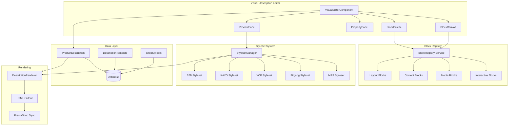
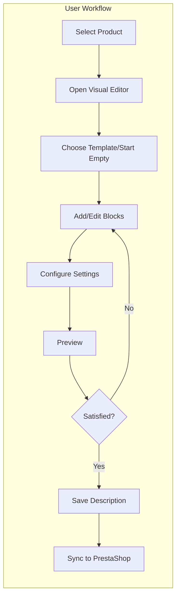
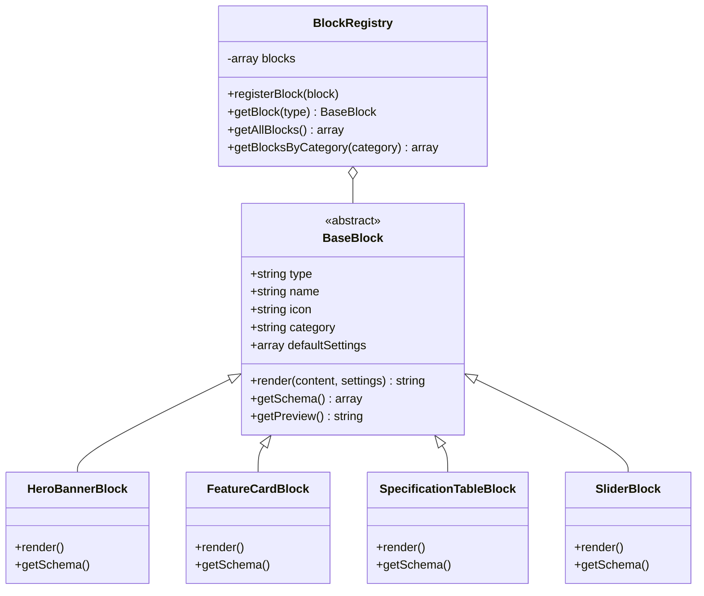

# RAPORT PRACY AGENTA: architect
**Data**: 2025-12-11 10:15
**Agent**: architect
**Zadanie**: Analiza opisow produktow PrestaShop dla Visual Description Editor

---

## ARCHITEKTURA SYSTEMU







---

## 1. PODSUMOWANIE ANALIZY

### 1.1 Statystyki Ogolne

| Sklep | Produkty | Z opisem | Unikalne klasy CSS | Patterns |
|-------|----------|----------|-------------------|----------|
| B2B Test DEV | 113 | 95 | 61 | 1 |
| KAYO | 33 | 33 | 117 | 5 |
| YCF | 27 | 25 | 66 | 2 |
| Pitgang | 4 | 4 | 58 | 1 |
| **MRF** | **50** | **50** | **71** | **2** |
| **SUMA** | **227** | **207** | **~373** | - |

### 1.2 Patterns Znalezione

| Pattern | B2B | KAYO | YCF | Pitgang | MRF |
|---------|-----|------|-----|---------|-----|
| feature_list | 83 | 33 | 21 | - | - |
| image_gallery | - | 33 | - | - | - |
| icons | - | 33 | - | - | 28 |
| accordion_tabs | - | 33 | - | - | - |
| video_embed | - | 15 | 9 | - | - |
| cta_buttons | - | - | - | 4 | 8 |
| multi_column | - | - | - | - | 4 |
| spec_table | - | - | - | - | 1 |

---

## 2. ANALIZA CSS - DESIGN SYSTEMS

### 2.1 B2B Test DEV - System "pd-*" (Product Description)

**Namespace**: `pd-` (product description)

**Core Grid System:**
```css
pd-grid           /* Main grid container */
pd-grid__cell     /* Grid cells */
pd-grid__header   /* Grid header */
pd-grid-row       /* Row container */
pd-cspan-4/5/7/8  /* Column spans */
```

**Block Types:**
```css
pd-block          /* Generic block container */
pd-baner          /* Banner/hero section */
pd-header         /* Header with title */
pd-features       /* Feature list section */
pd-assets         /* Assets/benefits list */
pd-personae       /* Target audience personas */
pd-maintenance    /* Maintenance info */
pd-economy        /* Economy/savings info */
pd-good-2-know    /* Additional info */
pd-customers      /* Customer testimonials */
```

**Component Classes:**
```css
pd-eco-item       /* Economy item card */
pd-eco-item__img  /* Economy item image */
pd-eco-item__label/* Economy item label */
pd-eco-item__desc /* Economy item description */
pd-person         /* Persona card */
pd-person__img    /* Persona image */
pd-person__label  /* Persona label */
pd-person__desc   /* Persona description */
pd-float-img      /* Floating image */
pd-heading-label  /* Section heading label */
pd-spare-part-link/* Spare parts link */
```

**Utility Classes:**
```css
obj-cover         /* Object-fit: cover */
obj-pos-right/left/* Object position */
push-row-end      /* Grid row push */
text-left/center  /* Text alignment */
pt-6, py-4        /* Padding utilities */
```

### 2.2 KAYO - System "pd-*" (Rozbudowany)

**Namespace**: `pd-` z dodatkowymi komponentami

**Intro/Cover System:**
```css
pd-intro          /* Introduction section */
pd-intro__heading /* Intro heading */
pd-intro__text    /* Intro text */
pd-cover          /* Cover image section */
pd-cover__picture /* Cover picture element */
pd-model          /* Model name display */
pd-model__type    /* Model type label */
pd-model__name    /* Model name */
```

**Slider/Carousel System:**
```css
pd-slider         /* Slider container */
pd-slider__heading/* Slider heading */
pd-slider__track  /* Slider track */
pd-slide          /* Individual slide */
pd-slide__title   /* Slide title */
pd-slide__desc    /* Slide description */
pd-slide__img     /* Slide image */
pd-feature-slider /* Feature slider */
```

**Merit/Benefit Cards:**
```css
pd-merit          /* Merit card */
pd-merit__heading /* Merit heading */
pd-merit__desc    /* Merit description */
pd-merits         /* Merits container */
pd-merits--dividers/* Merits with dividers */
```

**Specification Table:**
```css
pd-specification  /* Specification section */
pd-spec           /* Spec container */
pd-spec__block    /* Spec block */
pd-spec__name     /* Spec name */
pd-spec__list     /* Spec list */
```

**Background/Visual Effects:**
```css
pd-pseudo-parallax     /* Parallax effect */
pd-pseudo-parallax__img/* Parallax image */
pd-brand-backdrop      /* Brand background */
pd-text-shadow         /* Text shadow effect */
pd-stack-grid          /* Stacked grid */
pd-img-layer           /* Image layer */
pd-content-layer       /* Content layer */
```

**Color/Theme System:**
```css
bg-brand          /* Primary brand color */
bg-brand-300/600  /* Brand color variants */
bg-neutral-accent /* Neutral accent */
bg-neutral-300/500/900 /* Neutral variants */
bg-honey-500      /* Accent color */
pd-schema-neutral-accent /* Color schema */
```

**Video Integration:**
```css
pd-full-width-video /* Full-width video */
ratio-16-9         /* 16:9 aspect ratio */
yt-fasade          /* YouTube facade */
```

### 2.3 YCF - System "pd-*" + Custom

**Namespace**: Mix `pd-` i custom

**Model/Product Display:**
```css
model-cover       /* Model cover section */
model-name        /* Model name */
model-img         /* Model image */
model-intro       /* Model introduction */
```

**Specification System:**
```css
specification     /* Spec section */
specification__h3 /* Spec heading */
specification__details /* Spec details */
specification__nav/* Spec navigation */
spec-item         /* Single spec item */
spec-item-label   /* Spec label */
spec-item-value   /* Spec value */
```

**DNA/Feature System:**
```css
dna               /* DNA section */
dna-list          /* DNA list */
dna-item          /* DNA item */
dna-item-label    /* DNA item label */
dna-item-value    /* DNA item value */
dna-category      /* DNA category */
dna-mx/gp/sm      /* DNA variants */
```

**Info Cards:**
```css
info-card         /* Info card */
info-card__img    /* Info card image */
info-card__text   /* Info card text */
```

**Image Text Cards:**
```css
image-text-card   /* Image+text card */
image-text-card__img  /* Card image */
image-text-card__text /* Card text */
```

**Layout Classes:**
```css
pd-section        /* Section container */
pd-container      /* Container */
pd-content        /* Content area */
pd-heading        /* Section heading */
block-contained   /* Contained block */
custom-grid       /* Custom grid */
grid-columns-md-2x1  /* 2:1 grid */
grid-columns-md-2-1  /* 2:1 grid variant */
```

**Typography:**
```css
ff-serif          /* Serif font family */
smaller           /* Smaller text */
uppercase         /* Uppercase text */
dashed            /* Dashed style */
```

### 2.4 Pitgang - Custom "blok-*" System

**Namespace**: `blok-` (polski)

**Block Types:**
```css
blok-opisu        /* Description block */
blok-haslo        /* Slogan block */
blok-intro        /* Introduction block */
blok-atuty        /* Features block */
blok-oto-co-masz  /* "What you get" block */
blok-szukajacy    /* Seeker block */
blok-konkrety     /* Details block */
blok-dolacz-do-gangu /* CTA block */
blok-pelen-sklad  /* Full specs block */
```

**Block Components:**
```css
blok__nazwa       /* Block name/title */
blok__media       /* Block media */
blok__tekst       /* Block text */
blok__media-poziom/* Horizontal media */
blok__media-pion  /* Vertical media */
```

**Feature Cards:**
```css
atut-pojazdu      /* Vehicle feature */
atut-pojazdu__nazwa/* Feature name */
atut-pojazdu__opis/* Feature description */
lista-atutow      /* Features list */
```

**Visual Elements:**
```css
stempel-czaszki   /* Skull stamp (brand) */
lista-czaszki     /* Skull list */
czacha-btn        /* Skull button */
img-haslo         /* Slogan image */
img-intro         /* Intro image */
```

**Slider (Glide.js):**
```css
glide             /* Glide container */
glide__track      /* Glide track */
glide__slides     /* Glide slides */
glide__slide      /* Single slide */
```

### 2.5 MRF (sklep.pitbikemrf.pl) - System "pd-*" + Grid Utilities

**Namespace**: `pd-` (produkt description) + utility classes

**Core Block System:**
```css
pd-block              /* Main block container */
pd-block-contained    /* Contained block with max-width */
pd-joy-block          /* Joy/feature block variant */
pd-baner              /* Banner section */
pd-container          /* Content container */
pd-heading            /* Section heading */
pd-base-grid          /* Base grid layout */
```

**Grid System (CSS Grid-based):**
```css
grid                  /* CSS Grid container */
grid-row              /* Grid row */
grid-flow-column      /* Column flow direction */
grid-flow-row         /* Row flow direction */
row-start             /* Row start position */
row-end               /* Row end position */
column-start          /* Column start position */
column-end            /* Column end position */
colspan-2             /* Span 2 columns */
rowspan-2             /* Span 2 rows */
md-column-start       /* Responsive column start */
md-rowspan-2          /* Responsive row span */
```

**Layout Utilities:**
```css
inverted-colors       /* Dark mode / inverted color scheme */
bg-light-gray         /* Light gray background */
md-bg                 /* Medium screen background */
aspect-ratio-1        /* 1:1 aspect ratio */
zindex                /* Z-index utility */
img-cover             /* Object-fit: cover */
```

**Spacing System (Bootstrap-like):**
```css
py-3, py-4, py-5      /* Vertical padding */
px-3, px-4            /* Horizontal padding */
mx-3, mx-auto         /* Horizontal margin */
mt-3, mt-4, mt-5      /* Top margin */
mb-4, mb-5            /* Bottom margin */
pt-2, pt-4            /* Top padding */
pb-0, pb-3, pb-4      /* Bottom padding */
p-0                   /* No padding */
m-0                   /* No margin */
py-md-5, pl-md-5      /* Responsive padding */
pt-md-0               /* Responsive no top padding */
```

**Flexbox Utilities:**
```css
flex-col-reverse      /* Flex column reverse */
align-self-end        /* Align self to end */
align-self-center     /* Align self to center */
```

**Typography:**
```css
text-center           /* Center text */
text-end              /* End-aligned text */
text-md-left          /* Responsive left text */
text-transform-none   /* No text transform */
font-weight-bold      /* Bold text */
arial                 /* Arial font family */
```

**Button Styles:**
```css
btn                   /* Base button */
btn-outline-dark      /* Dark outline button */
btn-lg                /* Large button */
```

**Visual Elements:**
```css
icon-start            /* Icon at start */
border-bottom         /* Bottom border */
list-none             /* No list style */
block                 /* Display block */
inline                /* Display inline */
w-max-content         /* Width max-content */
lc-first              /* Line clamp first */
```

**Key Observations:**
- MRF uses `pd-*` namespace similar to B2B/KAYO/YCF
- Heavy use of utility classes (Bootstrap-like spacing)
- CSS Grid-based layout system
- Responsive modifiers with `md-` prefix
- 50 products analyzed with 71 unique CSS classes

---

## 3. WSPOLNE PATTERNS I STRUKTURY

### 3.1 Wspolne Elementy Miedzy Sklepami

**Grid/Layout Classes:**
- `grid-row` - B2B, KAYO, YCF, Pitgang
- `block` - KAYO, YCF, Pitgang
- `text-center` - B2B, KAYO, YCF, Pitgang
- `mx-auto` - KAYO, YCF

**Typography:**
- `text-uppercase` - KAYO, Pitgang
- `font-weight-bold` - KAYO, Pitgang
- `text-right` - YCF, Pitgang

**Spacing:**
- `my-3`, `mt-3`, `mt-5` - KAYO, Pitgang

### 3.2 HTML Structure Patterns

**Pattern 1: Hero Banner**
```html
<div class="pd-block pd-baner">
  <picture>
    <source srcset="..." media="(min-width: 760px)" />
    
  </picture>
</div>
```

**Pattern 2: Feature Section**
```html
<div class="pd-block pd-grid pd-features">
  <div class="pd-grid__cell">
    <h3>Feature Title</h3>
    <p>Feature description with <strong>bold highlights</strong></p>
  </div>
  <div class="pd-grid__cell">
    
  </div>
</div>
```

**Pattern 3: Specification Table**
```html
<div class="pd-specification">
  <div class="pd-spec">
    <dl class="pd-spec__list">
      <dt class="pd-spec__name">Spec Name</dt>
      <dd>Spec Value</dd>
    </dl>
  </div>
</div>
```

**Pattern 4: Slider/Carousel**
```html
<div class="pd-slider splide">
  <div class="splide__track pd-slider__track">
    <ul class="splide__list">
      <li class="splide__slide pd-slide">
        <h3 class="pd-slide__title">...</h3>
        <p class="pd-slide__desc">...</p>
        
      </li>
    </ul>
  </div>
</div>
```

**Pattern 5: Merit/Benefit Cards**
```html
<div class="pd-merits">
  <div class="pd-merit">
    <h3 class="pd-merit__heading">Benefit Title</h3>
    <p class="pd-merit__desc">Benefit description</p>
  </div>
</div>
```

---

## 4. ZIDENTYFIKOWANE KOMPONENTY DLA VISUAL EDITOR

Na podstawie analizy, wizualny edytor powinien zawierac nastepujace bloki:

### 4.1 Layout Blocks

| Block Type | Description | Sklepy |
|------------|-------------|--------|
| Hero Banner | Full-width image/video banner | ALL |
| Two Column | 50/50 split layout | ALL |
| Three Column | 33/33/33 layout | KAYO |
| Grid Section | Custom grid layout | ALL |
| Full Width | Edge-to-edge content | ALL |

### 4.2 Content Blocks

| Block Type | Description | Sklepy |
|------------|-------------|--------|
| Feature Card | Image + title + description | ALL |
| Specification Table | Key-value pairs table | ALL |
| Merit/Benefit List | Icon + heading + text | KAYO, B2B |
| Persona Card | Avatar + name + description | B2B |
| Info Card | Image + text combo | YCF |

### 4.3 Media Blocks

| Block Type | Description | Sklepy |
|------------|-------------|--------|
| Image | Single image with caption | ALL |
| Image Gallery | Multiple images | KAYO |
| Video Embed | YouTube/Vimeo iframe | KAYO, YCF |
| Parallax Image | Parallax scroll effect | KAYO |
| Picture Element | Responsive image | ALL |

### 4.4 Interactive Blocks

| Block Type | Description | Sklepy |
|------------|-------------|--------|
| Slider/Carousel | Splide.js carousel | KAYO |
| Accordion | Collapsible sections | KAYO |
| Tabs | Tab navigation | KAYO |
| CTA Button | Call to action | Pitgang |

### 4.5 Special Blocks

| Block Type | Description | Sklepy |
|------------|-------------|--------|
| Asset List | Bullet point benefits | KAYO |
| Economy Items | Cost savings display | B2B |
| DNA Section | Technical DNA display | YCF |
| Skull Stamp | Brand element | Pitgang |

---

## 5. REKOMENDACJE DLA ARCHITEKTURY

### 5.1 System Blokow (Component-Based)

```
VisualEditor
├── BlockRegistry
│   ├── LayoutBlocks/
│   │   ├── HeroBanner.php
│   │   ├── TwoColumn.php
│   │   ├── ThreeColumn.php
│   │   └── GridSection.php
│   ├── ContentBlocks/
│   │   ├── FeatureCard.php
│   │   ├── SpecificationTable.php
│   │   ├── MeritList.php
│   │   └── InfoCard.php
│   ├── MediaBlocks/
│   │   ├── Image.php
│   │   ├── ImageGallery.php
│   │   ├── VideoEmbed.php
│   │   └── ParallaxImage.php
│   └── InteractiveBlocks/
│       ├── Slider.php
│       ├── Accordion.php
│       └── CTAButton.php
├── BlockRenderer
│   ├── HtmlRenderer.php
│   └── PreviewRenderer.php
├── CssStyleManager
│   ├── ShopStylesets/
│   │   ├── B2BStyles.php
│   │   ├── KAYOStyles.php
│   │   ├── YCFStyles.php
│   │   ├── PitgangStyles.php
│   │   └── MRFStyles.php
│   └── CustomStyleBuilder.php
└── EditorUI (Livewire)
    ├── VisualEditorComponent.php
    ├── BlockPalette.php
    ├── PropertyPanel.php
    └── PreviewPane.php
```

### 5.2 Data Model

```php
// Block JSON Structure
{
    "type": "feature-card",
    "settings": {
        "layout": "image-left",
        "imagePosition": "cover",
        "backgroundColor": "transparent"
    },
    "content": {
        "heading": "Feature Title",
        "text": "<p>Rich text content...</p>",
        "image": {
            "url": "https://...",
            "alt": "...",
            "srcset": {...}
        }
    },
    "styles": {
        "cssClass": "pd-features",
        "customCss": ""
    }
}
```

### 5.3 Shop-Specific Stylesets

Kazdy sklep ma wlasny CSS namespace:
- **B2B**: `pd-*` (podstawowy)
- **KAYO**: `pd-*` (rozbudowany z slider, parallax)
- **YCF**: `pd-*` + custom (spec-item, dna-item)
- **Pitgang**: `blok-*` (polski namespace)
- **MRF**: `pd-*` + grid utilities (Bootstrap-like spacing)

### 5.4 Rendering Pipeline

```
User edits blocks → JSON structure →
BlockRenderer generates HTML →
CssStyleManager applies shop-specific styles →
Output: Clean HTML + CSS classes
```

---

## 6. WNIOSKI

### 6.1 Co Mamy

1. **Dobrze zdefiniowany design system** - klasy CSS sa spójne i semantyczne
2. **Component-based structure** - HTML jest podzielony na logiczne komponenty
3. **Responsive images** - uzywane `<picture>` i `srcset`
4. **Minimal inline styles** - wiekszosc stylów przez klasy CSS
5. **BEM-like naming** - `block__element` pattern

### 6.2 Wyzwania

1. **Rozne namespaces** per sklep (pd-*, blok-*)
2. **Slider biblioteka** - Splide.js vs Glide.js
3. **Parallax effects** - wymaga JS
4. **Video embeds** - YouTube facade pattern

### 6.3 Rekomendowany Stack

- **Backend**: Livewire 3.x Component
- **Frontend**: Alpine.js + SortableJS (drag & drop)
- **Preview**: iframe z real-time rendering
- **Storage**: JSON w bazie danych
- **CSS**: Per-shop stylesheets (lazy loaded)

---

## 7. PLIKI UTWORZONE

| Plik | Opis |
|------|------|
| `_TOOLS/analyze_prestashop_descriptions.php` | Skrypt analizy z bazy (B2B) |
| `_TOOLS/analyze_via_api.php` | Skrypt analizy via API (KAYO/YCF/Pitgang) |
| `_TOOLS/analysis_results_2025-12-11_100733.json` | Wyniki B2B |
| `_TOOLS/analysis_api_results_2025-12-11_101006.json` | Wyniki KAYO/YCF/Pitgang |

---

## 8. NASTEPNE KROKI

1. **Stworzyc ETAP_07f** z planem implementacji Visual Description Editor
2. **Zaprojektowac database schema** dla blokow i templates
3. **Stworzyc Livewire component** dla edytora
4. **Zaimplementowac BlockRegistry** z podstawowymi blokami
5. **Stworzyc per-shop CSS stylesets**
6. **Dodac drag & drop** z SortableJS
7. **Zintegrować z ProductForm** jako nowa zakladka

---

**Agent**: architect
**Status**: Analiza zakonczona
**Gotowe do**: Projektowanie architektury i plan ETAP_07f
