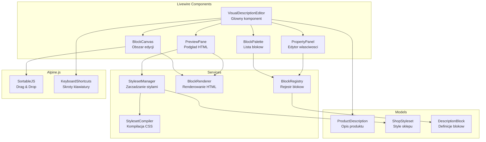
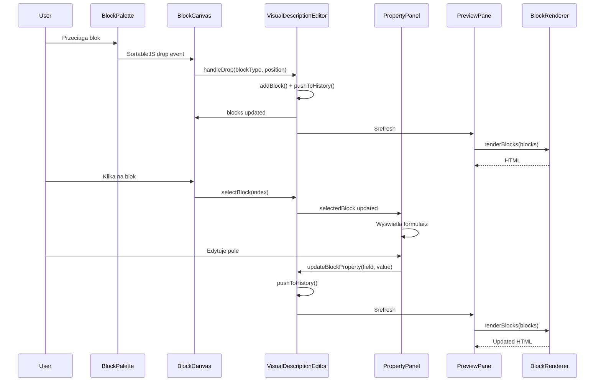
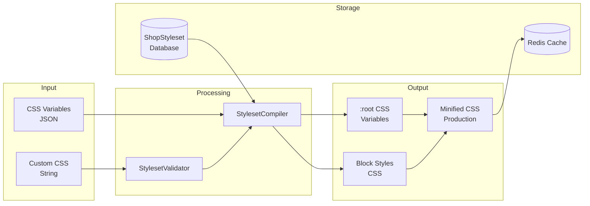

# RAPORT PRACY AGENTA: architect
**Data**: 2025-12-11
**Agent**: architect
**Zadanie**: Architektura ETAP_07f Faza 3 (Styleset System) + Faza 4 (Livewire Visual Editor)

---

## PODSUMOWANIE WYKONAWCZE

Niniejszy dokument przedstawia szczegolowa architekture dla Fazy 3 i Fazy 4 systemu Visual Description Editor. Architektura jest zaprojektowana z uwzglednieniem:
- Istniejacych wzorcow PPM-CC-Laravel (traity, serwisy, modularnosc)
- Limitu 300 linii per plik (zgodnie z CLAUDE.md)
- Integracji z juz zaimplementowana Faza 1 (modele) i Faza 2 (bloki)
- Istniejacego StylesetManager oraz ShopStyleset modelu

---

## FAZA 3: STYLESET SYSTEM - SZCZEGOLOWA ARCHITEKTURA

### 3.1 CSS Variables Schema

```css
/* Standard CSS Variables dla Visual Description Editor */
/* Namespace: --pd- (Product Description) */

:root {
  /* Kolory podstawowe */
  --pd-primary-color: #2563eb;
  --pd-secondary-color: #64748b;
  --pd-accent-color: #f59e0b;

  /* Kolory tekstu */
  --pd-text-color: #1e293b;
  --pd-text-muted: #64748b;
  --pd-text-light: #ffffff;

  /* Tla */
  --pd-background-color: #ffffff;
  --pd-background-alt: #f8fafc;
  --pd-background-dark: #1e293b;

  /* Typografia */
  --pd-font-family: system-ui, -apple-system, sans-serif;
  --pd-heading-font: inherit;
  --pd-font-size-base: 1rem;
  --pd-font-size-sm: 0.875rem;
  --pd-font-size-lg: 1.125rem;
  --pd-line-height: 1.6;

  /* Spacing */
  --pd-spacing-unit: 1rem;
  --pd-spacing-xs: 0.25rem;
  --pd-spacing-sm: 0.5rem;
  --pd-spacing-md: 1rem;
  --pd-spacing-lg: 1.5rem;
  --pd-spacing-xl: 2rem;

  /* Borders & Radius */
  --pd-border-color: #e2e8f0;
  --pd-border-radius: 0.5rem;
  --pd-border-radius-sm: 0.25rem;
  --pd-border-radius-lg: 0.75rem;

  /* Shadows */
  --pd-shadow: 0 4px 6px -1px rgb(0 0 0 / 0.1);
  --pd-shadow-sm: 0 1px 2px 0 rgb(0 0 0 / 0.05);
  --pd-shadow-lg: 0 10px 15px -3px rgb(0 0 0 / 0.1);

  /* Responsive Breakpoints (informacyjne) */
  --pd-breakpoint-sm: 640px;
  --pd-breakpoint-md: 768px;
  --pd-breakpoint-lg: 1024px;
  --pd-breakpoint-xl: 1280px;
}
```

### 3.2 Struktura Plikow Fazy 3

```
app/
├── Services/VisualEditor/
│   ├── Styleset/
│   │   ├── StylesetCompiler.php          # ~150 linii - kompilacja CSS
│   │   ├── StylesetValidator.php         # ~100 linii - walidacja zmiennych
│   │   ├── StylesetExporter.php          # ~80 linii - eksport/import
│   │   └── ShopStylesets/
│   │       ├── B2BStyleset.php           # ~100 linii - definicja B2B
│   │       ├── KayoStyleset.php          # ~100 linii - definicja KAYO
│   │       ├── YcfStyleset.php           # ~100 linii - definicja YCF
│   │       ├── PitgangStyleset.php       # ~100 linii - definicja Pitgang
│   │       └── MrfStyleset.php           # ~100 linii - definicja MRF
│   └── StylesetManager.php               # JUZ ISTNIEJE - rozszerzenie
│
├── Http/Livewire/Admin/VisualEditor/
│   └── StylesetEditor.php                # ~200 linii - edytor zmiennych CSS
│
resources/
├── css/visual-editor/
│   ├── base-blocks.css                   # ~200 linii - style generyczne blokow
│   ├── editor.css                        # ~150 linii - style edytora
│   └── preview.css                       # ~100 linii - style podgladu
│
├── css/stylesets/
│   ├── b2b.css                           # ~150 linii
│   ├── kayo.css                          # ~150 linii
│   ├── ycf.css                           # ~150 linii
│   ├── pitgang.css                       # ~150 linii
│   └── mrf.css                           # ~150 linii
│
└── views/livewire/admin/visual-editor/
    └── styleset-editor.blade.php         # ~150 linii
```

### 3.3 Kontrakty i Interfejsy - Faza 3

#### 3.3.1 StylesetCompiler Service

```php
<?php
namespace App\Services\VisualEditor\Styleset;

interface StylesetCompilerInterface
{
    /**
     * Kompiluje styleset do finalnego CSS
     * @param ShopStyleset $styleset
     * @param array $options ['minify' => bool, 'include_base' => bool]
     * @return string CSS output
     */
    public function compile(ShopStyleset $styleset, array $options = []): string;

    /**
     * Kompiluje tylko zmienne CSS do :root {}
     * @param array $variables ['--pd-primary-color' => '#fff', ...]
     * @return string CSS :root declaration
     */
    public function compileVariables(array $variables): string;

    /**
     * Minifikuje CSS
     * @param string $css
     * @return string
     */
    public function minify(string $css): string;

    /**
     * Waliduje skladnie CSS
     * @param string $css
     * @return array ['valid' => bool, 'errors' => array]
     */
    public function validate(string $css): array;
}
```

#### 3.3.2 ShopStyleset Definition Interface

```php
<?php
namespace App\Services\VisualEditor\Styleset\ShopStylesets;

interface ShopStylesetDefinitionInterface
{
    /**
     * Zwraca nazwe stylesetu
     */
    public function getName(): string;

    /**
     * Zwraca namespace CSS (np. 'pd-', 'blok-')
     */
    public function getNamespace(): string;

    /**
     * Zwraca domyslne zmienne CSS
     * @return array ['--pd-primary-color' => '#2563eb', ...]
     */
    public function getDefaultVariables(): array;

    /**
     * Zwraca dodatkowy CSS (poza zmiennymi)
     */
    public function getCustomCss(): string;

    /**
     * Zwraca konfiguracje dla edytora (grupowanie zmiennych)
     * @return array [
     *   'Kolory' => ['primary-color', 'secondary-color'],
     *   'Typografia' => ['font-family', 'heading-font'],
     * ]
     */
    public function getEditorGroups(): array;
}
```

### 3.4 Shop-Specific Styleset Definitions

#### B2B Styleset (Profesjonalny/Korporacyjny)
```php
// Namespace: pd-
// Kolory: blue (#2563eb), gray (#64748b)
// Typografia: system-ui, clean
// Features: minimalistyczny, czytelny
```

#### KAYO Styleset (Motocyklowy/Sportowy)
```php
// Namespace: pd- (extended)
// Kolory: orange (#f97316), black (#0f0f0f)
// Typografia: bold, dynamic
// Features: parallax support, sliders
```

#### YCF Styleset (Racing/Premium)
```php
// Namespace: pd- + custom
// Kolory: red (#dc2626), white (#ffffff)
// Typografia: serif accents dla nagłówków
// Features: premium look, racing feel
```

#### Pitgang Styleset (Urban/Bold)
```php
// Namespace: blok-* (ODMIENNY!)
// Kolory: black (#000), white (#fff), accent
// Typografia: bold, caps
// Features: skull stamps, aggressive styling
```

#### MRF Styleset (Modern/Grid)
```php
// Namespace: pd- + grid utilities
// Kolory: brand colors (do zdefiniowania)
// Features: Bootstrap-like spacing, CSS Grid
// Responsive: md- prefix modifiers
```

---

## FAZA 4: LIVEWIRE VISUAL EDITOR - SZCZEGOLOWA ARCHITEKTURA

### 4.1 Komponenty Livewire - Struktura

```
app/Http/Livewire/Products/VisualDescription/
├── VisualDescriptionEditor.php           # ~250 linii - GLOWNY komponent
├── Traits/
│   ├── EditorBlockManagement.php         # ~150 linii - CRUD blokow
│   ├── EditorUndoRedo.php                # ~100 linii - historia zmian
│   ├── EditorTemplates.php               # ~100 linii - template handling
│   └── EditorPreview.php                 # ~80 linii - preview generation
├── Services/
│   └── EditorStateManager.php            # ~120 linii - state management
└── Components/
    ├── BlockPalette.php                  # ~150 linii - paleta blokow
    ├── BlockCanvas.php                   # ~180 linii - obszar edycji
    ├── PropertyPanel.php                 # ~200 linii - panel wlasciwosci
    └── PreviewPane.php                   # ~120 linii - podglad HTML
```

### 4.2 Glowny Komponent - VisualDescriptionEditor

```php
<?php
namespace App\Http\Livewire\Products\VisualDescription;

use Livewire\Component;
use App\Http\Livewire\Products\VisualDescription\Traits\EditorBlockManagement;
use App\Http\Livewire\Products\VisualDescription\Traits\EditorUndoRedo;
use App\Http\Livewire\Products\VisualDescription\Traits\EditorTemplates;
use App\Http\Livewire\Products\VisualDescription\Traits\EditorPreview;

class VisualDescriptionEditor extends Component
{
    use EditorBlockManagement;
    use EditorUndoRedo;
    use EditorTemplates;
    use EditorPreview;

    // === PROPERTIES ===
    public ?int $productId = null;
    public ?int $shopId = null;
    public array $blocks = [];
    public ?int $selectedBlockIndex = null;
    public bool $showBlockPalette = true;
    public bool $showPreview = true;
    public bool $isDirty = false;
    public string $viewMode = 'desktop'; // desktop, tablet, mobile

    // === LISTENERS ===
    protected $listeners = [
        'block-selected' => 'selectBlock',
        'blocks-reordered' => 'handleReorder',
        'block-property-updated' => 'updateBlockProperty',
        'refresh-preview' => '$refresh',
    ];

    // === LIFECYCLE ===
    public function mount(?int $productId = null, ?int $shopId = null): void;
    public function render(): View;

    // === PUBLIC API (delegowane do Traits) ===
    // EditorBlockManagement: addBlock, removeBlock, moveBlock, duplicateBlock
    // EditorUndoRedo: undo, redo, canUndo, canRedo
    // EditorTemplates: loadTemplate, saveAsTemplate
    // EditorPreview: getPreviewHtml, setViewMode
}
```

### 4.3 Sub-Components Architecture

#### 4.3.1 BlockPalette Component

```php
<?php
namespace App\Http\Livewire\Products\VisualDescription\Components;

class BlockPalette extends Component
{
    // Properties
    public string $searchQuery = '';
    public ?string $selectedCategory = null;
    public bool $isCollapsed = false;

    // Computed Properties
    public function getBlocksByCategory(): array;
    public function getFilteredBlocks(): Collection;
    public function getCategories(): array;

    // Actions
    public function selectCategory(?string $category): void;
    public function startDrag(string $blockType): void;
}
```

**Blade View Structure (block-palette.blade.php):**
```blade
<div class="ve-palette"
     x-data="{ collapsed: @entangle('isCollapsed') }"
     :class="{ 've-palette--collapsed': collapsed }">

    <!-- Search -->
    <div class="ve-palette__search">
        <input type="text" wire:model.live.debounce.300ms="searchQuery" />
    </div>

    <!-- Categories -->
    <div class="ve-palette__categories">
        @foreach($categories as $cat => $label)
            <button wire:click="selectCategory('{{ $cat }}')">{{ $label }}</button>
        @endforeach
    </div>

    <!-- Blocks Grid -->
    <div class="ve-palette__blocks"
         x-sortable-source
         data-group="blocks">
        @foreach($filteredBlocks as $block)
            <div class="ve-palette__block"
                 draggable="true"
                 data-block-type="{{ $block['type'] }}">
                <span class="ve-palette__block-icon">{{ $block['icon'] }}</span>
                <span class="ve-palette__block-name">{{ $block['name'] }}</span>
            </div>
        @endforeach
    </div>
</div>
```

#### 4.3.2 BlockCanvas Component

```php
<?php
namespace App\Http\Livewire\Products\VisualDescription\Components;

class BlockCanvas extends Component
{
    // Properties
    public array $blocks = [];
    public ?int $selectedIndex = null;
    public bool $isDragging = false;
    public ?int $dragOverIndex = null;

    // Listeners
    protected $listeners = [
        'canvas-block-dropped' => 'handleDrop',
        'canvas-blocks-sorted' => 'handleSort',
    ];

    // Actions
    public function selectBlock(int $index): void;
    public function handleDrop(string $blockType, ?int $position): void;
    public function handleSort(array $newOrder): void;
    public function removeBlock(int $index): void;
    public function duplicateBlock(int $index): void;
}
```

**Blade View Structure (block-canvas.blade.php):**
```blade
<div class="ve-canvas"
     x-data="canvasManager(@js($blocks))"
     x-sortable
     data-group="blocks"
     @sortable-end="handleSort($event.detail)">

    @forelse($blocks as $index => $block)
        <div class="ve-canvas__block
                    {{ $selectedIndex === $index ? 've-canvas__block--selected' : '' }}"
             wire:key="block-{{ $index }}"
             wire:click="selectBlock({{ $index }})"
             data-block-index="{{ $index }}">

            <!-- Block Toolbar -->
            <div class="ve-canvas__block-toolbar">
                <button wire:click.stop="duplicateBlock({{ $index }})">
                    <x-heroicon-o-document-duplicate class="w-4 h-4" />
                </button>
                <button wire:click.stop="removeBlock({{ $index }})">
                    <x-heroicon-o-trash class="w-4 h-4" />
                </button>
            </div>

            <!-- Block Preview -->
            <div class="ve-canvas__block-preview">
                {!! $this->getBlockPreview($index) !!}
            </div>
        </div>
    @empty
        <div class="ve-canvas__empty">
            <p>Przeciagnij blok z palety lub kliknij aby dodac</p>
        </div>
    @endforelse

    <!-- Drop Zone Indicator -->
    <div class="ve-canvas__drop-indicator" x-show="isDragging"></div>
</div>
```

#### 4.3.3 PropertyPanel Component

```php
<?php
namespace App\Http\Livewire\Products\VisualDescription\Components;

class PropertyPanel extends Component
{
    // Properties
    public ?array $selectedBlock = null;
    public ?int $blockIndex = null;
    public string $activeTab = 'content'; // content, settings, advanced

    // Computed
    public function getBlockSchema(): array;
    public function getContentFields(): array;
    public function getSettingsFields(): array;

    // Actions
    public function updateContent(string $field, mixed $value): void;
    public function updateSetting(string $field, mixed $value): void;
    public function resetToDefaults(): void;
}
```

**Blade View Structure (property-panel.blade.php):**
```blade
<div class="ve-properties" x-data="{ activeTab: 'content' }">
    @if($selectedBlock)
        <!-- Block Header -->
        <div class="ve-properties__header">
            <span>{{ $selectedBlock['name'] }}</span>
            <span class="ve-properties__type">{{ $selectedBlock['type'] }}</span>
        </div>

        <!-- Tabs -->
        <div class="ve-properties__tabs">
            <button @click="activeTab = 'content'"
                    :class="{ 'active': activeTab === 'content' }">
                Tresc
            </button>
            <button @click="activeTab = 'settings'"
                    :class="{ 'active': activeTab === 'settings' }">
                Ustawienia
            </button>
        </div>

        <!-- Content Fields -->
        <div x-show="activeTab === 'content'" class="ve-properties__fields">
            @foreach($contentFields as $field => $config)
                <x-visual-editor.field
                    :type="$config['type']"
                    :label="$config['label']"
                    :value="$selectedBlock['content'][$field] ?? ''"
                    wire:change="updateContent('{{ $field }}', $event.target.value)"
                />
            @endforeach
        </div>

        <!-- Settings Fields -->
        <div x-show="activeTab === 'settings'" class="ve-properties__fields">
            @foreach($settingsFields as $field => $config)
                <x-visual-editor.field
                    :type="$config['type']"
                    :label="$config['label']"
                    :value="$selectedBlock['settings'][$field] ?? $config['default']"
                    :options="$config['options'] ?? []"
                    wire:change="updateSetting('{{ $field }}', $event.target.value)"
                />
            @endforeach
        </div>
    @else
        <div class="ve-properties__empty">
            <p>Wybierz blok aby edytowac jego wlasciwosci</p>
        </div>
    @endif
</div>
```

#### 4.3.4 PreviewPane Component

```php
<?php
namespace App\Http\Livewire\Products\VisualDescription\Components;

class PreviewPane extends Component
{
    // Properties
    public array $blocks = [];
    public ?int $shopId = null;
    public string $viewMode = 'desktop';
    public bool $showCss = false;

    // Computed
    public function getRenderedHtml(): string;
    public function getStylesetCss(): string;
    public function getViewportWidth(): string;

    // Actions
    public function setViewMode(string $mode): void;
    public function toggleCssView(): void;
    public function copyHtml(): void;
}
```

### 4.4 Alpine.js Integration

#### 4.4.1 SortableJS Integration

```javascript
// resources/js/visual-editor/sortable-integration.js

import Sortable from 'sortablejs';

document.addEventListener('alpine:init', () => {
    Alpine.directive('sortable', (el, {}, { cleanup }) => {
        const sortable = new Sortable(el, {
            group: 'blocks',
            animation: 150,
            ghostClass: 've-sortable-ghost',
            chosenClass: 've-sortable-chosen',
            dragClass: 've-sortable-drag',
            handle: '.ve-canvas__block',

            onEnd: (evt) => {
                const newOrder = Array.from(el.children)
                    .map(child => parseInt(child.dataset.blockIndex))
                    .filter(index => !isNaN(index));

                el.dispatchEvent(new CustomEvent('sortable-end', {
                    detail: { oldIndex: evt.oldIndex, newIndex: evt.newIndex, order: newOrder }
                }));
            }
        });

        cleanup(() => sortable.destroy());
    });

    // Source directive for palette
    Alpine.directive('sortable-source', (el) => {
        new Sortable(el, {
            group: { name: 'blocks', pull: 'clone', put: false },
            sort: false,
            animation: 150,
        });
    });
});
```

#### 4.4.2 Keyboard Shortcuts

```javascript
// resources/js/visual-editor/keyboard-shortcuts.js

document.addEventListener('alpine:init', () => {
    Alpine.data('keyboardShortcuts', () => ({
        init() {
            document.addEventListener('keydown', (e) => {
                // Skip if in input/textarea
                if (['INPUT', 'TEXTAREA'].includes(e.target.tagName)) return;

                // Ctrl+S: Save
                if (e.ctrlKey && e.key === 's') {
                    e.preventDefault();
                    this.$wire.saveDescription();
                }

                // Ctrl+Z: Undo
                if (e.ctrlKey && e.key === 'z' && !e.shiftKey) {
                    e.preventDefault();
                    this.$wire.undo();
                }

                // Ctrl+Shift+Z or Ctrl+Y: Redo
                if ((e.ctrlKey && e.shiftKey && e.key === 'z') || (e.ctrlKey && e.key === 'y')) {
                    e.preventDefault();
                    this.$wire.redo();
                }

                // Delete: Remove selected block
                if (e.key === 'Delete' && this.selectedBlockIndex !== null) {
                    e.preventDefault();
                    this.$wire.removeBlock(this.selectedBlockIndex);
                }

                // Ctrl+D: Duplicate selected block
                if (e.ctrlKey && e.key === 'd' && this.selectedBlockIndex !== null) {
                    e.preventDefault();
                    this.$wire.duplicateBlock(this.selectedBlockIndex);
                }
            });
        }
    }));
});
```

#### 4.4.3 Undo/Redo System (Trait)

```php
<?php
namespace App\Http\Livewire\Products\VisualDescription\Traits;

trait EditorUndoRedo
{
    /**
     * History stack for undo operations
     * @var array
     */
    public array $undoStack = [];

    /**
     * History stack for redo operations
     * @var array
     */
    public array $redoStack = [];

    /**
     * Maximum history size
     */
    protected int $maxHistorySize = 50;

    /**
     * Push current state to undo stack
     */
    protected function pushToHistory(): void
    {
        // Take snapshot of current blocks
        $snapshot = json_encode($this->blocks);

        // Add to undo stack
        $this->undoStack[] = $snapshot;

        // Trim if exceeds max
        if (count($this->undoStack) > $this->maxHistorySize) {
            array_shift($this->undoStack);
        }

        // Clear redo stack on new action
        $this->redoStack = [];
    }

    /**
     * Undo last action
     */
    public function undo(): void
    {
        if (empty($this->undoStack)) {
            return;
        }

        // Save current state to redo
        $this->redoStack[] = json_encode($this->blocks);

        // Restore previous state
        $previousState = array_pop($this->undoStack);
        $this->blocks = json_decode($previousState, true);

        $this->dispatch('notify', type: 'info', message: 'Cofnieto zmiane');
    }

    /**
     * Redo previously undone action
     */
    public function redo(): void
    {
        if (empty($this->redoStack)) {
            return;
        }

        // Save current state to undo
        $this->undoStack[] = json_encode($this->blocks);

        // Restore next state
        $nextState = array_pop($this->redoStack);
        $this->blocks = json_decode($nextState, true);

        $this->dispatch('notify', type: 'info', message: 'Przywrocono zmiane');
    }

    /**
     * Check if undo is available
     */
    public function getCanUndoProperty(): bool
    {
        return !empty($this->undoStack);
    }

    /**
     * Check if redo is available
     */
    public function getCanRedoProperty(): bool
    {
        return !empty($this->redoStack);
    }
}
```

---

## DIAGRAMY PRZEPLYWU DANYCH

### Diagram 1: Architektura Komponentow Visual Editora



### Diagram 2: Przepyw Danych - Edycja Bloku



### Diagram 3: Architektura Styleset System



---

## KONTRAKTY MIEDZY KOMPONENTAMI

### Events (Livewire dispatch)

| Event Name | From | To | Payload |
|------------|------|-----|---------|
| `block-selected` | BlockCanvas | PropertyPanel | `{index: int}` |
| `blocks-reordered` | BlockCanvas | VDE | `{order: int[]}` |
| `block-property-updated` | PropertyPanel | VDE | `{index: int, field: string, value: mixed}` |
| `refresh-preview` | VDE | PreviewPane | - |
| `notify` | Any | FlashMessages | `{type: string, message: string}` |

### Alpine.js Events

| Event Name | From | To | Detail |
|------------|------|-----|--------|
| `sortable-end` | SortableJS | BlockCanvas | `{oldIndex, newIndex, order}` |
| `block-drag-start` | BlockPalette | BlockCanvas | `{blockType: string}` |
| `keyboard-shortcut` | KeyboardShortcuts | VDE | `{action: string}` |

### Wire Model Bindings

| Property | Component | Type | Description |
|----------|-----------|------|-------------|
| `blocks` | VDE | array | Array of block data |
| `selectedBlockIndex` | VDE | ?int | Currently selected block |
| `searchQuery` | BlockPalette | string | Block search filter |
| `viewMode` | PreviewPane | string | desktop/tablet/mobile |
| `showBlockPalette` | VDE | bool | Palette visibility |
| `showPreview` | VDE | bool | Preview visibility |

---

## IMPLEMENTACJA - KOLEJNOSC

### FAZA 3 (Styleset System) - ~1 tydzien

1. **Dzien 1-2**: StylesetCompiler + StylesetValidator
2. **Dzien 3-4**: Shop-specific styleset definitions (5 plikow)
3. **Dzien 5**: Base block CSS + Styleset Editor Livewire
4. **Dzien 6-7**: Testy + integracja z istniejacym StylesetManager

### FAZA 4 (Livewire Visual Editor) - ~1.5 tygodnia

1. **Dzien 1-2**: VisualDescriptionEditor glowny komponent + traity
2. **Dzien 3-4**: BlockPalette + BlockCanvas components
3. **Dzien 5-6**: PropertyPanel + dynamiczne formularze
4. **Dzien 7-8**: PreviewPane + integracja z BlockRenderer
5. **Dzien 9-10**: Alpine.js (SortableJS, shortcuts, undo/redo)
6. **Dzien 11**: Testy E2E + polish UI

---

## ZALEZNOSCI OD FAZ 1-2

### Wykorzystanie z Fazy 1 (Database + Models)
- `DescriptionBlock` model - pobieranie definicji blokow
- `ProductDescription` model - zapis/odczyt opisow
- `ShopStyleset` model - zarzadzanie stylami

### Wykorzystanie z Fazy 2 (Block Registry)
- `BaseBlock` abstract class - definicje blokow
- `BlockRegistry` service - rejestr wszystkich blokow
- `BlockRenderer` service - renderowanie HTML
- `StylesetManager` service - obsluga styleset (rozszerzenie)

---

## RYZYKA I MITYGACJE

| Ryzyko | Prawdopodobienstwo | Wplyw | Mitygacja |
|--------|-------------------|-------|-----------|
| Performance z duza liczba blokow | Srednie | Wysoki | Virtual scrolling w BlockCanvas, lazy rendering |
| Konflikty CSS z istniejacymi stylami | Wysokie | Sredni | Izolacja namespace (pd-*, blok-*), Shadow DOM dla preview |
| Zlozonosc drag & drop nested blocks | Wysokie | Wysoki | Ograniczenie do 1 poziomu zagniezdzen na poczatek |
| Synchronizacja state Livewire-Alpine | Srednie | Sredni | Uzycie @entangle, jasne kontrakty events |

---

## PLIKI DO UTWORZENIA - PODSUMOWANIE

### Faza 3 (16 plikow)
```
app/Services/VisualEditor/Styleset/
├── StylesetCompiler.php
├── StylesetValidator.php
├── StylesetExporter.php
└── ShopStylesets/
    ├── B2BStyleset.php
    ├── KayoStyleset.php
    ├── YcfStyleset.php
    ├── PitgangStyleset.php
    └── MrfStyleset.php

app/Http/Livewire/Admin/VisualEditor/
└── StylesetEditor.php

resources/css/visual-editor/
├── base-blocks.css
├── editor.css
└── preview.css

resources/css/stylesets/
├── b2b.css
├── kayo.css
├── ycf.css
├── pitgang.css
└── mrf.css

resources/views/livewire/admin/visual-editor/
└── styleset-editor.blade.php
```

### Faza 4 (17 plikow)
```
app/Http/Livewire/Products/VisualDescription/
├── VisualDescriptionEditor.php
├── Traits/
│   ├── EditorBlockManagement.php
│   ├── EditorUndoRedo.php
│   ├── EditorTemplates.php
│   └── EditorPreview.php
├── Services/
│   └── EditorStateManager.php
└── Components/
    ├── BlockPalette.php
    ├── BlockCanvas.php
    ├── PropertyPanel.php
    └── PreviewPane.php

resources/js/visual-editor/
├── sortable-integration.js
├── keyboard-shortcuts.js
└── preview-renderer.js

resources/views/livewire/products/visual-description/
├── visual-description-editor.blade.php
└── components/
    ├── block-palette.blade.php
    ├── block-canvas.blade.php
    ├── property-panel.blade.php
    └── preview-pane.blade.php
```

---

## NASTEPNE KROKI

1. **Review architektury** przez uzytkownika
2. **Zatwierdzenie** struktury plikow i kontraktow
3. **Implementacja Fazy 3** w kolejnosci z sekcji IMPLEMENTACJA
4. **Testy jednostkowe** dla StylesetCompiler
5. **Implementacja Fazy 4** z integracja Fazy 3
6. **Testy E2E** Visual Editora

---

**Utworzono**: 2025-12-11
**Agent**: architect
**Wersja dokumentu**: 1.0
