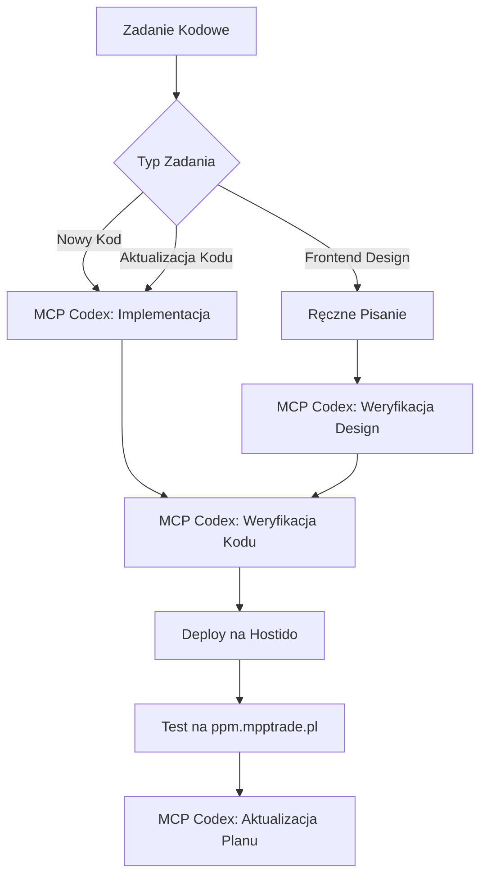

# CLAUDE.md

This file provides guidance to Claude Code (claude.ai/code) when working with code in this repository.

## Projekt: PPM-CC-Laravel (Prestashop Product Manager)

Aplikacja klasy enterprise do zarządzania produktami na wielu sklepach Prestashop jednocześnie, będąca centralnym hubem produktów dla organizacji MPP TRADE.

## Środowisko Techniczne

### Stack Technologiczny
- **Backend**: PHP 8.3 + Laravel 12.x
- **UI**: Blade + Livewire 3.x + Alpine.js 
- **Build**: Vite (tylko lokalne buildy)
- **DB**: MySQL SQL
- **Cache/Kolejki**: Redis (lub driver database jako fallback)
- **Import XLSX**: Laravel-Excel (PhpSpreadsheet)
- **Autoryzacja**: Laravel Socialite (Google Workspace + Microsoft Entra ID) - implementacja na końcu

### Środowisko Deployment
- **Domena**: ppm.mpptrade.pl
- **Hosting**: Hostido.net.pl
- **SSH**: host379076@host379076.hostido.net.pl:64321 (klucz SSH wymagany)
- **Baza**: host379076_ppm@localhost (MariaDB 10.11.13)
- **PHP**: 8.3.23 (natywnie dostępny)
- **Composer**: 2.8.5 (preinstalowany)

## Architektura Aplikacji

### System Użytkowników (Hierarchia uprawnień)
1. **Admin** - pełny dostęp + zarządzanie użytkownikami/sklepami/ERP
2. **Menadżer** - zarządzanie produktami + eksport + import CSV/ERP
3. **Redaktor** - edycja opisów/zdjęć + eksport (bez usuwania produktów)
4. **Magazynier** - panel dostaw (bez rezerwacji z kontenera)
5. **Handlowiec** - rezerwacje z kontenera (bez widoczności cen zakupu)
6. **Reklamacje** - panel reklamacji
7. **Użytkownik** - odczyt + wyszukiwarka

### Kluczowe Encje
- **Produkty**: SKU (klucz główny), nazwa, kategorie wielopoziomowe, opisy HTML, ceny grupowe, stany magazynowe, warianty
- **Kategorie**: 5 poziomów zagnieżdżenia (Kategoria→Kategoria4)
- **Grupy Cenowe**: Detaliczna, Dealer Standard/Premium, Warsztat/Premium, Szkółka-Komis-Drop, Pracownik
- **Magazyny**: MPPTRADE, Pitbike.pl, Cameraman, Otopit, INFMS, Reklamacje + custom
- **Sklepy Prestashop**: Multi-store support z dedykowanymi opisami/kategoriami per sklep
- **Integracje ERP**: Baselinker, Subiekt GT, Microsoft Dynamics

### System Importu/Eksportu
- **Import XLSX**: Mapowanie kolumn z predefiniowanymi szablonami (POJAZDY/CZĘŚCI)
- **Kluczowe kolumny**: ORDER, Parts Name, U8 Code, MRF CODE, Qty, Ctn no., Size, Weight, Model, VIN, Engine No.
- **System kontenerów**: id_kontener + dokumenty odprawy (.zip, .xlsx, .pdf, .xml)
- **Weryfikacja**: Sprawdzanie poprawności przed eksportem na Prestashop

## MCP Codex Integration - GŁÓWNE NARZĘDZIE DEVELOPMENT

### KRYTYCZNA ROLA MCP CODEX w PPM-CC-Laravel

**MCP Codex** jest głównym narzędziem do pisania, weryfikacji i zarządzania kodem w projekcie PPM-CC-Laravel. Wszystkie operacje kodowe MUSZĄ przejść przez Codex.

### Zasady Integracji MCP Codex

1. **PISANIE KODU przez MCP Codex**
   - Cały nowy kod (PHP, Laravel, Blade, JS) pisany przez `mcp__codex__codex`
   - Aktualizacje istniejącego kodu przez `mcp__codex__codex`
   - **WYJĄTEK**: Design frontend - może być pisany ręcznie, ale MUSI być zweryfikowany przez Codex

2. **WERYFIKACJA KODU przez MCP Codex**
   ```
   Po napisaniu frontend designu -> weryfikacja przez mcp__codex__codex
   Po każdej aktualizacji kodu -> weryfikacja przez mcp__codex__codex
   Przed każdym deploymentem -> weryfikacja przez mcp__codex__codex
   ```

3. **ZARZĄDZANIE PLANEM przez MCP Codex**
   - Plan projektu (`Plan_Projektu/*.md`) konsultowany z MCP Codex
   - Weryfikacja zgodności z `_init.md` przez MCP Codex
   - Aktualizacja statusu realizacji przez MCP Codex
   - Usuwanie zbędnych punktów przez MCP Codex

### Workflow z MCP Codex



### MCP Codex Commands

```typescript
// Implementacja nowej funkcjonalności
await mcp__codex__codex({
  prompt: "Zaimplementuj ProductController dla PPM-CC-Laravel zgodnie z _init.md requirements",
  cwd: "D:\\OneDrive - MPP TRADE\\Skrypty\\PPM-CC-Laravel",
  model: "opus",
  sandbox: "workspace-write"
});

// Weryfikacja kodu
await mcp__codex__codex({
  prompt: "Zweryfikuj poprawność kodu frontend design dla ProductList component zgodnie z Laravel + Livewire 3.x standards",
  cwd: "D:\\OneDrive - MPP TRADE\\Skrypty\\PPM-CC-Laravel",
  model: "sonnet",
  sandbox: "read-only"
});

// Konsultacja planu
await mcp__codex__codex({
  prompt: "Przeanalizuj Plan_Projektu/ETAP_05_Produkty.md pod kątem zgodności z _init.md i usuń zbędne punkty nieprzynoszące korzyści projektowi",
  cwd: "D:\\OneDrive - MPP TRADE\\Skrypty\\PPM-CC-Laravel",
  model: "sonnet",
  sandbox: "workspace-write"
});
```

## Komendy i Workflow

### Development Workflow z MCP Codex
```bash
# 1. ZAWSZE najpierw konsultacja z MCP Codex
# mcp__codex__codex({prompt: "Zaplanuj implementację...", sandbox: "read-only"})

# 2. Implementacja przez MCP Codex
# mcp__codex__codex({prompt: "Zaimplementuj...", sandbox: "workspace-write"})

# 3. Lokalne testy (opcjonalnie)
php artisan serve
php artisan migrate
php artisan db:seed

# 4. Build assets (jeśli potrzebne)
npm install
npm run dev       # Development
npm run build     # Production

# 5. Weryfikacja przez MCP Codex przed deploymentem
# mcp__codex__codex({prompt: "Zweryfikuj kod przed deploymentem", sandbox: "read-only"})

# 6. Testy (opcjonalnie)
php artisan test
./vendor/bin/phpunit
```

### Deployment na Hostido
```powershell
# SSH z kluczem PuTTY (ścieżka do klucza)
$HostidoKey = "D:\OneDrive - MPP TRADE\SSH\Hostido\HostidoSSHNoPass.ppk"

# Test połączenia
plink -ssh host379076@host379076.hostido.net.pl -P 64321 -i $HostidoKey -batch "php -v"

# Deployment commands
plink -ssh host379076@host379076.hostido.net.pl -P 64321 -i $HostidoKey -batch "cd domains/ppm.mpptrade.pl/public_html && composer install --no-dev"

# Migracje i cache
plink -ssh host379076@host379076.hostido.net.pl -P 64321 -i $HostidoKey -batch "cd domains/ppm.mpptrade.pl/public_html && php artisan migrate --force && php artisan config:cache"
```

### Ręczne połączenie SSH
```bash
# Wymaga klucza SSH (HostidoSSHNoPass.ppk)
ssh -p 64321 host379076@host379076.hostido.net.pl
```

### Baza Danych
```bash
# Migracje
php artisan migrate
php artisan migrate:rollback
php artisan migrate:status

# Seeders
php artisan db:seed
php artisan db:seed --class=ProductSeeder
```

## Kluczowe Funkcjonalności

### System Dopasowań Pojazdów
- **Cechy**: Model, Oryginał, Zamiennik
- **Format eksportu**: Osobne wpisy dla każdego modelu (Model: X, Model: Y, etc.)
- **Filtrowanie**: Per sklep Prestashop (globalne modele z możliwością "banowania" na wybranych sklepach)

### System Wyszukiwania
- **Inteligentna wyszukiwarka**: Podpowiedzi, obsługa błędów, literówek
- **Filtry**: "Wyszukaj dokładnie" vs. przybliżone wyszukiwanie
- **Domyślny widok**: Statystyki zamiast listy produktów (dopóki nie wyszuka)

### Synchronizacja Multi-Store
- **Status synchronizacji**: Monitoring rozbieżności między aplikacją a Prestashop/ERP
- **Dedykowane dane per sklep**: Różne opisy, kategorie, cechy
- **Mapowanie**: Grupy cenowe, magazyny, kategorie między systemami

## Struktura Folderów Projektu

```
PPM-CC-Laravel/
├── _init.md                    # Dokumentacja projektu
├── AGENTS.md                   # Instrukcje dla agentów
├── dane_hostingu.md           # Dane hostingu i SSH
├── References/                # Mockupy UI i pliki źródłowe
│   ├── Dashboard_admin.png
│   ├── Lista_produktów.png
│   ├── Produkt_part1.png
│   ├── ERP_Dashboard.png
│   └── JK25154D*.xlsx         # Przykładowe pliki importu
└── [Laravel structure when created]
```

## Integracje

### Prestashop API
- Multi-store support
- Zachowanie struktur katalogów dla zdjęć
- Weryfikacja zgodności z bazą danych Prestashop 8.x/9.x
- **KRYTYCZNE**: Sprawdzanie struktury DB: https://github.com/PrestaShop/PrestaShop/blob/8.3.x/install-dev/data/db_structure.sql

### ERP Systems
- **Baselinker**: Priorytet #1 dla integracji
- **Subiekt GT**: Import/eksport + mapowanie magazynów
- **Microsoft Dynamics**: Zaawansowana integracja business

## Zasady Development

### Jakość Kodu
- **Klasa Enterprise**: Bez skrótów i uproszczeń
- **Bez hardcode'u**: Wszystko konfigurowane przez admin
- **Best Practices**: Laravel + Prestashop oficjalna dokumentacja
- **Bezpieczeństwo**: Walidacja, sanitization, error handling

### System Planowania z MCP Codex
- Plan w folderze `Plan_Projektu/` - każdy etap osobny plik
- **KRYTYCZNE**: Wszystkie plany MUSZĄ być konsultowane z MCP Codex przed implementacją
- **Weryfikacja planu**: MCP Codex sprawdza zgodność z `_init.md` i usuwa zbędne punkty
- **Aktualizacja statusu**: MCP Codex weryfikuje która część planu została zrealizowana
- Statusy: ❌ (nie rozpoczęte), 🛠️ (w trakcie), ✅ (ukończone), ⚠️ (zablokowane)
- Raporty agentów w `_AGENT_REPORTS/`

### Integracja Agentów AI z MCP Codex

**WSZYSTKIE AGENCI AI** muszą przestrzegać następujących zasad:

1. **Przed pisaniem kodu** → deleguj do MCP Codex
2. **Przed aktualizacją planu** → konsultuj z MCP Codex  
3. **Po implementacji** → weryfikacja przez MCP Codex
4. **Design frontend** → może być pisany przez agenta, ale MUSI być zweryfikowany przez MCP Codex

**Przykładowy workflow agenta:**
```
Agent otrzymuje zadanie → Analizuje requirements → 
Deleguje implementację do MCP Codex → MCP Codex pisze kod →
Agent deleguje weryfikację do MCP Codex → Deploy i testy
```

### Kolejność Implementacji
1. ✅ Backend fundament + modele - COMPLETED
2. ✅ Dashboard + Panel produktów - COMPLETED
3. ✅ Panel admina (FAZA A, B, C) - COMPLETED
4. ⏳ Integracja Baselinker - IN PROGRESS
5. API Prestashop
6. Frontend z prawdziwymi danymi
7. System dostaw (przyszłość)
8. System reklamacji (przyszłość)
n### FAZA C: System Administration - COMPLETED 2025-01-09
- ✅ SystemSettings - Centralized application configuration
- ✅ BackupManager - Automated backup system z monitoring
- ✅ DatabaseMaintenance - Maintenance tools i health monitoring
- ✅ Enterprise Security - Encrypted settings i audit trail
- 📍 **Routes**: /admin/system-settings, /admin/backup, /admin/maintenance

## Uwagi Specjalne
- w pliku [dane_hostingu.md](dane_hostingu.md) masz wszystkie potrzebne dane do instalacji i uploadu aplikacji na serwerze Hostido.net.pl. Zgodnie z założeniami projektu nie tworzymy lokalnego środowiska, tylko piszemy tu kod. Całe gotowe środowisko znajduje się na serwerze Hostido gdzie zawsze po napisaniu lub aktualizacji kodu eksportujesz pliki przez SSH, a nastepnie przeprowadzasz weryfikacje poprawności ich działania na stronie https://ppm.mpptrade.pl
- **Laravel lokalizacja**: `/domains/ppm.mpptrade.pl/public_html/` - Laravel bezpośrednio w public_html (bez podfolderu)
- **Hybrydowy workflow**: Lokalne development → deploy na serwer → testy na ppm.mpptrade.pl
- **PowerShell environment**: Windows + PowerShell 7, unikać polskich znaków w skryptach
- **Nie tworzyć**: Niepotrzebnych wersji plików (_v1, _v2, etc.)
- **OAuth**: Implementować jako ostatni krok (Google Workspace + Microsoft)
- **Pierwszy admin**: Setup przez bezpośrednie wprowadzenie danych (email, hasło, firma)

## Super Admin Account - Testing & Verification

**KONTO SUPER ADMINISTRATORA** (dla Claude Code testing i verification):

```
URL: https://ppm.mpptrade.pl/login
Email: admin@mpptrade.pl
Password: Admin123!MPP
Role: Admin (pełne uprawnienia)
User ID: 8
Created: 2025-09-09
Status: Active
```

**Admin Panel Routes:**
- Dashboard: `/admin` - Main admin dashboard z widgets
- Shop Management: `/admin/shops` - PrestaShop connections
- ERP Integration: `/admin/integrations` - Baselinker, Subiekt GT, Dynamics  
- System Settings: `/admin/system-settings` - Application configuration
- Backup Management: `/admin/backup` - Automated backup system
- Maintenance: `/admin/maintenance` - Database maintenance tools
- Notifications: `/admin/notifications` - Real-time notification center
- Reports: `/admin/reports` - Business Intelligence analytics
- API Management: `/admin/api` - API monitoring i usage statistics
- Customization: `/admin/customization` - Theme i layout management

**Permissions:** Wszystkie 47 admin permissions assigned
**Features:** Complete ETAP_04 Panel Administracyjny (5 faz: A, B, C, D, E)

**Last Verified:** 2025-09-09 - All admin functions operational