# Media System Architecture - Visual Diagrams

**Project:** PPM-CC-Laravel
**Document:** Media Management System Architecture
**Created:** 2025-11-28
**Version:** 1.0

---

## 🏗️ SYSTEM ARCHITECTURE OVERVIEW

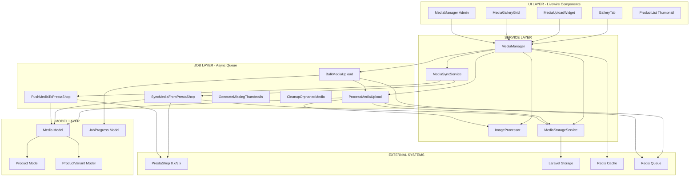

---

## 📤 UPLOAD FLOW DIAGRAM

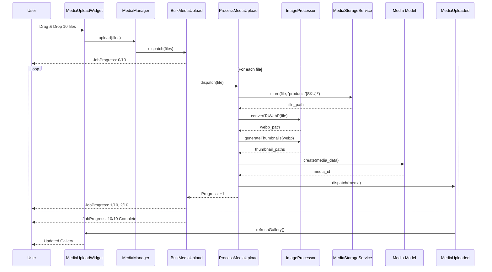

---

## 🔄 PRESTASHOP SYNC FLOW

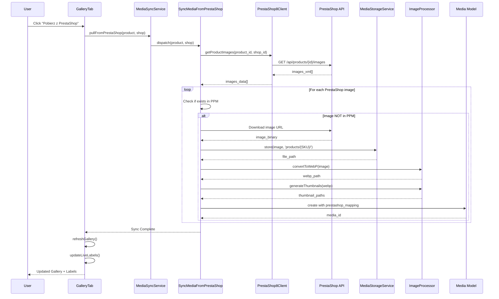

---

## 🎨 COMPONENT RELATIONSHIPS

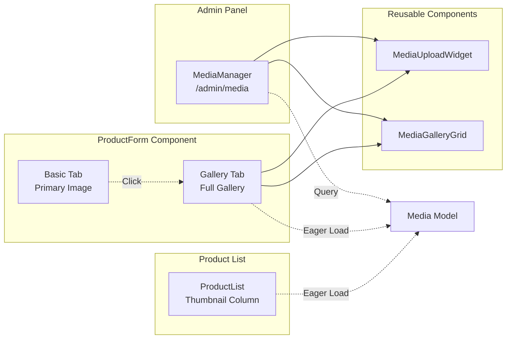

---

## 📁 FILE STORAGE STRUCTURE

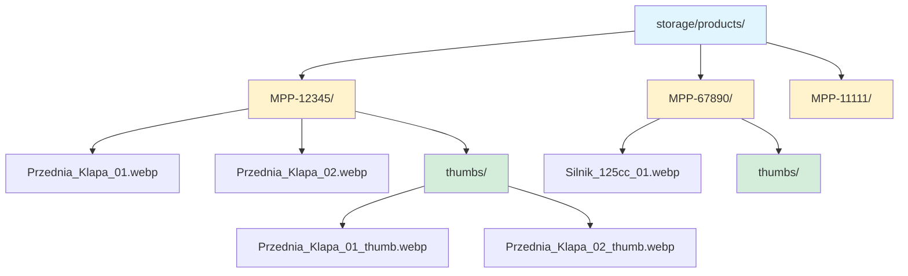

---

## 🗄️ DATABASE SCHEMA RELATIONSHIPS

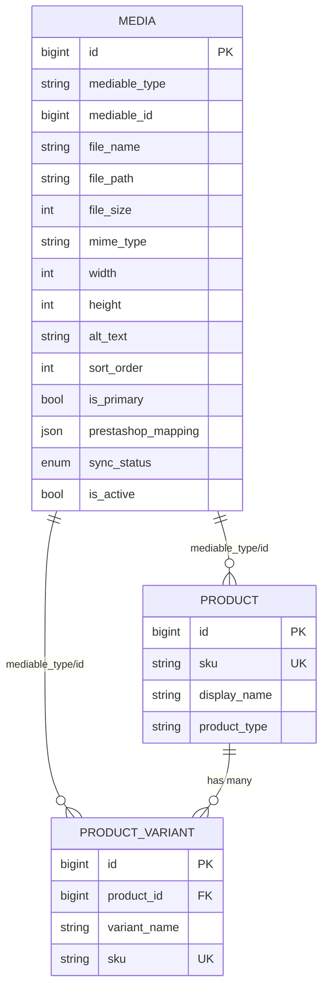

---

## 🚀 IMPLEMENTATION PHASES TIMELINE

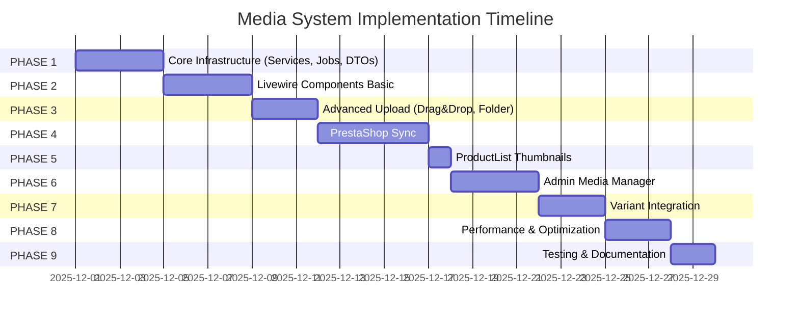

---

## 🔐 SECURITY & PERMISSIONS FLOW

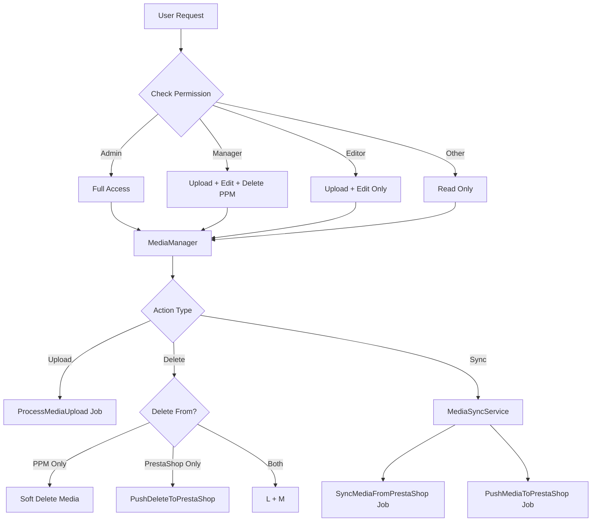

---

## 📊 PERFORMANCE OPTIMIZATION STRATEGY

```mermaid
graph TB
    subgraph "Request Level"
        A1[Lazy Load Gallery]
        A2[Thumbnail Cache Redis]
        A3[Infinite Scroll]
    end

    subgraph "Processing Level"
        B1[Queue High Priority<br/>Upload]
        B2[Queue Default<br/>Sync]
        B3[Queue Low<br/>Thumbnails/Cleanup]
    end

    subgraph "Storage Level"
        C1[WebP Compression]
        C2[Multiple Thumbnail Sizes]
        C3[SKU-based Folders]
    end

    subgraph "Database Level"
        D1[Strategic Indexes<br/>polymorphic]
        D2[Eager Loading<br/>with()]
        D3[Soft Deletes]
    end

    A1 --> E[Fast UI < 500ms]
    A2 --> E
    A3 --> E

    B1 --> F[Non-Blocking UX]
    B2 --> F
    B3 --> F

    C1 --> G[Small File Sizes]
    C2 --> G
    C3 --> G

    D1 --> H[Fast Queries]
    D2 --> H
    D3 --> H
```

---

## 🔄 JOB DEPENDENCIES & PRIORITIES

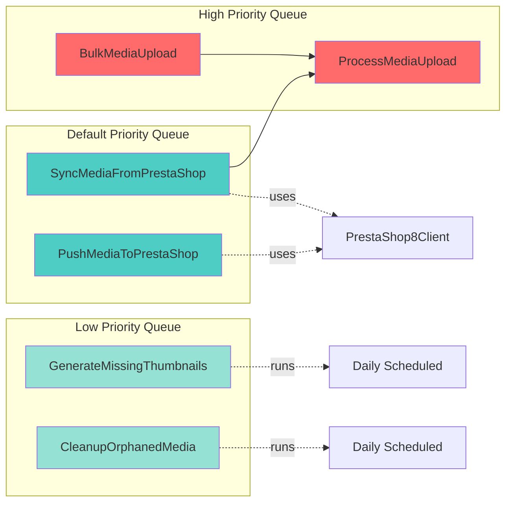

---

## 🎯 SUCCESS METRICS DASHBOARD

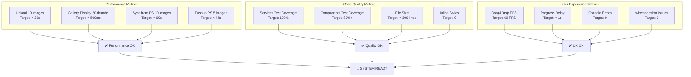

---

## 🛠️ DEVELOPMENT WORKFLOW

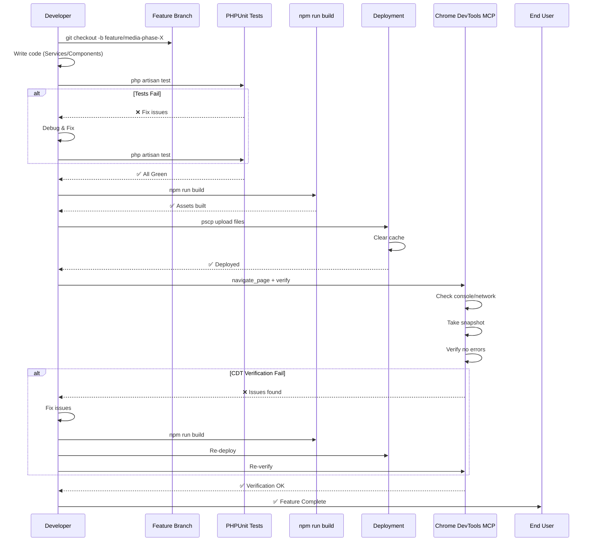

---

## 📚 DOCUMENTATION STRUCTURE

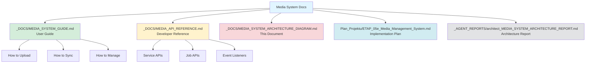

---

## 🔗 INTEGRATION POINTS

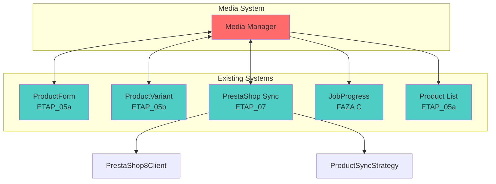

---

**DOCUMENT END**

*Generated by: architect agent*
*Date: 2025-11-28*
*Version: 1.0*
*Status: Complete - Ready for Implementation*
