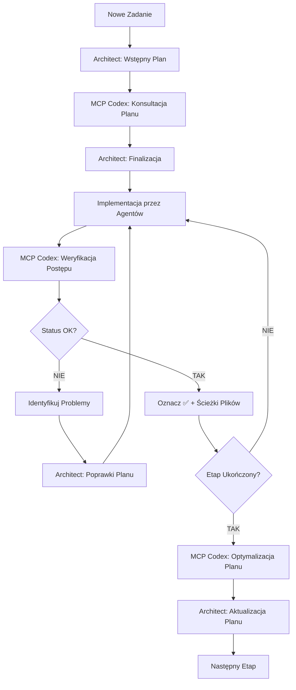

# 📋 PROCEDURY ZARZĄDZANIA PLANEM Z MCP CODEX

**Wersja:** 2.0 z MCP Codex Integration  
**Data:** 2025-01-11  
**Projekt:** PPM-CC-Laravel  
**Przeznaczenie:** Kompletne procedury zarządzania planem projektu z wykorzystaniem MCP Codex

---

## 🎯 FILOSOFIA ZARZĄDZANIA PLANEM Z MCP CODEX

### KRYTYCZNE ZASADY:
1. **MCP Codex WERYFIKUJE wszystkie plany** przed implementacją
2. **MCP Codex USUWA zbędne punkty** nieprzynoszące korzyści
3. **MCP Codex SPRAWDZA zgodność** z requirements z `_init.md`
4. **MCP Codex AKTUALIZUJE status** realizacji zadań

---

## 📝 PROCEDURA 1: TWORZENIE NOWEGO PLANU

### Krok 1: Wstępne Planowanie przez Architect
```markdown
Agent Architect tworzy wstępny plan na podstawie:
- Analizy zadania/funkcjonalności
- Requirements z _init.md
- Architektury PPM-CC-Laravel
- Best practices dla Laravel 12.x + Livewire 3.x
```

### Krok 2: OBOWIĄZKOWA Konsultacja z MCP Codex
```javascript
const consultPlanWithMCPCodex = async (initialPlan, taskDescription) => {
    const result = await mcp__codex__codex({
        prompt: `Przeanalizuj i zoptymalizuj plan projektu dla PPM-CC-Laravel.

ZADANIE: ${taskDescription}

WSTĘPNY PLAN:
${initialPlan}

WERYFIKACJA:
1. Zgodność z requirements z _init.md (https://github.com/PrestaShop/PrestaShop/blob/8.2.x/install-dev/data/db_structure.sql)
2. Czy wszystkie punkty przynoszą bezpośrednią korzyść projektowi?
3. Czy nie ma zbędnych punktów (over-engineering)?
4. Czy plan jest realistyczny dla środowiska Hostido shared hosting?
5. Czy uwzględnia ograniczenia Laravel 12.x + Livewire 3.x?
6. Czy jest zgodny z architekturą enterprise multi-store?

USUŃ ZBĘDNE PUNKTY I ZOPTYMALIZUJ:
- Usuń punkty które duplikują inne zadania
- Usuń zbyt ogólne punkty nieprzynoszące konkretnych korzyści
- Dodaj brakujące krytyczne elementy
- Uporządkuj hierarchię zadań
- Zaproponuj realistyczne timeframe

ZWRÓĆ zoptymalizowany plan w formacie hierarchicznym zgodnie z CLAUDE.md standards.`,
        model: "opus", // complex planning requires opus
        sandbox: "workspace-write",
        cwd: "D:\\OneDrive - MPP TRADE\\Skrypty\\PPM-CC-Laravel"
    });
    
    return result;
};
```

### Krok 3: Finalizacja Planu
```markdown
Agent Architect:
1. Analizuje feedback od MCP Codex
2. Aktualizuje plan zgodnie z rekomendacjami
3. Tworzy final plan w folderze Plan_Projektu/
4. Używa proper hierarchical format z CLAUDE.md
```

---

## 🔄 PROCEDURA 2: WERYFIKACJA STATUSU REALIZACJI

### Automatyczna Weryfikacja przez MCP Codex
```javascript
const verifyPlanProgress = async (planFile, implementedFiles) => {
    const result = await mcp__codex__codex({
        prompt: `Zweryfikuj status realizacji planu projektu PPM-CC-Laravel.

PLAN DO WERYFIKACJI:
${planFile}

PLIKI IMPLEMENTACJI:
${implementedFiles.map(file => `- ${file}`).join('\n')}

WERYFIKACJA:
1. Sprawdź które zadania zostały faktycznie zrealizowane
2. Zweryfikuj czy kod w plikach implementacji działa poprawnie
3. Sprawdź czy implementacja spełnia requirements z planu
4. Zidentyfikuj zadania oznaczone jako ✅ ale bez rzeczywistej implementacji
5. Zidentyfikuj zadania z implementacją ale nie oznaczone jako ✅

ZWRÓĆ:
- Lista zadań do oznaczenia jako ✅ (z ścieżkami do plików)
- Lista zadań błędnie oznaczonych jako ✅ 
- Lista zadań wymagających dodatkowych prac
- Sugestie aktualizacji statusów w planie

Format: Konkretne instrukcje aktualizacji dla Architect agenta.`,
        model: "sonnet", // verification can use sonnet
        sandbox: "read-only",
        cwd: "D:\\OneDrive - MPP TRADE\\Skrypty\\PPM-CC-Laravel"
    });
    
    return result;
};
```

---

## ⚡ PROCEDURA 3: OPTYMALIZACJA ISTNIEJĄCEGO PLANU

### Regularne Czyszczenie Planu przez MCP Codex
```javascript
const optimizeExistingPlan = async (currentPlan, projectProgress) => {
    const result = await mcp__codex__codex({
        prompt: `Zoptymalizuj i wyczyść istniejący plan projektu PPM-CC-Laravel.

AKTUALNY PLAN:
${currentPlan}

POSTĘP PROJEKTU:
${projectProgress}

OPTYMALIZACJA:
1. USUŃ zbędne punkty które:
   - Nie przynoszą bezpośredniej korzyści projektowi
   - Są zbyt ogólne lub niekonkretne
   - Duplikują inne zadania
   - Są niezgodne z aktualnym kierunkiem rozwoju
   - Są unrealistic dla shared hosting environment

2. DODAJ brakujące krytyczne elementy:
   - Security considerations
   - Performance optimizations
   - Error handling
   - Testing procedures
   - Documentation updates

3. REORGANIZUJ hierarchię:
   - Logical task dependencies
   - Priority-based ordering
   - Realistic milestone grouping

4. AKTUALIZUJ statusy:
   - Verify completed tasks
   - Identify blocked tasks
   - Update in-progress tasks

ZWRÓĆ zoptymalizowany plan gotowy do zastąpienia obecnego.`,
        model: "sonnet",
        sandbox: "workspace-write",
        cwd: "D:\\OneDrive - MPP TRADE\\Skrypty\\PPM-CC-Laravel"
    });
    
    return result;
};
```

---

## 🎬 PROCEDURA 4: WORKFLOW KOMPLETNEGO ZARZĄDZANIA PLANEM

### Cykl Życia Planu z MCP Codex:



---

## 🔧 PROCEDURA 5: TEMPLATE KONSULTACJI PLANU

### Standardowy Template dla MCP Codex Consultations:
```javascript
const standardPlanConsultation = {
    // Model selection
    model: "opus", // Always use opus for complex planning
    sandbox: "workspace-write", // Allow plan modifications
    
    // Standard prompt template
    promptTemplate: `
    ANALIZA PLANU PROJEKTU PPM-CC-Laravel
    
    KONTEKST:
    - Aplikacja enterprise multi-store Prestashop management
    - Laravel 12.x + Livewire 3.x + Alpine.js stack
    - Hostido shared hosting environment
    - 7-poziomowy system uprawnień użytkowników
    - Integracje: Baselinker (priorytet), Subiekt GT, Microsoft Dynamics
    - 8 grup cenowych + multi-warehouse support
    
    ZADANIE DO PLANOWANIA:
    {taskDescription}
    
    WSTĘPNY PLAN:
    {initialPlan}
    
    KRYTERIA WERYFIKACJI:
    1. Zgodność z _init.md requirements
    2. Wykonalność na shared hosting
    3. Enterprise security standards
    4. Performance considerations
    5. Scalability dla dużych zbiorów danych
    6. Maintainability długoterminowa
    7. Integration compatibility
    
    ZWRÓĆ:
    - Zoptymalizowany plan w hierarchicznym formacie
    - Lista usuniętych zbędnych punktów z uzasadnieniem
    - Lista dodanych krytycznych elementów
    - Sugestie timeframe dla major milestones
    `,
    
    // Standard verification criteria
    verificationCriteria: [
        "Zgodność z _init.md",
        "Wykonalność techniczna",
        "Enterprise standards",
        "Performance impact",
        "Security considerations",
        "Maintainability",
        "ROI/business value"
    ]
};
```

---

## 📊 PROCEDURA 6: METRYKI I MONITOROWANIE PLANU

### Tracking Effectiveness z MCP Codex:
```javascript
const generatePlanMetrics = async (planHistory, implementationResults) => {
    const metrics = await mcp__codex__codex({
        prompt: `Wygeneruj metryki efektywności zarządzania planem dla PPM-CC-Laravel.

HISTORIA PLANÓW:
${planHistory}

WYNIKI IMPLEMENTACJI:
${implementationResults}

ANALIZA:
1. Plan completion rate (% zrealizowanych zadań)
2. Accuracy rate (% tasks correctly estimated)
3. Waste elimination (ile zbędnych punktów usunięto)
4. Quality improvements (feedback z code reviews)
5. Timeline adherence (czy milestones były realistic)

METRYKI DO ZWRÓCENIA:
- Current plan health score (1-10)
- Recommendations for plan improvement
- Identified planning anti-patterns
- Success patterns to replicate

Format: Executive summary z actionable insights.`,
        model: "sonnet",
        sandbox: "read-only"
    });
    
    return metrics;
};
```

---

## 🎯 PROCEDURA 7: EMERGENCY PLAN RECOVERY

### Plan Recovery w przypadku problemów:
```javascript
const emergencyPlanRecovery = async (problematicPlan, issues) => {
    const recovery = await mcp__codex__codex({
        prompt: `EMERGENCY: Odzyskaj i napraw problematyczny plan projektu PPM-CC-Laravel.

PROBLEMATYCZNY PLAN:
${problematicPlan}

ZIDENTYFIKOWANE PROBLEMY:
${issues}

RECOVERY ACTIONS:
1. Identify root causes of plan failure
2. Salvage valuable completed work
3. Re-prioritize remaining tasks based on business value
4. Create simplified, focused recovery plan
5. Establish realistic new milestones
6. Implement risk mitigation strategies

ZWRÓĆ:
- Emergency recovery plan (immediate 1-2 weeks)
- Long-term restructured plan
- Risk mitigation strategies
- Communication plan for stakeholders

PRIORYTET: Zachować momentum projektu i team morale.`,
        model: "opus", // emergency situations need opus
        sandbox: "workspace-write"
    });
    
    return recovery;
};
```

---

## ✅ CHECKLIST: IMPLEMENTACJA PROCEDUR

### Pre-Implementation Checklist:
- [ ] Wszyscy agenci zaktualizowani z MCP Codex procedures
- [ ] Templates procedur dostępne w `_DOCS/`
- [ ] Standard prompts przetestowane z MCP Codex
- [ ] Workflow procedures zdokumentowane w CLAUDE.md
- [ ] Backup procedures zdefiniowane dla plan recovery

### Post-Implementation Monitoring:
- [ ] Weekly plan health checks przez MCP Codex
- [ ] Monthly optimization reviews
- [ ] Quarterly planning methodology improvements
- [ ] Continuous feedback loop z agents i MCP results

---

## 🚀 PODSUMOWANIE

**MCP Codex revolutionizes plan management dla PPM-CC-Laravel przez:**

✅ **Automatic plan optimization** - usuwa zbędne punkty  
✅ **Continuous compliance verification** - zgodność z _init.md  
✅ **Real-time progress tracking** - accurate status updates  
✅ **Intelligent task prioritization** - business value focus  
✅ **Proactive risk identification** - early problem detection  

**Result: Bardziej focused, realistic i executable plans prowadzące do project success.**