# ProductForm Architecture Comparison

Wizualne porównanie OBECNEJ vs NOWEJ architektury.

---

## 1. OBECNA ARCHITEKTURA (PROBLEMATYCZNA)

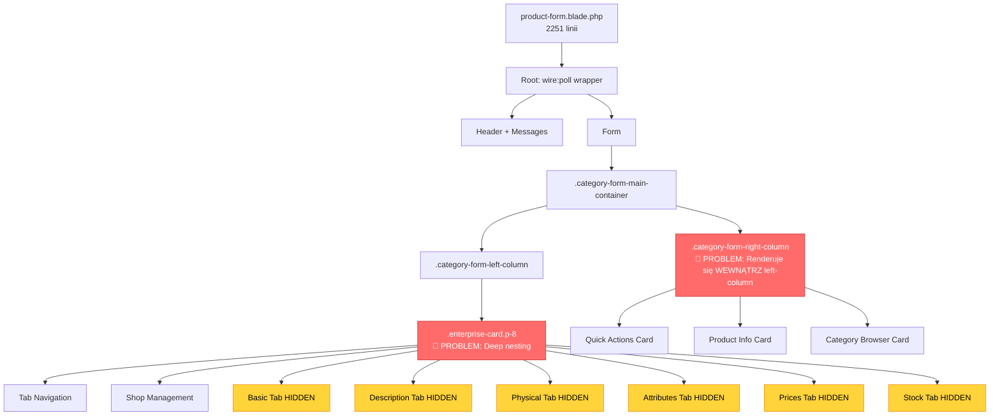

**Problemy:**
- 🔴 **Deep nesting:** 6-7 poziomów divów
- 🔴 **Błędny layout:** Right-column wewnątrz left-column
- 🟡 **DOM bloat:** WSZYSTKIE 6 tabów ZAWSZE w DOM (hidden)
- 🔴 **Separation of concerns:** Wszystko w jednym 2251-liniowym pliku

---

## 2. NOWA ARCHITEKTURA (CLEAN DESIGN)

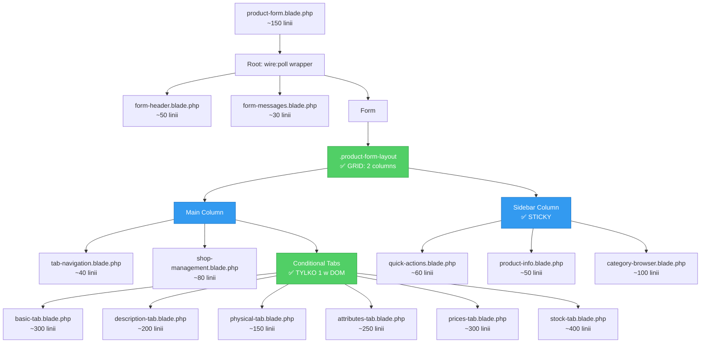

**Zalety:**
- ✅ **Shallow nesting:** Maksymalnie 3-4 poziomy
- ✅ **Poprawny layout:** Grid z sticky sidebar
- ✅ **Conditional rendering:** TYLKO 1 tab w DOM jednocześnie
- ✅ **Modular:** 16 małych plików zamiast 1 wielkiego
- ✅ **Testable:** Każdy partial osobno testowalny
- ✅ **Maintainable:** 150-400 linii per file (vs 2251)

---

## 3. DOM SIZE COMPARISON

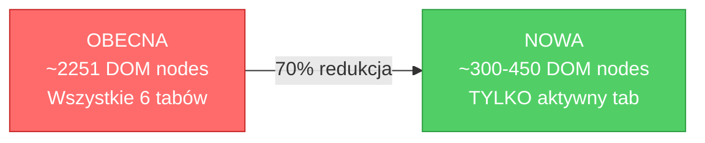

**Impact:**
- **Performance:** 70% mniej DOM nodes → szybsze renderowanie
- **Memory:** 70% mniejsze zużycie pamięci przeglądarki
- **Debugowanie:** 70% mniej elementów do inspekcji w DevTools

---

## 4. FILE SIZE COMPARISON

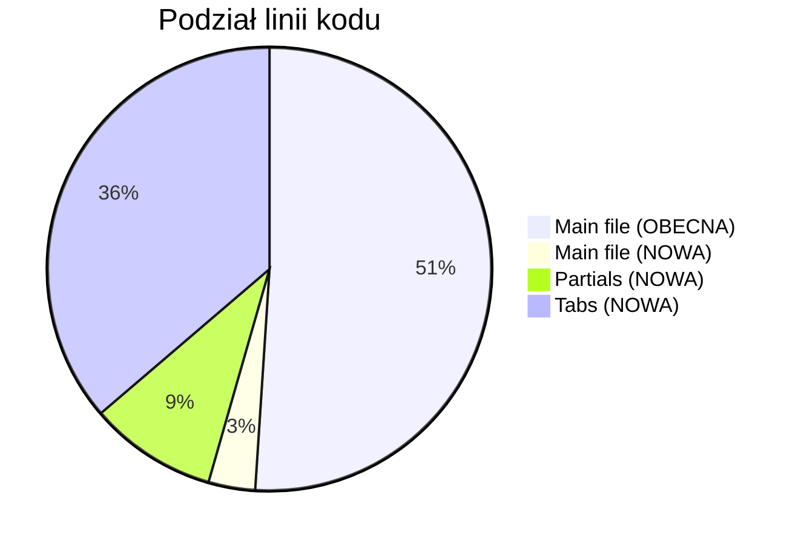

**OBECNA:**
- 1 plik: 2251 linii
- Trudny w maintenance
- Konflikty w Git przy multi-developer

**NOWA:**
- 17 plików: ~2160 linii total (więcej przez overhead, ale każdy mały)
- Main: 150 linii (czytelny!)
- Partials: 410 linii (reusable)
- Tabs: 1600 linii (izolowane, testable)
- Łatwiejszy maintenance
- Mniej konfliktów w Git

---

## 5. LAYOUT FLOW COMPARISON

### OBECNA (Błędna)

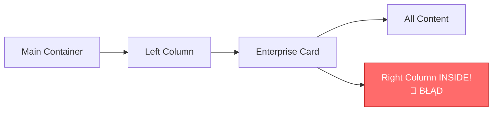

**Problem:** Right-column jest dzieckiem left-column → nie może być obok

### NOWA (Poprawna)

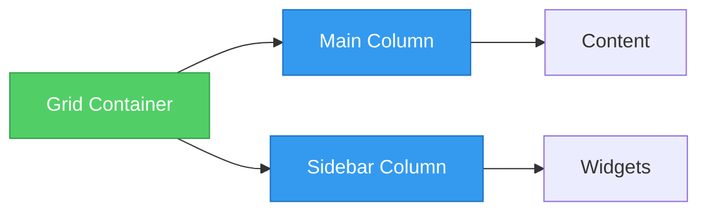

**Rozwiązanie:** Grid z dwoma RÓWNORZĘDNYMI kolumnami → sidebar obok main

---

## 6. CSS ARCHITECTURE COMPARISON

### OBECNA

```css
/* Semantyczny błąd: .category-form-* dla product form */
.category-form-main-container { /* grid */ }
.category-form-left-column { /* flex */ }
.category-form-right-column { /* stuck inside left! */ }
```

**Problemy:**
- Niewłaściwe nazwy klas
- Deep nesting w CSS
- Sidebar nie sticky

### NOWA

```css
/* Semantic: .product-form-* dla product form */
.product-form-layout { display: grid; grid-template-columns: 1fr 400px; }
.product-form-main { /* main content */ }
.product-form-sidebar { position: sticky; top: 1rem; }
```

**Zalety:**
- Semantyczne nazwy
- Prosty grid layout
- Sticky sidebar działa

---

## 7. MIGRATION FLOW

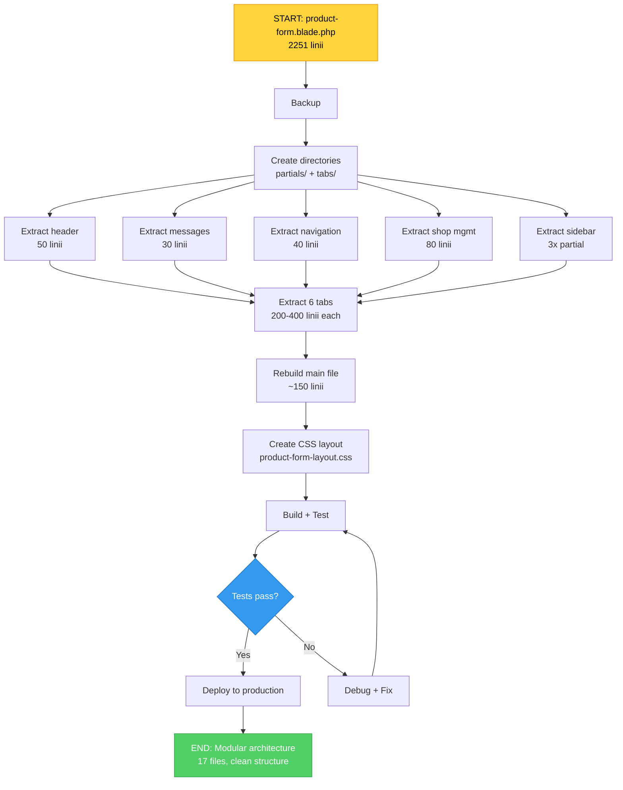

**Timeline:** 12-13 godzin (1.5-2 dni robocze)

---

## 8. RESPONSIVE BEHAVIOR

### Desktop (> 1280px)

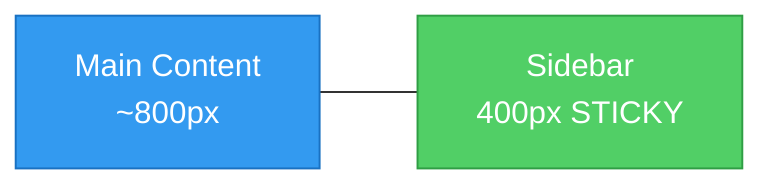

### Mobile (< 1280px)

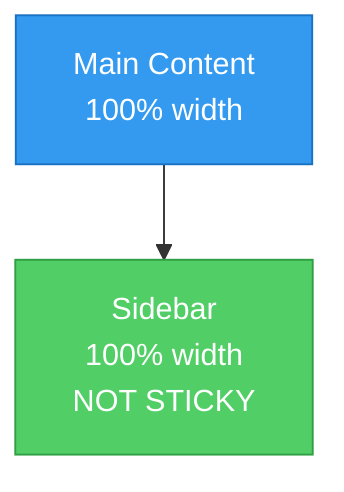

**CSS:**
```css
@media (max-width: 1280px) {
    .product-form-layout {
        grid-template-columns: 1fr; /* Stack */
    }
    .product-form-sidebar {
        position: relative; /* No sticky */
    }
}
```

---

## 9. COMPONENT HIERARCHY COMPARISON

### OBECNA (Monolith)

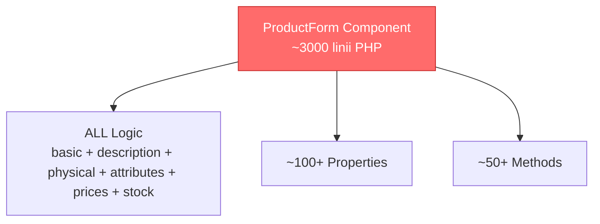

### NOWA (OPTION A - Recommended)

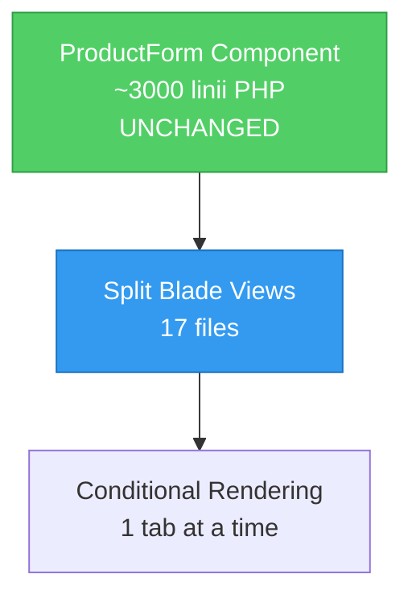

**Zalecenie:** Zmień TYLKO views (Blade), backend (Livewire) bez zmian

### NOWA (OPTION B - Future)

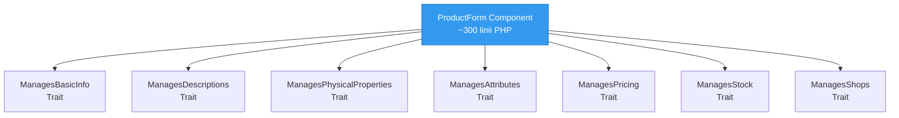

**Future:** Po stabilizacji Option A, rozważ split na traits

---

## 10. SUCCESS METRICS

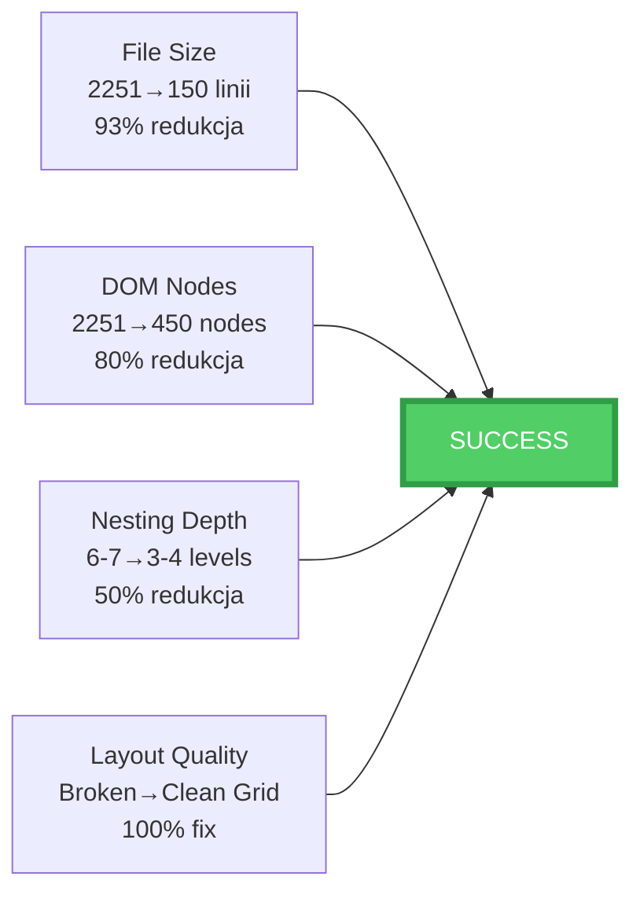

**Targets:**
- ✅ Main file < 200 linii (obecnie: 2251)
- ✅ DOM nodes < 500 (obecnie: ~2000+)
- ✅ Nesting ≤ 4 levels (obecnie: 6-7)
- ✅ Sidebar sticky (obecnie: nie działa)
- ✅ Modular structure (obecnie: monolith)

---

**CONCLUSION:**

**OBECNA architektura:** ❌ Broken layout, deep nesting, DOM bloat, maintenance nightmare

**NOWA architektura:** ✅ Clean grid, shallow nesting, conditional rendering, modular files

**RECOMMENDATION:** Implement redesign (12-13h effort, massive quality improvement)
